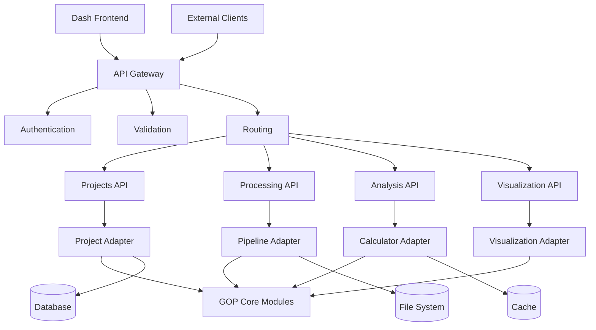

# API слой для интеграции GUI с GOP модулями

## 1. Обзор API архитектуры

### 1.1 Архитектура API слоя



### 1.2 Технологический стек API

- **Фреймворк**: Flask RESTful API
- **Аутентификация**: JWT Tokens
- **Валидация**: Marshmallow Schemas
- **Документация**: Swagger/OpenAPI 3.0
- **Кэширование**: Redis
- **Очередь задач**: Celery + Redis
- **Мониторинг**: Prometheus + Grafana

## 2. Детальная спецификация API endpoints

### 2.1 Аутентификация и сессии

#### Базовая аутентификация
```python
# POST /api/auth/login
{
    "username": "user@example.com",
    "password": "password123"
}

# Response
{
    "access_token": "eyJ0eXAiOiJKV1QiLCJhbGciOiJIUzI1NiJ9...",
    "refresh_token": "eyJ0eXAiOiJKV1QiLCJhbGciOiJIUzI1NiJ9...",
    "expires_in": 3600,
    "user": {
        "id": "user123",
        "email": "user@example.com",
        "role": "researcher"
    }
}
```

#### Сессии пользователей
```python
# GET /api/sessions/current
Headers: {"Authorization": "Bearer <token>"}

# Response
{
    "session_id": "session123",
    "user_id": "user123", 
    "created_at": "2024-01-01T10:00:00Z",
    "projects": [...],
    "preferences": {...}
}
```

### 2.2 Управление проектами

#### Создание проекта
```python
# POST /api/projects
{
    "name": "Исследование пшеницы 2024",
    "description": "Анализ состояния пшеничных полей",
    "tags": ["пшеница", "вегетация", "2024"],
    "metadata": {
        "location": "Московская область",
        "crop_type": "пшеница",
        "area_ha": 150.5
    }
}

# Response (201 Created)
{
    "id": "project123",
    "name": "Исследование пшеницы 2024",
    "status": "created",
    "created_at": "2024-01-01T10:00:00Z",
    "file_count": 0,
    "processing_status": "idle"
}
```

#### Загрузка файлов в проект
```python
# POST /api/projects/{project_id}/files
Content-Type: multipart/form-data

# Form Data
files: [file1.bil, file2.hdr, metadata.json]
sensor_type: "Hyperspectral"

# Response
{
    "uploaded_files": [
        {
            "id": "file123",
            "name": "file1.bil",
            "size": 1024000,
            "type": "hyperspectral",
            "status": "uploaded",
            "validation_result": {
                "valid": true,
                "bands": 224,
                "resolution": "10x10m",
                "wavelength_range": [400, 2500]
            }
        }
    ]
}
```

### 2.3 Обработка данных

#### Запуск обработки
```python
# POST /api/process
{
    "project_id": "project123",
    "pipeline_config": {
        "sensor_type": "Hyperspectral",
        "processing_steps": [
            "radiometric_correction",
            "atmospheric_correction", 
            "noise_reduction",
            "orthophoto_creation",
            "segmentation",
            "index_calculation"
        ],
        "parameters": {
            "radiometric_correction": {"method": "empirical_line"},
            "noise_reduction": {"method": "pca", "n_components": 0.95},
            "segmentation": {"use_refinement": true}
        },
        "selected_indices": ["GNDVI", "NDWI", "MCARI", "OSAVI"]
    }
}

# Response
{
    "task_id": "task123",
    "status": "queued",
    "estimated_duration": 1800,  # seconds
    "progress_url": "/api/process/task123/status"
}
```

#### Мониторинг прогресса
```python
# GET /api/process/{task_id}/status

# Response
{
    "task_id": "task123",
    "status": "processing",  # queued, processing, completed, failed
    "progress": 65.5,
    "current_step": "index_calculation",
    "step_progress": 80,
    "estimated_remaining": 300,  # seconds
    "started_at": "2024-01-01T10:00:00Z",
    "last_updated": "2024-01-01T10:25:00Z"
}
```

### 2.4 Научный анализ

#### Статистический анализ
```python
# GET /api/analysis/{project_id}/statistics?index=GNDVI

# Response
{
    "index": "GNDVI",
    "statistics": {
        "count": 150000,
        "mean": 0.654,
        "std": 0.123,
        "min": 0.123,
        "max": 0.987,
        "percentiles": {
            "25": 0.543,
            "50": 0.654, 
            "75": 0.765
        }
    },
    "distribution": {
        "bins": [0.1, 0.2, 0.3, 0.4, 0.5, 0.6, 0.7, 0.8, 0.9],
        "frequencies": [100, 500, 1500, 5000, 10000, 25000, 50000, 30000, 10000]
    }
}
```

#### Корреляционный анализ
```python
# POST /api/analysis/{project_id}/correlation
{
    "indices": ["GNDVI", "NDWI", "MCARI", "OSAVI"],
    "method": "pearson"
}

# Response
{
    "correlation_matrix": [
        [1.000, 0.856, 0.723, 0.645],
        [0.856, 1.000, 0.678, 0.589],
        [0.723, 0.678, 1.000, 0.812],
        [0.645, 0.589, 0.812, 1.000]
    ],
    "index_names": ["GNDVI", "NDWI", "MCARI", "OSAVI"],
    "significant_correlations": [
        {
            "index1": "GNDVI",
            "index2": "NDWI", 
            "correlation": 0.856,
            "p_value": 0.0001
        }
    ]
}
```

### 2.5 Визуализация данных

#### Генерация визуализаций
```python
# POST /api/visualization/{project_id}/generate
{
    "type": "index_map",
    "parameters": {
        "index": "GNDVI",
        "colormap": "viridis",
        "resolution": "high",
        "format": "png"
    }
}

# Response
{
    "visualization_id": "viz123",
    "url": "/api/visualization/viz123/image",
    "metadata": {
        "type": "index_map",
        "index": "GNDVI",
        "generated_at": "2024-01-01T10:00:00Z",
        "size": "1920x1080"
    }
}
```

#### Интерактивные визуализации
```python
# GET /api/visualization/{project_id}/interactive

# Response (Plotly JSON)
{
    "data": [
        {
            "type": "heatmap",
            "z": [[0.1, 0.2, 0.3], [0.4, 0.5, 0.6]],
            "colorscale": "Viridis",
            "colorbar": {"title": "GNDVI"}
        }
    ],
    "layout": {
        "title": "Карта индекса GNDVI",
        "xaxis": {"title": "X координата"},
        "yaxis": {"title": "Y координата"}
    }
}
```

## 3. Реализация API handlers

### 3.1 Базовый API handler

#### [`src/api/base_handler.py`](src/api/base_handler.py)
```python
"""
Базовый класс для API handlers
"""

from flask import jsonify, request
from functools import wraps
import logging

logger = logging.getLogger(__name__)

class APIHandler:
    """Базовый класс для обработки API запросов"""
    
    def __init__(self):
        self.logger = logger
    
    @staticmethod
    def handle_errors(f):
        """Декоратор для обработки ошибок"""
        @wraps(f)
        def decorated_function(*args, **kwargs):
            try:
                return f(*args, **kwargs)
            except ValueError as e:
                return jsonify({'error': str(e)}), 400
            except PermissionError as e:
                return jsonify({'error': str(e)}), 403
            except FileNotFoundError as e:
                return jsonify({'error': str(e)}), 404
            except Exception as e:
                logger.error(f"Unexpected error: {e}")
                return jsonify({'error': 'Internal server error'}), 500
        return decorated_function
    
    def validate_request(self, schema):
        """Валидация запроса по схеме"""
        def decorator(f):
            @wraps(f)
            def decorated_function(*args, **kwargs):
                errors = schema.validate(request.json or {})
                if errors:
                    return jsonify({'errors': errors}), 400
                return f(*args, **kwargs)
            return decorated_function
        return decorator
    
    def paginate_response(self, data, page, per_page):
        """Пагинация ответа"""
        start = (page - 1) * per_page
        end = start + per_page
        paginated_data = data[start:end]
        
        return {
            'data': paginated_data,
            'pagination': {
                'page': page,
                'per_page': per_page,
                'total': len(data),
                'pages': (len(data) + per_page - 1) // per_page
            }
        }
```

### 3.2 Projects API handler

#### [`src/api/projects_handler.py`](src/api/projects_handler.py)
```python
"""
Обработчик API для управления проектами
"""

from flask import request, current_app
from src.api.base_handler import APIHandler
from src.adapters.project_adapter import ProjectAdapter

class ProjectsHandler(APIHandler):
    """Обработчик для API проектов"""
    
    def __init__(self):
        super().__init__()
        self.project_adapter = ProjectAdapter()
    
    def create_project(self):
        """Создание нового проекта"""
        project_data = request.json
        
        # Валидация данных
        if not project_data.get('name'):
            return {'error': 'Project name is required'}, 400
        
        # Создание проекта
        try:
            project = self.project_adapter.create_project(
                name=project_data['name'],
                description=project_data.get('description', ''),
                metadata=project_data.get('metadata', {})
            )
            
            self.logger.info(f"Project created: {project['id']}")
            return project, 201
            
        except Exception as e:
            self.logger.error(f"Error creating project: {e}")
            return {'error': str(e)}, 500
    
    def upload_files(self, project_id):
        """Загрузка файлов в проект"""
        if 'files' not in request.files:
            return {'error': 'No files provided'}, 400
        
        files = request.files.getlist('files')
        sensor_type = request.form.get('sensor_type', 'Hyperspectral')
        
        try:
            uploaded_files = []
            
            for file in files:
                if file.filename == '':
                    continue
                
                # Сохранение файла
                file_info = self.project_adapter.save_file(
                    project_id=project_id,
                    file_obj=file,
                    sensor_type=sensor_type
                )
                
                # Валидация файла
                validation_result = self.project_adapter.validate_file(file_info['path'])
                file_info['validation'] = validation_result
                
                uploaded_files.append(file_info)
            
            self.logger.info(f"Uploaded {len(uploaded_files)} files to project {project_id}")
            return {'uploaded_files': uploaded_files}, 200
            
        except Exception as e:
            self.logger.error(f"Error uploading files: {e}")
            return {'error': str(e)}, 500
    
    def get_project_status(self, project_id):
        """Получение статуса проекта"""
        try:
            status = self.project_adapter.get_project_status(project_id)
            return status, 200
        except Exception as e:
            self.logger.error(f"Error getting project status: {e}")
            return {'error': str(e)}, 500
```

### 3.3 Processing API handler

#### [`src/api/processing_handler.py`](src/api/processing_handler.py)
```python
"""
Обработчик API для обработки данных
"""

from flask import request, current_app
from src.api.base_handler import APIHandler
from src.adapters.pipeline_adapter import PipelineAdapter
from src.tasks.processing_tasks import process_pipeline

class ProcessingHandler(APIHandler):
    """Обработчик для API обработки данных"""
    
    def __init__(self):
        super().__init__()
        self.pipeline_adapter = PipelineAdapter()
    
    def start_processing(self):
        """Запуск обработки данных"""
        processing_config = request.json
        
        # Валидация конфигурации
        if not processing_config.get('project_id'):
            return {'error': 'Project ID is required'}, 400
        
        try:
            # Запуск асинхронной задачи
            task = process_pipeline.delay(processing_config)
            
            self.logger.info(f"Processing task started: {task.id}")
            return {
                'task_id': task.id,
                'status': 'queued',
                'progress_url': f'/api/process/{task.id}/status'
            }, 202
            
        except Exception as e:
            self.logger.error(f"Error starting processing: {e}")
            return {'error': str(e)}, 500
    
    def get_processing_status(self, task_id):
        """Получение статуса обработки"""
        try:
            from celery.result import AsyncResult
            task_result = AsyncResult(task_id)
            
            status = {
                'task_id': task_id,
                'status': task_result.status,
                'progress': 0,
                'current_step': None
            }
            
            if task_result.status == 'PROGRESS':
                status.update(task_result.result.get('progress', {}))
            elif task_result.status == 'SUCCESS':
                status['progress'] = 100
                status['result'] = task_result.result
            elif task_result.status == 'FAILURE':
                status['error'] = str(task_result.result)
            
            return status, 200
            
        except Exception as e:
            self.logger.error(f"Error getting processing status: {e}")
            return {'error': str(e)}, 500
    
    def cancel_processing(self, task_id):
        """Отмена обработки"""
        try:
            from celery.result import AsyncResult
            task = AsyncResult(task_id)
            task.revoke(terminate=True)
            
            self.logger.info(f"Processing task cancelled: {task_id}")
            return {'message': 'Processing cancelled'}, 200
            
        except Exception as e:
            self.logger.error(f"Error cancelling processing: {e}")
            return {'error': str(e)}, 500
```

## 4. WebSocket API для реального времени

### 4.1 WebSocket events

#### [`src/api/websocket_handler.py`](src/api/websocket_handler.py)
```python
"""
WebSocket handler для реального времени
"""

import json
from flask_socketio import SocketIO, emit
from src.core.cache_manager import CacheManager

class WebSocketHandler:
    """Обработчик WebSocket соединений"""
    
    def __init__(self, socketio):
        self.socketio = socketio
        self.cache_manager = CacheManager()
        self.setup_events()
    
    def setup_events(self):
        """Настройка WebSocket событий"""
        
        @self.socketio.on('connect')
        def handle_connect():
            """Обработка подключения клиента"""
            emit('connected', {'message': 'Connected to GOP GUI'})
        
        @self.socketio.on('subscribe_progress')
        def handle_subscribe_progress(data):
            """Подписка на прогресс обработки"""
            task_id = data.get('task_id')
            if task_id:
                # Добавление клиента в комнату для задачи
                join_room(task_id)
                emit('subscribed', {'task_id': task_id})
        
        @self.socketio.on('unsubscribe_progress')
        def handle_unsubscribe_progress(data):
            """Отписка от прогресса обработки"""
            task_id = data.get('task_id')
            if task_id:
                leave_room(task_id)
                emit('unsubscribed', {'task_id': task_id})
    
    def broadcast_progress(self, task_id, progress_data):
        """Трансляция прогресса обработки"""
        self.socketio.emit('processing_progress', progress_data, room=task_id)
    
    def broadcast_notification(self, user_id, notification):
        """Трансляция уведомления пользователю"""
        self.socketio.emit('notification', notification, room=user_id)
```

### 4.2 WebSocket events спецификация

```python
# События от клиента к серверу
{
    "event": "subscribe_progress",
    "data": {"task_id": "task123"}
}

{
    "event": "unsubscribe_progress", 
    "data": {"task_id": "task123"}
}

# События от сервера к клиенту
{
    "event": "processing_progress",
    "data": {
        "task_id": "task123",
        "progress": 65.5,
        "current_step": "index_calculation",
        "message": "Расчет индекса GNDVI"
    }
}

{
    "event": "notification",
    "data": {
        "type": "success",
        "title": "Обработка завершена",
        "message": "Проект 'Исследование пшеницы' успешно обработан",
        "timestamp": "2024-01-01T10:00:00Z"
    }
}
```

## 5. Документация API

### 5.1 OpenAPI спецификация

#### [`docs/openapi.yaml`](docs/openapi.yaml)
```yaml
openapi: 3.0.0
info:
  title: GOP GUI API
  description: API для веб-интерфейса гиперспектральной обработки данных
  version: 1.0.0
  contact:
    name: Индыков Дмитрий Андреевич
    email: indykovdm@example.com

servers:
  - url: http://localhost:8050/api
    description: Development server

paths:
  /projects:
    post:
      summary: Создание нового проекта
      tags: [Projects]
      requestBody:
        required: true
        content:
          application/json:
            schema:
              $ref: '#/components/schemas/ProjectCreate'
      responses:
        '201':
          description: Проект создан
          content:
            application/json:
              schema:
                $ref: '#/components/schemas/Project'
        '400':
          description: Неверные данные
        '500':
          description: Внутренняя ошибка сервера

components:
  schemas:
    ProjectCreate:
      type: object
      required: [name]
      properties:
        name:
          type: string
          description: Название проекта
        description:
          type: string
          description: Описание проекта
        metadata:
          type: object
          description: Дополнительные метаданные

    Project:
      type: object
      properties:
        id:
          type: string
        name:
          type: string
        status:
          type: string
          enum: [created, processing, completed, error]
        created_at:
          type: string
          format: date-time
```

Этот API слой обеспечивает полную интеграцию между веб-интерфейсом и существующими модулями GOP, предоставляя RESTful API для управления проектами, обработки данных, научного анализа и визуализации, а также WebSocket API для обновлений в реальном времени.