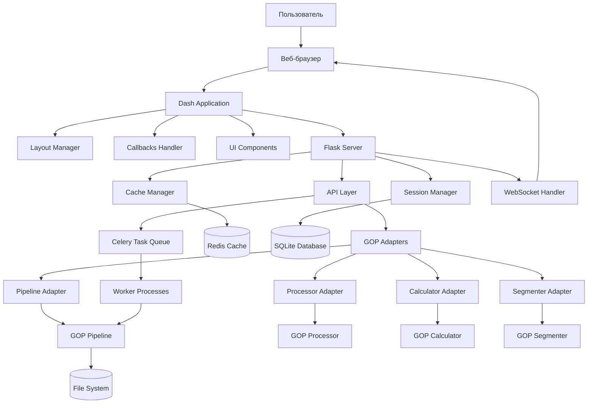

# Архитектура GUI для проекта GOP на основе Flask/Dash

## 1. Обзор архитектуры

### 1.1 Архитектурная схема



### 1.2 Компоненты архитектуры

#### **Frontend Layer (Dash)**
- **Dash Application** - Основное приложение
- **Layout Manager** - Управление макетами интерфейса
- **Callbacks Handler** - Обработчики событий и обновлений
- **UI Components** - Переиспользуемые компоненты интерфейса

#### **Backend Layer (Flask)**
- **Flask Server** - Веб-сервер приложения
- **API Layer** - REST API для взаимодействия с GOP
- **Session Manager** - Управление сессиями пользователей
- **Cache Manager** - Кэширование данных и результатов

#### **Integration Layer**
- **GOP Adapters** - Адаптеры для интеграции с существующими классами GOP
- **Pipeline Adapter** - Адаптер для [`Pipeline`](src/core/pipeline.py:21)
- **Processor Adapter** - Адаптер для [`HyperspectralProcessor`](src/processing/hyperspectral.py:33)
- **Calculator Adapter** - Адаптер для [`VegetationIndexCalculator`](src/indices/calculator.py:21)
- **Segmenter Adapter** - Адаптер для [`ImageSegmenter`](src/segmentation/segmenter.py:20)

#### **Data Layer**
- **Redis Cache** - Кэширование и брокер сообщений
- **SQLite Database** - Хранение метаданных проектов
- **File System** - Хранение файлов данных и результатов

## 2. Структура проекта

### 2.1 Организация файлов и модулей

```
gop-gui/
├── app.py                          # Точка входа приложения
├── requirements.txt                # Зависимости GUI
├── config/
│   ├── __init__.py
│   ├── gui_config.py              # Конфигурация GUI
│   └── development.py             # Настройки разработки
├── src/
│   ├── __init__.py
│   ├── core/
│   │   ├── __init__.py
│   │   ├── app_factory.py         # Фабрика приложения
│   │   ├── session_manager.py     # Менеджер сессий
│   │   └── cache_manager.py       # Менеджер кэша
│   ├── api/
│   │   ├── __init__.py
│   │   ├── routes.py              # Маршруты API
│   │   ├── projects.py            # API проектов
│   │   ├── processing.py          # API обработки
│   │   ├── analysis.py            # API анализа
│   │   └── visualization.py       # API визуализации
│   ├── adapters/
│   │   ├── __init__.py
│   │   ├── pipeline_adapter.py    # Адаптер Pipeline
│   │   ├── processor_adapter.py   # Адаптер HyperspectralProcessor
│   │   ├── calculator_adapter.py  # Адаптер VegetationIndexCalculator
│   │   └── segmenter_adapter.py   # Адаптер ImageSegmenter
│   ├── layouts/
│   │   ├── __init__.py
│   │   ├── main_layout.py         # Главный макет
│   │   ├── project_layout.py      # Макет проектов
│   │   ├── processing_layout.py   # Макет обработки
│   │   ├── analysis_layout.py     # Макет анализа
│   │   └── visualization_layout.py # Макет визуализации
│   ├── components/
│   │   ├── __init__.py
│   │   ├── navigation.py          # Навигационная панель
│   │   ├── sidebar.py             # Боковая панель
│   │   ├── data_upload.py         # Виджет загрузки данных
│   │   ├── processing_widget.py   # Виджет обработки
│   │   ├── visualization_widget.py # Виджет визуализации
│   │   └── analysis_widget.py     # Виджет анализа
│   ├── callbacks/
│   │   ├── __init__.py
│   │   ├── project_callbacks.py   # Колбэки проектов
│   │   ├── processing_callbacks.py # Колбэки обработки
│   │   ├── analysis_callbacks.py  # Колбэки анализа
│   │   └── visualization_callbacks.py # Колбэки визуализации
│   ├── utils/
│   │   ├── __init__.py
│   │   ├── file_utils.py          # Утилиты работы с файлами
│   │   ├── validation.py          # Валидация данных
│   │   ├── serialization.py       # Сериализация данных
│   │   └── async_utils.py         # Утилиты асинхронности
│   └── tasks/
│       ├── __init__.py
│       ├── celery_app.py          # Конфигурация Celery
│       ├── processing_tasks.py    # Задачи обработки
│       └── analysis_tasks.py      # Задачи анализа
├── static/
│   ├── css/
│   │   ├── main.css               # Основные стили
│   │   ├── components.css         # Стили компонентов
│   │   └── themes/                # Темы оформления
│   ├── js/
│   │   ├── main.js                # Основной JavaScript
│   │   ├── visualization.js       # JavaScript для визуализации
│   │   └── utils.js               # Утилиты JavaScript
│   └── assets/
│       ├── images/                # Изображения
│       └── icons/                 # Иконки
├── templates/
│   └── base.html                  # Базовый шаблон
├── data/
│   ├── uploads/                   # Загруженные файлы
│   ├── projects/                  # Данные проектов
│   └── cache/                     # Кэшированные данные
└── logs/
    └── gui.log                    # Логи приложения
```

## 3. API слой

### 3.1 REST API Endpoints

#### Управление проектами
```python
# Projects API
GET    /api/projects                    # Список проектов
POST   /api/projects                    # Создание проекта
GET    /api/projects/{project_id}       # Информация о проекте
PUT    /api/projects/{project_id}       # Обновление проекта
DELETE /api/projects/{project_id}       # Удаление проекта
POST   /api/projects/{project_id}/files # Загрузка файлов в проект
```

#### Обработка данных
```python
# Processing API
POST   /api/process/upload              # Загрузка данных
POST   /api/process/preprocess          # Предобработка
POST   /api/process/orthophoto          # Создание ортофотоплана
POST   /api/process/segmentation        # Сегментация
POST   /api/process/indices             # Расчет индексов
GET    /api/process/status/{task_id}    # Статус обработки
```

#### Анализ и визуализация
```python
# Analysis API
GET    /api/analysis/statistics         # Статистика
POST   /api/analysis/correlation        # Корреляционный анализ
POST   /api/analysis/spatial            # Пространственный анализ
GET    /api/visualization/{type}        # Генерация визуализаций
POST   /api/visualization/export        # Экспорт результатов
```

### 3.2 WebSocket Events

```python
# События реального времени
{
    "type": "processing_progress",
    "task_id": "uuid",
    "progress": 75,
    "message": "Шумоподавление..."
}

{
    "type": "visualization_update",
    "data": {...},
    "timestamp": "2024-01-01T10:00:00Z"
}
```

## 4. Интерфейсный слой

### 4.1 Структура Dash приложения

```python
class GOPDashApp:
    def __init__(self):
        self.app = dash.Dash(__name__)
        self.setup_layout()
        self.setup_callbacks()
        self.setup_api()
    
    def setup_layout(self):
        """Настройка макетов интерфейса"""
        self.app.layout = html.Div([
            # Навигационная панель
            NavigationComponent(),
            
            # Основной контент
            html.Div([
                SidebarComponent(),
                MainContentComponent()
            ], className="main-container")
        ])
    
    def setup_callbacks(self):
        """Настройка колбэков"""
        # Колбэки проектов
        ProjectCallbacks.register(self.app)
        
        # Колбэки обработки
        ProcessingCallbacks.register(self.app)
        
        # Колбэки анализа
        AnalysisCallbacks.register(self.app)
```

### 4.2 Компоненты интерфейса

#### Навигационная панель
```python
class NavigationComponent:
    def __init__(self):
        self.component = dbc.Navbar(
            brand="GOP - Гиперспектральная обработка",
            color="primary",
            dark=True,
            children=[
                # Элементы навигации
            ]
        )
```

#### Виджет загрузки данных
```python
class DataUploadWidget:
    def __init__(self):
        self.component = dcc.Upload(
            id='upload-data',
            children=html.Div(['Перетащите файлы или ', html.A('выберите файлы')]),
            multiple=True,
            style={...}
        )
```

## 5. Слой данных

### 5.1 Управление сессиями

```python
class SessionManager:
    def __init__(self):
        self.sessions = {}
        self.db_connection = create_connection()
    
    def create_session(self, user_id):
        """Создание новой сессии"""
        session_id = str(uuid.uuid4())
        self.sessions[session_id] = {
            'user_id': user_id,
            'created_at': datetime.now(),
            'projects': [],
            'current_project': None
        }
        return session_id
    
    def get_session(self, session_id):
        """Получение данных сессии"""
        return self.sessions.get(session_id)
```

### 5.2 Кэширование данных

```python
class CacheManager:
    def __init__(self):
        self.redis_client = redis.Redis()
        self.local_cache = {}
    
    def get(self, key):
        """Получение данных из кэша"""
        # Попытка получить из локального кэша
        if key in self.local_cache:
            return self.local_cache[key]
        
        # Попытка получить из Redis
        cached_data = self.redis_client.get(key)
        if cached_data:
            data = json.loads(cached_data)
            self.local_cache[key] = data
            return data
        
        return None
    
    def set(self, key, data, ttl=3600):
        """Сохранение данных в кэш"""
        self.local_cache[key] = data
        self.redis_client.setex(key, ttl, json.dumps(data))
```

## 6. Интеграционные паттерны

### 6.1 Adapter Pattern для GOP Core

```python
class PipelineAdapter:
    def __init__(self):
        self.pipeline = Pipeline()
    
    async def process_async(self, config: Dict) -> Dict:
        """Асинхронная обработка через GOP Pipeline"""
        try:
            # Запуск обработки в отдельном процессе
            result = await self._run_in_executor(
                self.pipeline.process,
                config['input_path'],
                config['output_dir'],
                config.get('sensor_type', 'Hyperspectral')
            )
            return {
                'status': 'completed',
                'result': result
            }
        except Exception as e:
            return {
                'status': 'error',
                'error': str(e)
            }
    
    def get_status(self, task_id: str) -> Dict:
        """Получение статуса задачи"""
        # Интеграция с системой мониторинга задач
        pass
```

### 6.2 Proxy Pattern для тяжелых операций

```python
class ProcessingProxy:
    def __init__(self):
        self.cache = CacheManager()
        self.processor = HyperspectralProcessor()
    
    def process(self, data_config: Dict) -> Dict:
        """Обработка с кэшированием"""
        cache_key = self._generate_cache_key(data_config)
        
        # Проверка кэша
        cached_result = self.cache.get(cache_key)
        if cached_result:
            return cached_result
        
        # Выполнение обработки
        result = self.processor.process(
            data_config['input_path'],
            data_config['output_dir']
        )
        
        # Сохранение в кэш
        self.cache.set(cache_key, result)
        
        return result
```

## 7. Рекомендации по реализации

### 7.1 Этапы разработки

1. **Фаза 1: Базовая инфраструктура** (2 недели)
   - Настройка Flask/Dash приложения
   - Создание базовых компонентов интерфейса
   - Интеграция с GOP Pipeline

2. **Фаза 2: Функциональность обработки** (3 недели)
   - Реализация загрузки и предпросмотра данных
   - Интеграция с модулями обработки GOP
   - Асинхронная обработка задач

3. **Фаза 3: Анализ и визуализация** (3 недели)
   - Реализация виджетов анализа
   - Интеграция с Plotly для визуализации
   - Система отчетов и экспорта

4. **Фаза 4: Оптимизация и тестирование** (2 недели)
   - Оптимизация производительности
   - Тестирование интерфейса
   - Документация и развертывание

### 7.2 Технический стек

#### Frontend
- **Dash** - Основной фреймворк
- **Plotly** - Графики и визуализация
- **Bootstrap** - Стилизация компонентов
- **JavaScript** - Кастомная интерактивность

#### Backend
- **Flask** - Веб-фреймворк
- **Celery** - Очередь задач
- **Redis** - Кэширование и брокер
- **SQLite** - Хранение метаданных

#### Интеграция
- **REST API** - Для взаимодействия с GOP
- **WebSocket** - Реальное время
- **Adapter Pattern** - Для интеграции с GOP классами

### 7.3 Ключевые особенности

1. **Модульность** - Каждый компонент независим и переиспользуем
2. **Масштабируемость** - Поддержка больших объемов данных
3. **Производительность** - Асинхронная обработка и кэширование
4. **Расширяемость** - Плагинная архитектура для новых функций
5. **Совместимость** - Бесшовная интеграция с существующим кодом GOP

Данная архитектура обеспечивает надежную основу для создания современного веб-интерфейса для научной библиотеки GOP, сочетая мощь существующего аналитического ядра с удобством веб-технологий.