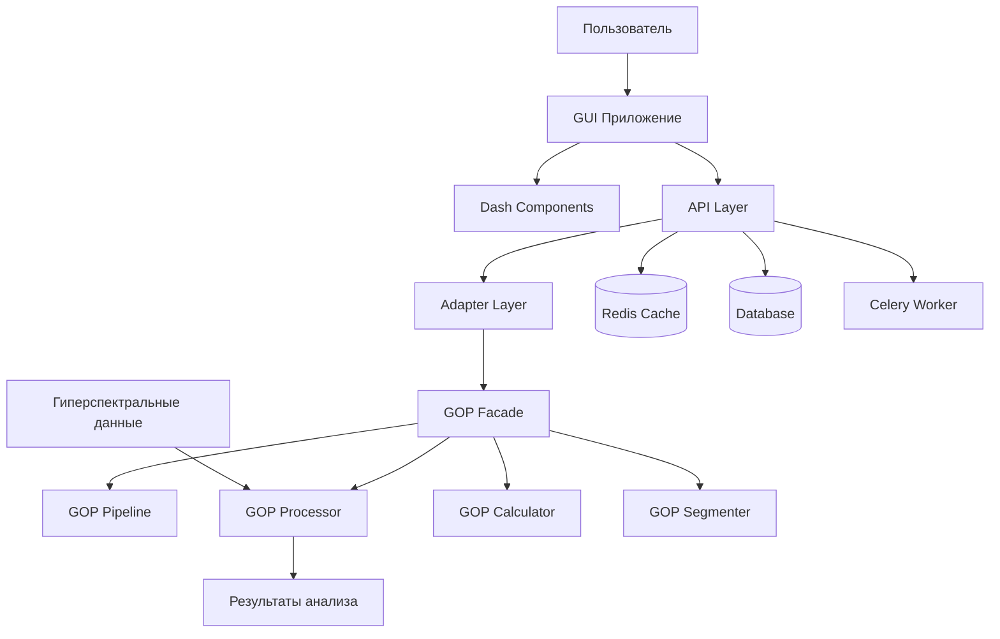
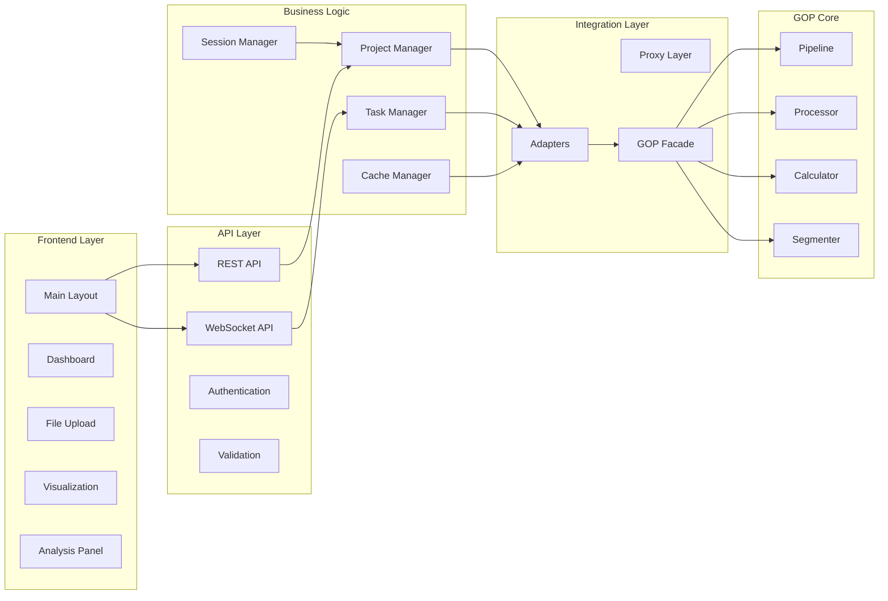

# Техническая архитектура GUI для проекта GOP

## Оглавление

1. [Обзор архитектуры](#1-обзор-архитектуры)
2. [Архитектурная схема](#2-архитектурная-схема)
3. [Структура проекта](#3-структура-проекта)
4. [API слой](#4-api-слой)
5. [Интерфейсный слой](#5-интерфейсный-слой)
6. [Слой данных](#6-слой-данных)
7. [Интеграционные паттерны](#7-интеграционные-паттерны)
8. [Рекомендации по реализации](#8-рекомендации-по-реализации)

## 1. Обзор архитектуры

GUI для проекта GOP построен на основе Flask/Dash фреймворка и обеспечивает веб-интерфейс для работы с гиперспектральными данными и анализа растительности.

### 1.1 Ключевые характеристики

- **Многоуровневая архитектура**: Четкое разделение ответственности между слоями
- **Асинхронная обработка**: Поддержка длительных операций обработки данных
- **Реактивный интерфейс**: Real-time обновления состояния через WebSocket
- **Модульность**: Возможность расширения функциональности
- **Интеграция с GOP**: Глубокая интеграция с существующими модулями обработки

### 1.2 Технологический стек

| Компонент | Технология | Назначение |
|-----------|------------|------------|
| **Frontend** | Dash, Plotly, Bootstrap | Пользовательский интерфейс |
| **Backend** | Flask, Dash | Веб-сервер и логика приложения |
| **API** | REST, WebSocket | Коммуникация с клиентом |
| **Очереди задач** | Celery, Redis | Асинхронная обработка |
| **Кэширование** | Redis, Memory | Оптимизация производительности |
| **База данных** | SQLite/PostgreSQL | Хранение сессий и проектов |

## 2. Архитектурная схема

### 2.1 Высокоуровневая архитектура



### 2.2 Детальная схема компонентов



## 3. Структура проекта

### 3.1 Организация файлов

```
gui/
├── app.py                          # Основное приложение Dash
├── requirements.txt                # Зависимости
├── config/
│   ├── __init__.py
│   ├── config.py                  # Конфигурация приложения
│   └── development.py             # Конфигурация разработки
├── src/
│   ├── __init__.py
│   ├── api/
│   │   ├── __init__.py
│   │   ├── routes.py              # REST API маршруты
│   │   ├── websocket.py           # WebSocket обработчики
│   │   └── validation.py          # Валидация данных
│   ├── components/
│   │   ├── __init__.py
│   │   ├── layout.py              # Основной layout
│   │   ├── dashboard.py           # Dashboard компоненты
│   │   ├── file_upload.py         # Компонент загрузки файлов
│   │   ├── visualization.py       # Визуализации
│   │   └── analysis.py            # Панель анализа
│   ├── core/
│   │   ├── __init__.py
│   │   ├── session_manager.py     # Управление сессиями
│   │   ├── cache_manager.py       # Управление кэшем
│   │   ├── task_manager.py        # Управление задачами
│   │   └── project_manager.py     # Управление проектами
│   ├── adapters/
│   │   ├── __init__.py
│   │   ├── base_adapter.py        # Базовый адаптер
│   │   ├── pipeline_adapter.py    # Адаптер Pipeline
│   │   ├── processor_adapter.py   # Адаптер Processor
│   │   ├── calculator_adapter.py  # Адаптер Calculator
│   │   ├── segmenter_adapter.py   # Адаптер Segmenter
│   │   ├── processing_proxy.py    # Proxy для обработки
│   │   ├── gop_facade.py          # GOP Facade
│   │   └── state_observer.py      # Observer для состояния
│   └── utils/
│       ├── __init__.py
│       ├── file_utils.py          # Утилиты для работы с файлами
│       ├── validation_utils.py    # Утилиты валидации
│       └── visualization_utils.py # Утилиты визуализации
├── static/
│   ├── css/
│   │   └── styles.css             # Стили приложения
│   ├── js/
│   │   └── custom.js              # Кастомный JavaScript
│   └── images/                    # Статические изображения
├── templates/                     # HTML шаблоны (если нужны)
└── tests/
    ├── __init__.py
    ├── test_api.py                # Тесты API
    ├── test_components.py         # Тесты компонентов
    └── test_integration.py        # Интеграционные тесты
```

### 3.2 Ключевые модули и их назначение

| Модуль | Назначение | Основные классы |
|--------|------------|-----------------|
| **app.py** | Точка входа приложения | DashApp, AppConfig |
| **api/routes.py** | REST API endpoints | APIRouter, RequestHandler |
| **components/** | Dash компоненты | Layout, Dashboard, FileUpload |
| **core/** | Бизнес-логика | SessionManager, CacheManager |
| **adapters/** | Интеграция с GOP | BaseAdapter, GOPFacade |
| **utils/** | Вспомогательные функции | FileUtils, ValidationUtils |

## 4. API слой

### 4.1 REST API Endpoints

#### Проекты
- `GET /api/projects` - Список проектов
- `POST /api/projects` - Создание проекта
- `GET /api/projects/{id}` - Получение проекта
- `PUT /api/projects/{id}` - Обновление проекта
- `DELETE /api/projects/{id}` - Удаление проекта

#### Обработка данных
- `POST /api/process` - Запуск обработки
- `GET /api/process/{task_id}` - Статус обработки
- `DELETE /api/process/{task_id}` - Отмена обработки

#### Анализ данных
- `POST /api/analyze` - Запуск анализа
- `GET /api/analyze/{analysis_id}` - Результаты анализа

#### Файлы
- `POST /api/upload` - Загрузка файлов
- `GET /api/files/{file_id}` - Информация о файле
- `DELETE /api/files/{file_id}` - Удаление файла

### 4.2 WebSocket Events

#### События от клиента
- `connect` - Подключение к WebSocket
- `subscribe_task` - Подписка на обновления задачи
- `unsubscribe_task` - Отписка от обновлений

#### События от сервера
- `task_progress` - Обновление прогресса
- `task_completed` - Завершение задачи
- `task_error` - Ошибка обработки
- `notification` - Системные уведомления

### 4.3 Пример API вызова

```python
# Создание проекта
POST /api/projects
{
    "name": "Анализ поля пшеницы",
    "description": "Анализ NDVI для оценки состояния посевов",
    "files": ["/path/to/hyperspectral_data.hdr"]
}

# Запуск обработки
POST /api/process
{
    "project_id": "project_123",
    "config": {
        "processing_steps": ["preprocessing", "indices", "segmentation"],
        "selected_indices": ["NDVI", "EVI", "SAVI"],
        "sensor_type": "Hyperspectral"
    }
}
```

## 5. Интерфейсный слой

### 5.1 Структура Dash приложения

#### Основной layout
```python
app.layout = html.Div([
    # Header
    dcc.Location(id='url', refresh=False),
    create_header(),
    
    # Main content area
    html.Div(id='page-content', className='content'),
    
    # Hidden components
    dcc.Store(id='session-store'),
    dcc.Store(id='project-store'),
    dcc.Interval(id='progress-updater', interval=1000),
    
    # WebSocket connection
    dcc.Store(id='ws-connection')
])
```

#### Компоненты интерфейса

**Dashboard Component**
- Отображение текущих проектов
- Быстрый доступ к последним анализам
- Статистика использования

**File Upload Component**
- Drag & drop загрузка файлов
- Валидация форматов
- Предпросмотр метаданных

**Visualization Component**
- Интерактивные карты индексов
- Гистограммы распределения
- Сравнительный анализ

**Analysis Panel**
- Настройка параметров обработки
- Выбор вегетационных индексов
- Конфигурация сегментации

### 5.2 Callback система

```python
@app.callback(
    Output('processing-progress', 'children'),
    Input('progress-updater', 'n_intervals'),
    State('current-task', 'data')
)
def update_progress(n_intervals, task_data):
    """Обновление прогресса обработки"""
    if not task_data:
        return "Нет активных задач"
    
    progress = get_task_progress(task_data['task_id'])
    return f"Прогресс: {progress}%"
```

## 6. Слой данных

### 6.1 Управление сессиями

**SessionManager** отвечает за:
- Аутентификацию пользователей
- Хранение состояния сессии
- Управление временем жизни сессии
- Восстановление состояния при перезагрузке

```python
class SessionManager:
    def create_session(self, user_data):
        """Создание новой сессии"""
        session_id = generate_session_id()
        session_data = {
            'user': user_data,
            'created_at': datetime.now(),
            'last_activity': datetime.now(),
            'projects': [],
            'settings': {}
        }
        self.redis.setex(session_id, SESSION_TTL, session_data)
        return session_id
```

### 6.2 Кэширование данных

**Многоуровневое кэширование:**
1. **In-memory cache** - Быстрый доступ к часто используемым данным
2. **Redis cache** - Распределенное кэширование
3. **Disk cache** - Долгосрочное хранение больших данных

```python
class CacheManager:
    def get_with_fallback(self, key):
        """Получение данных с fallback кэшированием"""
        # Попытка получить из memory cache
        data = self.memory_cache.get(key)
        if data:
            return data
        
        # Попытка получить из Redis
        data = self.redis_cache.get(key)
        if data:
            # Сохранение в memory cache
            self.memory_cache.set(key, data, ttl=300)
            return data
        
        # Генерация данных и кэширование
        data = self.generate_data(key)
        self.set_multi_level(key, data)
        return data
```

### 6.3 Управление проектами

**ProjectManager** обеспечивает:
- Создание и удаление проектов
- Хранение метаданных проектов
- Управление версиями данных
- Резервное копирование

## 7. Интеграционные паттерны

### 7.1 Adapter Pattern

**BaseGOPAdapter** - базовый класс для интеграции:
- Преобразование интерфейсов GOP для GUI
- Обработка ошибок и их форматирование
- Асинхронное выполнение синхронных методов

```python
class PipelineAdapter(BaseGOPAdapter):
    async def process_data(self, config):
        """Асинхронная обработка через GOP Pipeline"""
        return await self.execute_sync_method(
            self.pipeline.process, config
        )
```

### 7.2 Proxy Pattern

**ProcessingProxy** оптимизирует доступ:
- Многоуровневое кэширование
- Контроль доступа к ресурсоемким операциям
- Статистика использования

### 7.3 Facade Pattern

**GOPFacade** предоставляет единый интерфейс:
- Упрощенное API для всех операций GOP
- Координация между различными адаптерами
- Управление жизненным циклом проектов

### 7.4 Observer Pattern

**ProcessingObserver** для реактивных обновлений:
- Real-time уведомления о прогрессе
- Автоматическое обновление интерфейса
- Обработка ошибок в реальном времени

## 8. Рекомендации по реализации

### 8.1 Этапы разработки

**Фаза 1: Базовая инфраструктура**
1. Настройка Flask/Dash приложения
2. Реализация базовых компонентов интерфейса
3. Создание API слоя с REST endpoints

**Фаза 2: Интеграция с GOP**
1. Разработка адаптеров для GOP модулей
2. Реализация фасада для упрощенного доступа
3. Настройка асинхронной обработки задач

**Фаза 3: Расширенная функциональность**
1. Реализация WebSocket для real-time обновлений
2. Добавление продвинутых визуализаций
3. Оптимизация производительности и кэширования

### 8.2 Best Practices

**Производительность:**
- Использовать кэширование для часто запрашиваемых данных
- Реализовать lazy loading для больших наборов данных
- Оптимизировать запросы к базе данных

**Безопасность:**
- Валидация всех входных данных
- Ограничение размера загружаемых файлов
- Защита от CSRF атак

**Масштабируемость:**
- Использование микросервисной архитектуры для тяжелых операций
- Разделение статических и динамических компонентов
- Мониторинг производительности и ресурсов

### 8.3 Мониторинг и отладка

**Логирование:**
- Структурированное логирование всех операций
- Мониторинг производительности API вызовов
- Трассировка распределенных транзакций

**Метрики:**
- Время отклика интерфейса
- Использование памяти и CPU
- Статистика обработки задач

### 8.4 Тестирование

**Типы тестов:**
- Unit tests для отдельных компонентов
- Integration tests для API и адаптеров
- E2E tests для полного workflow
- Performance tests для нагрузочного тестирования

## Заключение

Представленная архитектура обеспечивает надежную основу для разработки GUI приложения для проекта GOP. Многоуровневая структура с четким разделением ответственности позволяет эффективно интегрировать существующие модули GOP с современным веб-интерфейсом.

Ключевые преимущества архитектуры:
- **Гибкость**: Легко расширяемая модульная структура
- **Производительность**: Оптимизированная обработка больших данных
- **Надежность**: Обработка ошибок и отказоустойчивость
- **Поддерживаемость**: Четкое разделение слоев и ответственности

Данная архитектура служит основой для реализации полнофункционального GUI, который значительно упростит работу с гиперспектральными данными и анализом растительности для пользователей проекта GOP.