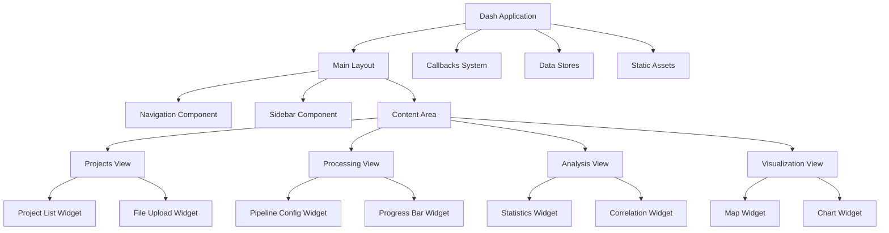

# Интерфейсный слой Dash компонентов для GOP GUI

## 1. Архитектура интерфейсного слоя

### 1.1 Компонентная архитектура



### 1.2 Технологический стек интерфейса

- **Фреймворк**: Dash 2.14+
- **Компоненты**: Dash Bootstrap Components 1.5+
- **Графики**: Plotly 5.15+
- **Стили**: Bootstrap 5.1+ + Custom CSS
- **Интерактивность**: JavaScript utilities
- **Иконки**: Font Awesome 6.0+

## 2. Основные макеты интерфейса

### 2.1 Главный макет

#### [`src/layouts/main_layout.py`](src/layouts/main_layout.py)
```python
"""
Главный макет интерфейса GOP GUI
"""

import dash_bootstrap_components as dbc
from dash import html, dcc

def create_main_layout():
    """Создание главного макета приложения"""
    return html.Div([
        # Глобальные хранилища данных
        dcc.Store(id='session-store', storage_type='session'),
        dcc.Store(id='current-project-store'),
        dcc.Store(id='processing-state-store'),
        dcc.Store(id='analysis-results-store'),
        
        # Навигационная панель
        create_navigation_bar(),
        
        # Основной контейнер
        html.Div([
            # Боковая панель
            create_sidebar(),
            
            # Область контента
            create_content_area()
        ], className="main-container d-flex"),
        
        # Модальные окна
        create_modals(),
        
        # Уведомления
        dbc.Toast(
            id="global-notification",
            header="Уведомление",
            is_open=False,
            dismissable=True,
            duration=4000,
            style={"position": "fixed", "top": 66, "right": 10, "width": 350}
        ),
        
        # Загрузочный экран
        create_loading_screen()
    ], className="app-container")

def create_navigation_bar():
    """Создание навигационной панели"""
    return dbc.Navbar(
        [
            # Логотип и название
            html.A(
                dbc.Row([
                    dbc.Col(html.I(className="fas fa-satellite fa-2x")),
                    dbc.Col(dbc.NavbarBrand("GOP - Гиперспектральная обработка")),
                ], align="center", className="g-0"),
                href="#",
                style={"textDecoration": "none"},
            ),
            
            # Навигационные ссылки
            dbc.Nav([
                dbc.NavItem(dbc.NavLink("Проекты", href="/projects", id="nav-projects")),
                dbc.NavItem(dbc.NavLink("Обработка", href="/processing", id="nav-processing")),
                dbc.NavItem(dbc.NavLink("Анализ", href="/analysis", id="nav-analysis")),
                dbc.NavItem(dbc.NavLink("Визуализация", href="/visualization", id="nav-visualization")),
            ], navbar=True),
            
            # Панель пользователя
            dbc.DropdownMenu(
                [
                    dbc.DropdownMenuItem("Профиль", href="#"),
                    dbc.DropdownMenuItem("Настройки", href="#"),
                    dbc.DropdownMenuItem(divider=True),
                    dbc.DropdownMenuItem("Выйти", href="#"),
                ],
                nav=True,
                in_navbar=True,
                label="Пользователь",
                align_end=True,
            ),
        ],
        color="primary",
        dark=True,
        sticky="top",
        className="mb-3"
    )

def create_sidebar():
    """Создание боковой панели"""
    return html.Div([
        dbc.Card([
            dbc.CardHeader("Быстрый доступ"),
            dbc.CardBody([
                dbc.Button("Новый проект", id="btn-new-project", color="primary", className="w-100 mb-2"),
                dbc.Button("Загрузить данные", id="btn-upload-data", color="secondary", className="w-100 mb-2"),
                html.Hr(),
                html.H6("Активные задачи"),
                html.Div(id="active-tasks-list"),
                html.Hr(),
                html.H6("Системная информация"),
                html.Div(id="system-info")
            ])
        ])
    ], className="sidebar", id="sidebar")

def create_content_area():
    """Создание области контента"""
    return html.Div([
        # Динамическое содержимое на основе URL
        dcc.Location(id='url', refresh=False),
        html.Div(id='page-content', className="content-area")
    ], className="content-container flex-grow-1")

def create_modals():
    """Создание модальных окон"""
    return html.Div([
        # Модальное окно создания проекта
        dbc.Modal([
            dbc.ModalHeader(dbc.ModalTitle("Создание нового проекта")),
            dbc.ModalBody(create_project_modal_content()),
            dbc.ModalFooter([
                dbc.Button("Отмена", id="cancel-project-modal", color="secondary"),
                dbc.Button("Создать", id="create-project-modal", color="primary"),
            ]),
        ], id="project-modal", size="lg"),
        
        # Модальное окно загрузки файлов
        dbc.Modal([
            dbc.ModalHeader(dbc.ModalTitle("Загрузка данных")),
            dbc.ModalBody(create_upload_modal_content()),
            dbc.ModalFooter([
                dbc.Button("Отмена", id="cancel-upload-modal", color="secondary"),
                dbc.Button("Загрузить", id="confirm-upload-modal", color="primary"),
            ]),
        ], id="upload-modal", size="xl"),
    ])

def create_loading_screen():
    """Создание загрузочного экрана"""
    return dcc.Loading(
        id="global-loading",
        type="circle",
        children=html.Div(id="loading-output"),
        style={"position": "fixed", "top": "50%", "left": "50%", "transform": "translate(-50%, -50%)"}
    )
```

## 3. Компоненты представлений

### 3.1 Представление проектов

#### [`src/components/projects_view.py`](src/components/projects_view.py)
```python
"""
Компонент представления проектов
"""

import dash_bootstrap_components as dbc
from dash import html, dcc

def create_projects_view():
    """Создание представления проектов"""
    return html.Div([
        # Заголовок и кнопки действий
        dbc.Row([
            dbc.Col(html.H2("Управление проектами"), width="auto"),
            dbc.Col(dbc.Button("+ Новый проект", id="btn-create-project", color="success"), width="auto"),
        ], className="mb-4 align-items-center"),
        
        # Фильтры и поиск
        create_projects_filters(),
        
        # Список проектов
        html.Div(id="projects-list-container", className="mt-3"),
        
        # Детали проекта
        html.Div(id="project-details-modal")
    ])

def create_projects_filters():
    """Создание фильтров проектов"""
    return dbc.Card([
        dbc.CardBody([
            dbc.Row([
                dbc.Col([
                    dbc.InputGroup([
                        dbc.InputGroupText("Поиск"),
                        dbc.Input(id="project-search", placeholder="Название проекта...")
                    ])
                ], md=4),
                dbc.Col([
                    dbc.InputGroup([
                        dbc.InputGroupText("Статус"),
                        dbc.Select(
                            id="project-status-filter",
                            options=[
                                {"label": "Все", "value": "all"},
                                {"label": "Активные", "value": "active"},
                                {"label": "Завершенные", "value": "completed"},
                                {"label": "Ошибки", "value": "error"}
                            ],
                            value="all"
                        )
                    ])
                ], md=3),
                dbc.Col([
                    dbc.InputGroup([
                        dbc.InputGroupText("Сортировка"),
                        dbc.Select(
                            id="project-sort",
                            options=[
                                {"label": "По дате создания", "value": "created"},
                                {"label": "По названию", "value": "name"},
                                {"label": "По статусу", "value": "status"}
                            ],
                            value="created"
                        )
                    ])
                ], md=3),
            ])
        ])
    ])

def create_project_card(project):
    """Создание карточки проекта"""
    status_colors = {
        'created': 'secondary',
        'processing': 'warning', 
        'completed': 'success',
        'error': 'danger'
    }
    
    return dbc.Card([
        dbc.CardHeader([
            dbc.Row([
                dbc.Col(html.H5(project['name'], className="mb-0")),
                dbc.Col([
                    dbc.Badge(project['status'], color=status_colors.get(project['status'], 'secondary')),
                ], width="auto")
            ])
        ]),
        dbc.CardBody([
            html.P(project.get('description', 'Без описания'), className="card-text"),
            html.Div([
                html.Small(f"Файлов: {project.get('file_count', 0)}"),
                html.Br(),
                html.Small(f"Создан: {project['created_at']}"),
            ], className="text-muted")
        ]),
        dbc.CardFooter([
            dbc.ButtonGroup([
                dbc.Button("Открыть", color="primary", size="sm", id={"type": "open-project", "index": project['id']}),
                dbc.Button("Удалить", color="danger", size="sm", id={"type": "delete-project", "index": project['id']}),
            ])
        ])
    ], className="mb-3")
```

### 3.2 Представление обработки данных

#### [`src/components/processing_view.py`](src/components/processing_view.py)
```python
"""
Компонент представления обработки данных
"""

import dash_bootstrap_components as dbc
from dash import html, dcc

def create_processing_view():
    """Создание представления обработки данных"""
    return html.Div([
        # Заголовок и информация о проекте
        dbc.Row([
            dbc.Col(html.H2("Обработка гиперспектральных данных"), width="auto"),
            dbc.Col(html.Div(id="current-project-info"), width="auto"),
        ], className="mb-4"),
        
        # Конфигурация пайплайна
        create_pipeline_configuration(),
        
        # Прогресс обработки
        create_processing_progress(),
        
        # Результаты обработки
        html.Div(id="processing-results", className="mt-4")
    ])

def create_pipeline_configuration():
    """Создание конфигурации пайплайна"""
    return dbc.Card([
        dbc.CardHeader("Конфигурация обработки"),
        dbc.CardBody([
            dbc.Row([
                dbc.Col([
                    html.H6("Тип сенсора"),
                    dbc.Select(
                        id="sensor-type-select",
                        options=[
                            {"label": "Гиперспектральный", "value": "Hyperspectral"},
                            {"label": "Мультиспектральный", "value": "Multispectral"},
                            {"label": "RGB", "value": "RGB"}
                        ],
                        value="Hyperspectral"
                    )
                ], md=3),
                dbc.Col([
                    html.H6("Этапы обработки"),
                    dbc.Checklist(
                        id="processing-steps",
                        options=[
                            {"label": "Предобработка", "value": "preprocessing"},
                            {"label": "Создание ортофотоплана", "value": "orthophoto"},
                            {"label": "Сегментация", "value": "segmentation"},
                            {"label": "Расчет индексов", "value": "indices"}
                        ],
                        value=["preprocessing", "orthophoto", "segmentation", "indices"],
                        inline=True
                    )
                ], md=6),
            ]),
            
            # Дополнительные параметры
            html.Div(id="advanced-parameters", className="mt-3"),
            
            # Кнопка запуска
            dbc.Row([
                dbc.Col(dbc.Button("Запустить обработку", id="btn-start-processing", color="success", size="lg"), width="auto"),
            ], className="mt-3 justify-content-center")
        ])
    ])

def create_processing_progress():
    """Создание компонента прогресса обработки"""
    return dbc.Card([
        dbc.CardHeader("Ход обработки"),
        dbc.CardBody([
            # Общий прогресс
            html.Div([
                html.H6("Общий прогресс"),
                dbc.Progress(id="overall-progress", value=0, className="mb-2"),
                html.Div(id="overall-progress-text", className="small text-muted")
            ]),
            
            # Прогресс по этапам
            html.Div(id="step-progress-container", className="mt-3"),
            
            # Лог обработки
            html.Div([
                html.H6("Лог обработки"),
                html.Div(id="processing-log", className="log-container")
            ], className="mt-3")
        ])
    ])
```

## 4. Специализированные виджеты

### 4.1 Виджет загрузки файлов

#### [`src/components/file_upload_widget.py`](src/components/file_upload_widget.py)
```python
"""
Виджет загрузки файлов
"""

import dash_bootstrap_components as dbc
from dash import html, dcc

def create_file_upload_widget():
    """Создание виджета загрузки файлов"""
    return dcc.Upload(
        id='file-upload-widget',
        children=create_upload_area(),
        multiple=True,
        accept='.bil,.hdr,.tif,.tiff,.dat,.json',
        style=upload_widget_style()
    )

def create_upload_area():
    """Создание области загрузки"""
    return html.Div([
        html.Div([
            html.I(className="fas fa-cloud-upload-alt fa-3x mb-3"),
            html.H5("Перетащите файлы сюда"),
            html.P("или нажмите для выбора файлов", className="text-muted"),
            html.P("Поддерживаемые форматы: BIL/HDR, TIFF, DAT", className="small")
        ], className="upload-area-content")
    ], className="upload-area")

def upload_widget_style():
    """Стили виджета загрузки"""
    return {
        'width': '100%',
        'height': '200px',
        'lineHeight': '200px',
        'borderWidth': '2px',
        'borderStyle': 'dashed',
        'borderRadius': '10px',
        'textAlign': 'center',
        'margin': '10px 0',
        'cursor': 'pointer',
        'backgroundColor': '#f8f9fa',
        'borderColor': '#6c757d'
    }

def create_file_list(files):
    """Создание списка загруженных файлов"""
    if not files:
        return html.Div("Файлы не загружены", className="text-muted")
    
    file_items = []
    for file in files:
        file_items.append(create_file_item(file))
    
    return html.Div(file_items, className="file-list")

def create_file_item(file_info):
    """Создание элемента списка файлов"""
    return dbc.Card([
        dbc.CardBody([
            dbc.Row([
                dbc.Col([
                    html.Div([
                        html.I(className="fas fa-file-alt me-2"),
                        html.Strong(file_info['name'])
                    ])
                ], width=6),
                dbc.Col([
                    html.Small(f"Размер: {format_file_size(file_info['size'])}")
                ], width=3),
                dbc.Col([
                    dbc.Badge(file_info['status'], color=get_status_color(file_info['status']))
                ], width=3)
            ])
        ])
    ], className="mb-2")

def format_file_size(size_bytes):
    """Форматирование размера файла"""
    for unit in ['B', 'KB', 'MB', 'GB']:
        if size_bytes < 1024.0:
            return f"{size_bytes:.1f} {unit}"
        size_bytes /= 1024.0
    return f"{size_bytes:.1f} TB"

def get_status_color(status):
    """Получение цвета статуса"""
    colors = {
        'uploaded': 'secondary',
        'validating': 'warning',
        'valid': 'success',
        'invalid': 'danger'
    }
    return colors.get(status, 'secondary')
```

### 4.2 Виджет визуализации индексов

#### [`src/components/visualization_widget.py`](src/components/visualization_widget.py)
```python
"""
Виджет визуализации вегетационных индексов
"""

import dash_bootstrap_components as dbc
from dash import html, dcc
import plotly.graph_objects as go

def create_visualization_widget():
    """Создание виджета визуализации"""
    return dbc.Card([
        dbc.CardHeader("Визуализация вегетационных индексов"),
        dbc.CardBody([
            # Панель управления
            create_visualization_controls(),
            
            # Графики
            dbc.Tabs([
                dbc.Tab(create_map_tab(), label="Карта индексов"),
                dbc.Tab(create_chart_tab(), label="Графики"),
                dbc.Tab(create_statistics_tab(), label="Статистика"),
            ])
        ])
    ])

def create_visualization_controls():
    """Создание панели управления визуализацией"""
    return dbc.Row([
        dbc.Col([
            html.Label("Индекс"),
            dcc.Dropdown(
                id="index-selector",
                options=[
                    {"label": "GNDVI", "value": "GNDVI"},
                    {"label": "NDWI", "value": "NDWI"},
                    {"label": "MCARI", "value": "MCARI"},
                    {"label": "OSAVI", "value": "OSAVI"}
                ],
                value="GNDVI"
            )
        ], md=3),
        dbc.Col([
            html.Label("Цветовая схема"),
            dcc.Dropdown(
                id="colormap-selector",
                options=[
                    {"label": "Viridis", "value": "viridis"},
                    {"label": "Plasma", "value": "plasma"},
                    {"label": "Inferno", "value": "inferno"},
                    {"label": "RdYlGn", "value": "RdYlGn"}
                ],
                value="viridis"
            )
        ], md=3),
        dbc.Col([
            html.Label("Диапазон значений"),
            dcc.RangeSlider(
                id="value-range-slider",
                min=0,
                max=1,
                step=0.01,
                value=[0, 1],
                marks={i/10: str(i/10) for i in range(0, 11)}
            )
        ], md=6),
    ], className="mb-3")

def create_map_tab():
    """Создание вкладки с картой"""
    return html.Div([
        dcc.Graph(
            id="index-map",
            config={
                'displayModeBar': True,
                'modeBarButtonsToAdd': ['drawline', 'drawopenpath', 'drawclosedpath', 'drawcircle', 'drawrect', 'eraseshape']
            }
        ),
        html.Div([
            dbc.Button("Экспорт изображения", id="btn-export-map"),
            dbc.Button("Сохранить настройки", id="btn-save-map-settings"),
        ], className="mt-2")
    ])

def create_chart_tab():
    """Создание вкладки с графиками"""
    return html.Div([
        dbc.Row([
            dbc.Col(dcc.Graph(id="histogram-chart"), md=6),
            dbc.Col(dcc.Graph(id="distribution-chart"), md=6),
        ]),
        dbc.Row([
            dbc.Col(dcc.Graph(id="correlation-chart"), md=12),
        ])
    ])

def create_default_map():
    """Создание карты по умолчанию"""
    fig = go.Figure()
    fig.update_layout(
        title="Карта вегетационного индекса",
        xaxis_title="X координата",
        yaxis_title="Y координата",
        template="plotly_white"
    )
    return fig
```

## 5. Система колбэков

### 5.1 Основные колбэки

#### [`src/callbacks/main_callbacks.py`](src/callbacks/main_callbacks.py)
```python
"""
Основные колбэки приложения
"""

from dash import Input, Output, State, callback, ctx
import dash_bootstrap_components as dbc

@callback(
    Output('page-content', 'children'),
    Input('url', 'pathname')
)
def display_page(pathname):
    """Отображение страницы на основе URL"""
    if pathname == '/processing':
        from src.components.processing_view import create_processing_view
        return create_processing_view()
    elif pathname == '/analysis':
        from src.components.analysis_view import create_analysis_view
        return create_analysis_view()
    elif pathname == '/visualization':
        from src.components.visualization_view import create_visualization_view
        return create_visualization_view()
    else:  # /projects или корень
        from src.components.projects_view import create_projects_view
        return create_projects_view()

@callback(
    Output('project-modal', 'is_open'),
    Input('btn-create-project', 'n_clicks'),
    Input('cancel-project-modal', 'n_clicks'),
    Input('create-project-modal', 'n_clicks'),
    State('project-modal', 'is_open')
)
def toggle_project_modal(create_clicks, cancel_clicks, confirm_clicks, is_open):
    """Управление модальным окном проекта"""
    if ctx.triggered_id in ['btn-create-project', 'create-project-modal']:
        return not is_open
    return False

@callback(
    Output('global-notification', 'is_open'),
    Output('global-notification', 'header'),
    Output('global-notification', 'children'),
    Input('notification-trigger', 'data')
)
def show_notification(notification_data):
    """Показать глобальное уведомление"""
    if notification_data:
        return True, notification_data.get('title', 'Уведомление'), notification_data.get('message', '')
    return False, '', ''
```

### 5.2 Колбэки обработки данных

#### [`src/callbacks/processing_callbacks.py`](src/callbacks/processing_callbacks.py)
```python
"""
Колбэки для обработки данных
"""

from dash import Input, Output, State, callback
import json

@callback(
    Output('processing-results', 'children'),
    Output('processing-state-store', 'data'),
    Input('btn-start-processing', 'n_clicks'),
    State('sensor-type-select', 'value'),
    State('processing-steps', 'value'),
    State('current-project-store', 'data'),
    prevent_initial_call=True
)
def start_processing(n_clicks, sensor_type, processing_steps, project_data):
    """Запуск обработки данных"""
    if not n_clicks or not project_data:
        return "Выберите проект для обработки", None
    
    # Подготовка конфигурации
    config = {
        'project_id': project_data['id'],
        'sensor_type': sensor_type,
        'processing_steps': processing_steps,
        'parameters': {
            'radiometric_correction': {'method': 'empirical_line'},
            'noise_reduction': {'method': 'pca', 'n_components': 0.95}
        }
    }
    
    # Запуск асинхронной задачи
    try:
        from src.tasks.processing_tasks import process_pipeline
        task = process_pipeline.delay(config)
        
        # Сохранение состояния
        state = {
            'task_id': task.id,
            'status': 'queued',
            'project_id': project_data['id']
        }
        
        return "Обработка запущена...", state
        
    except Exception as e:
        return f"Ошибка запуска обработки: {str(e)}", None

@callback(
    Output('overall-progress', 'value'),
    Output('overall-progress-text', 'children'),
    Output('step-progress-container', 'children'),
    Output('processing-log', 'children'),
    Input('interval-component', 'n_intervals'),
    State('processing-state-store', 'data')
)
def update_progress(n_intervals, processing_state):
    """Обновление прогресса обработки"""
    if not processing_state or 'task_id' not in processing_state:
        return 0, "Ожидание запуска...", "", ""
    
    try:
        from celery.result import AsyncResult
        task = AsyncResult(processing_state['task_id'])
        
        if task.status == 'SUCCESS':
            progress = 100
            progress_text = "Обработка завершена"
            steps = create_completed_steps()
            log = "Все этапы выполнены успешно"
            
        elif task.status == 'PROGRESS':
            progress_info = task.result.get('progress', {})
            progress = progress_info.get('overall', 0)
            progress_text = f"Прогресс: {progress}%"
            steps = create_step_progress(progress_info.get('steps', {}))
            log = create_processing_log(progress_info.get('log', []))
            
        else:
            progress = 0
            progress_text = f"Статус: {task.status}"
            steps = ""
            log = ""
        
        return progress, progress_text, steps, log
        
    except Exception as e:
        return 0, f"Ошибка: {str(e)}", "", ""
```

Этот интерфейсный слой предоставляет полный набор компонентов для создания современного веб-интерфейса GOP, включая навигацию, управление проектами, обработку данных, анализ и визуализацию с использованием технологии Dash и Bootstrap.