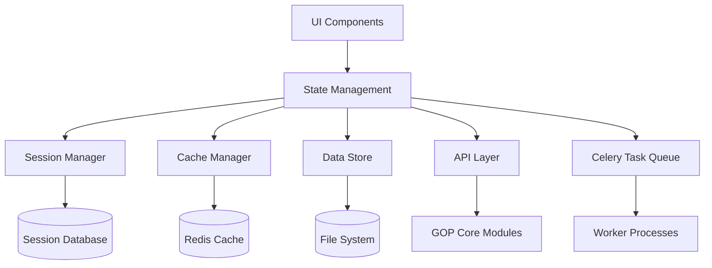

# Слой данных и управления состоянием для GOP GUI

## 1. Архитектура управления данными

### 1.1 Общая архитектура данных



### 1.2 Компоненты управления состоянием

- **Session Manager**: Управление сессиями пользователей
- **Cache Manager**: Многоуровневое кэширование
- **Data Store**: Хранение проектов и результатов
- **State Synchronization**: Синхронизация между компонентами
- **Data Validation**: Валидация и очистка данных

## 2. Менеджер сессий

### 2.1 Расширенная реализация Session Manager

#### [`src/core/session_manager.py`](src/core/session_manager.py)
```python
"""
Расширенный менеджер сессий с поддержкой проектов и настроек
"""

import uuid
import json
from datetime import datetime, timedelta
from typing import Dict, Any, List, Optional
from sqlalchemy import create_engine, Column, String, DateTime, JSON, Text
from sqlalchemy.ext.declarative import declarative_base
from sqlalchemy.orm import sessionmaker, scoped_session

Base = declarative_base()

class UserSession(Base):
    """Модель сессии пользователя с расширенными полями"""
    __tablename__ = 'user_sessions'
    
    session_id = Column(String(36), primary_key=True)
    user_id = Column(String(36), nullable=True)
    created_at = Column(DateTime, default=datetime.utcnow)
    last_accessed = Column(DateTime, default=datetime.utcnow)
    expires_at = Column(DateTime)
    ip_address = Column(String(45))
    user_agent = Column(Text)
    session_data = Column(JSON)

class Project(Base):
    """Модель проекта"""
    __tablename__ = 'projects'
    
    id = Column(String(36), primary_key=True)
    session_id = Column(String(36))
    name = Column(String(255), nullable=False)
    description = Column(Text)
    status = Column(String(50), default='created')
    created_at = Column(DateTime, default=datetime.utcnow)
    updated_at = Column(DateTime, default=datetime.utcnow, onupdate=datetime.utcnow)
    metadata = Column(JSON)
    files = Column(JSON)  # Список файлов проекта

class SessionManager:
    """Расширенный менеджер сессий с поддержкой проектов"""
    
    def __init__(self, database_url: str = 'sqlite:///gop_gui.db'):
        self.engine = create_engine(database_url)
        self.session_factory = sessionmaker(bind=self.engine)
        self.Session = scoped_session(self.session_factory)
        Base.metadata.create_all(self.engine)
    
    def create_session(self, user_id: Optional[str] = None, 
                      ip_address: str = None, 
                      user_agent: str = None,
                      expires_hours: int = 24) -> str:
        """Создание новой сессии с расширенными параметрами"""
        session_id = str(uuid.uuid4())
        expires_at = datetime.utcnow() + timedelta(hours=expires_hours)
        
        session_data = {
            'user_id': user_id,
            'created_at': datetime.utcnow().isoformat(),
            'last_accessed': datetime.utcnow().isoformat(),
            'projects': [],
            'current_project': None,
            'preferences': {
                'theme': 'light',
                'language': 'ru',
                'default_sensor_type': 'Hyperspectral',
                'auto_save': True
            },
            'recent_files': [],
            'processing_history': []
        }
        
        db_session = self.Session()
        user_session = UserSession(
            session_id=session_id,
            user_id=user_id,
            expires_at=expires_at,
            ip_address=ip_address,
            user_agent=user_agent,
            session_data=session_data
        )
        
        db_session.add(user_session)
        db_session.commit()
        db_session.close()
        
        return session_id
    
    def get_session(self, session_id: str) -> Optional[Dict[str, Any]]:
        """Получение данных сессии с обновлением времени доступа"""
        db_session = self.Session()
        user_session = db_session.query(UserSession).filter_by(session_id=session_id).first()
        
        if not user_session or user_session.expires_at < datetime.utcnow():
            db_session.close()
            return None
        
        # Обновление времени доступа
        user_session.last_accessed = datetime.utcnow()
        db_session.commit()
        db_session.close()
        
        return user_session.session_data
    
    def create_project(self, session_id: str, name: str, description: str = '', 
                      metadata: Dict[str, Any] = None) -> Dict[str, Any]:
        """Создание нового проекта в сессии"""
        project_id = str(uuid.uuid4())
        project_data = {
            'id': project_id,
            'name': name,
            'description': description,
            'metadata': metadata or {},
            'status': 'created',
            'created_at': datetime.utcnow().isoformat(),
            'files': [],
            'processing_results': {}
        }
        
        # Сохранение в базу данных
        db_session = self.Session()
        project = Project(
            id=project_id,
            session_id=session_id,
            name=name,
            description=description,
            metadata=metadata or {},
            files=[]
        )
        db_session.add(project)
        db_session.commit()
        db_session.close()
        
        # Обновление сессии
        session_data = self.get_session(session_id)
        if session_data:
            session_data['projects'].append(project_data)
            session_data['current_project'] = project_id
            self.update_session(session_id, session_data)
        
        return project_data
    
    def get_project(self, session_id: str, project_id: str) -> Optional[Dict[str, Any]]:
        """Получение проекта по ID"""
        db_session = self.Session()
        project = db_session.query(Project).filter_by(id=project_id, session_id=session_id).first()
        db_session.close()
        
        if project:
            return {
                'id': project.id,
                'name': project.name,
                'description': project.description,
                'status': project.status,
                'created_at': project.created_at.isoformat(),
                'updated_at': project.updated_at.isoformat(),
                'metadata': project.metadata or {},
                'files': project.files or []
            }
        return None
    
    def update_project_status(self, session_id: str, project_id: str, 
                            status: str, results: Dict[str, Any] = None):
        """Обновление статуса проекта и результатов"""
        db_session = self.Session()
        project = db_session.query(Project).filter_by(id=project_id, session_id=session_id).first()
        
        if project:
            project.status = status
            project.updated_at = datetime.utcnow()
            
            if results:
                # Обновление результатов обработки
                current_metadata = project.metadata or {}
                current_metadata['processing_results'] = results
                project.metadata = current_metadata
            
            db_session.commit()
        
        db_session.close()
    
    def cleanup_expired_sessions(self):
        """Очистка просроченных сессий"""
        db_session = self.Session()
        expired_sessions = db_session.query(UserSession).filter(
            UserSession.expires_at < datetime.utcnow()
        ).all()
        
        for session in expired_sessions:
            db_session.delete(session)
        
        db_session.commit()
        db_session.close()
```

## 3. Многоуровневый кэш-менеджер

### 3.1 Расширенный Cache Manager

#### [`src/core/cache_manager.py`](src/core/cache_manager.py)
```python
"""
Многоуровневый кэш-менеджер с поддержкой различных стратегий
"""

import json
import pickle
import hashlib
from datetime import datetime, timedelta
from typing import Any, Optional, Callable
import redis
from threading import Lock

class MultiLevelCache:
    """Многоуровневый кэш с локальным и распределенным хранением"""
    
    def __init__(self, redis_url: str = 'redis://localhost:6379/0', 
                 local_ttl: int = 300,  # 5 минут для локального кэша
                 redis_ttl: int = 3600):  # 1 час для Redis
        self.redis_client = redis.from_url(redis_url)
        self.local_cache = {}
        self.local_ttl = local_ttl
        self.redis_ttl = redis_ttl
        self.lock = Lock()
        
        # Статистика использования
        self.stats = {
            'local_hits': 0,
            'redis_hits': 0,
            'misses': 0,
            'sets': 0
        }
    
    def get(self, key: str, use_local: bool = True) -> Optional[Any]:
        """Получение данных из кэша с многоуровневым поиском"""
        cache_key = self._normalize_key(key)
        
        # Поиск в локальном кэше
        if use_local:
            with self.lock:
                if cache_key in self.local_cache:
                    cached_item = self.local_cache[cache_key]
                    if self._is_valid(cached_item):
                        self.stats['local_hits'] += 1
                        return cached_item['data']
                    else:
                        del self.local_cache[cache_key]
        
        # Поиск в Redis
        try:
            cached_data = self.redis_client.get(cache_key)
            if cached_data:
                cached_item = pickle.loads(cached_data)
                if self._is_valid(cached_item):
                    # Сохранение в локальный кэш
                    with self.lock:
                        self.local_cache[cache_key] = cached_item
                    self.stats['redis_hits'] += 1
                    return cached_item['data']
                else:
                    self.redis_client.delete(cache_key)
        except (pickle.PickleError, redis.RedisError):
            pass
        
        self.stats['misses'] += 1
        return None
    
    def set(self, key: str, data: Any, ttl: Optional[int] = None, 
           use_local: bool = True):
        """Сохранение данных в кэш"""
        cache_key = self._normalize_key(key)
        if ttl is None:
            ttl = self.redis_ttl
        
        cache_item = {
            'data': data,
            'created_at': datetime.now().isoformat(),
            'ttl': ttl
        }
        
        # Сохранение в локальный кэш
        if use_local:
            with self.lock:
                self.local_cache[cache_key] = cache_item
        
        # Сохранение в Redis
        try:
            serialized_data = pickle.dumps(cache_item)
            self.redis_client.setex(cache_key, ttl, serialized_data)
        except (pickle.PickleError, redis.RedisError):
            pass
        
        self.stats['sets'] += 1
    
    def get_or_set(self, key: str, factory: Callable[[], Any], 
                  ttl: Optional[int] = None) -> Any:
        """Получить данные или установить с помощью фабрики"""
        cached_data = self.get(key)
        if cached_data is not None:
            return cached_data
        
        data = factory()
        self.set(key, data, ttl)
        return data
    
    def invalidate(self, key: str):
        """Инвалидация кэша по ключу"""
        cache_key = self._normalize_key(key)
        
        with self.lock:
            if cache_key in self.local_cache:
                del self.local_cache[cache_key]
        
        try:
            self.redis_client.delete(cache_key)
        except redis.RedisError:
            pass
    
    def invalidate_pattern(self, pattern: str):
        """Инвалидация кэша по шаблону"""
        try:
            keys = self.redis_client.keys(pattern)
            if keys:
                self.redis_client.delete(*keys)
        except redis.RedisError:
            pass
        
        # Инвалидация локального кэша по шаблону
        with self.lock:
            keys_to_remove = [k for k in self.local_cache.keys() if pattern in k]
            for key in keys_to_remove:
                del self.local_cache[key]
    
    def _normalize_key(self, key: str) -> str:
        """Нормализация ключа кэша"""
        if isinstance(key, str):
            return hashlib.md5(key.encode()).hexdigest()
        return str(key)
    
    def _is_valid(self, cache_item: Dict[str, Any]) -> bool:
        """Проверка валидности кэшированных данных"""
        created_at = datetime.fromisoformat(cache_item['created_at'])
        expires_at = created_at + timedelta(seconds=cache_item['ttl'])
        return datetime.now() < expires_at
    
    def get_stats(self) -> Dict[str, int]:
        """Получение статистики кэша"""
        return self.stats.copy()
    
    def clear_stats(self):
        """Очистка статистики"""
        self.stats = {'local_hits': 0, 'redis_hits': 0, 'misses': 0, 'sets': 0}

class CacheManager:
    """Менеджер кэша с специализированными методами для GOP"""
    
    def __init__(self, redis_url: str = 'redis://localhost:6379/0'):
        self.cache = MultiLevelCache(redis_url)
        
        # Префиксы для различных типов данных
        self.prefixes = {
            'project': 'project:',
            'file': 'file:',
            'processing': 'processing:',
            'analysis': 'analysis:',
            'visualization': 'visualization:'
        }
    
    # Специализированные методы для проектов
    def cache_project_data(self, project_id: str, data: Any, ttl: int = 3600):
        """Кэширование данных проекта"""
        key = f"{self.prefixes['project']}{project_id}"
        self.cache.set(key, data, ttl)
    
    def get_project_data(self, project_id: str) -> Optional[Any]:
        """Получение кэшированных данных проекта"""
        key = f"{self.prefixes['project']}{project_id}"
        return self.cache.get(key)
    
    def invalidate_project_cache(self, project_id: str):
        """Инвалидация кэша проекта"""
        key = f"{self.prefixes['project']}{project_id}"
        self.cache.invalidate(key)
    
    # Специализированные методы для обработки
    def cache_processing_result(self, task_id: str, result: Any, ttl: int = 7200):
        """Кэширование результатов обработки"""
        key = f"{self.prefixes['processing']}{task_id}"
        self.cache.set(key, result, ttl)
    
    def get_processing_result(self, task_id: str) -> Optional[Any]:
        """Получение кэшированных результатов обработки"""
        key = f"{self.prefixes['processing']}{task_id}"
        return self.cache.get(key)
    
    # Специализированные методы для визуализации
    def cache_visualization(self, viz_id: str, data: Any, ttl: int = 86400):
        """Кэширование визуализаций"""
        key = f"{self.prefixes['visualization']}{viz_id}"
        self.cache.set(key, data, ttl)
    
    def get_visualization(self, viz_id: str) -> Optional[Any]:
        """Получение кэшированных визуализаций"""
        key = f"{self.prefixes['visualization']}{viz_id}"
        return self.cache.get(key)
```

## 4. Управление состоянием приложения

### 4.1 Централизованный State Manager

#### [`src/core/state_manager.py`](src/core/state_manager.py)
```python
"""
Централизованный менеджер состояния приложения
"""

import json
from typing import Dict, Any, Optional, Callable
from datetime import datetime
from threading import Lock

class AppState:
    """Класс для хранения состояния приложения"""
    
    def __init__(self):
        self._state = {
            'session': None,
            'current_project': None,
            'processing_tasks': {},
            'ui_state': {
                'current_view': 'projects',
                'sidebar_collapsed': False,
                'theme': 'light'
            },
            'notifications': [],
            'user_preferences': {}
        }
        self._listeners = {}
        self._lock = Lock()
    
    def get(self, path: str, default: Any = None) -> Any:
        """Получение значения по пути"""
        keys = path.split('.')
        value = self._state
        
        try:
            for key in keys:
                value = value[key]
            return value
        except (KeyError, TypeError):
            return default
    
    def set(self, path: str, value: Any, notify: bool = True):
        """Установка значения по пути"""
        keys = path.split('.')
        current = self._state
        
        with self._lock:
            for key in keys[:-1]:
                if key not in current:
                    current[key] = {}
                current = current[key]
            
            current[keys[-1]] = value
        
        # Уведомление слушателей
        if notify:
            self._notify_listeners(path, value)
    
    def update(self, path: str, updates: Dict[str, Any], notify: bool = True):
        """Обновление словаря по пути"""
        current = self.get(path, {})
        if isinstance(current, dict):
            current.update(updates)
            self.set(path, current, notify)
    
    def subscribe(self, path: str, callback: Callable[[Any], None]):
        """Подписка на изменения по пути"""
        if path not in self._listeners:
            self._listeners[path] = []
        self._listeners[path].append(callback)
    
    def unsubscribe(self, path: str, callback: Callable[[Any], None]):
        """Отписка от изменений по пути"""
        if path in self._listeners:
            self._listeners[path].remove(callback)
    
    def _notify_listeners(self, path: str, value: Any):
        """Уведомление слушателей об изменении"""
        if path in self._listeners:
            for callback in self._listeners[path]:
                try:
                    callback(value)
                except Exception as e:
                    print(f"Error in state listener: {e}")
    
    def to_dict(self) -> Dict[str, Any]:
        """Экспорт состояния в словарь"""
        return self._state.copy()
    
    def from_dict(self, state_dict: Dict[str, Any]):
        """Импорт состояния из словаря"""
        with self._lock:
            self._state.update(state_dict)

class StateManager:
    """Менеджер состояния с интеграцией сессий и кэша"""
    
    def __init__(self, session_manager, cache_manager):
        self.session_manager = session_manager
        self.cache_manager = cache_manager
        self.app_state = AppState()
        
        # Восстановление состояния из сессии
        self._restore_from_session()
    
    def _restore_from_session(self):
        """Восстановление состояния из сессии"""
        # Этот метод будет вызываться при инициализации
        # для восстановления состояния пользователя
        pass
    
    def set_current_project(self, project_id: str):
        """Установка текущего проекта"""
        self.app_state.set('current_project', project_id)
        
        # Кэширование данных проекта
        project_data = self.session_manager.get_project(
            self.get_session_id(), project_id
        )
        if project_data:
            self.cache_manager.cache_project_data(project_id, project_data)
    
    def get_current_project(self) -> Optional[Dict[str, Any]]:
        """Получение текущего проекта"""
        project_id = self.app_state.get('current_project')
        if project_id:
            # Попытка получить из кэша
            cached_data = self.cache_manager.get_project_data(project_id)
            if cached_data:
                return cached_data
            
            # Получение из базы данных
            project_data = self.session_manager.get_project(
                self.get_session_id(), project_id
            )
            if project_data:
                self.cache_manager.cache_project_data(project_id, project_data)
                return project_data
        
        return None
    
    def add_processing_task(self, task_id: str, task_data: Dict[str, Any]):
        """Добавление задачи обработки"""
        self.app_state.update('processing_tasks', {task_id: task_data})
    
    def update_processing_task(self, task_id: str, updates: Dict[str, Any]):
        """Обновление задачи обработки"""
        current_tasks = self.app_state.get('processing_tasks', {})
        if task_id in current_tasks:
            current_tasks[task_id].update(updates)
            self.app_state.set('processing_tasks', current_tasks)
    
    def add_notification(self, title: str, message: str, type: str = 'info'):
        """Добавление уведомления"""
        notification = {
            'id': str(hash(f"{title}{message}{datetime.now()}")),
            'title': title,
            'message': message,
            'type': type,
            'timestamp': datetime.now().isoformat(),
            'read': False
        }
        
        notifications = self.app_state.get('notifications', [])
        notifications.append(notification)
        self.app_state.set('notifications', notifications)
    
    def get_session_id(self) -> Optional[str]:
        """Получение ID текущей сессии"""
        return self.app_state.get('session.id')
```

## 5. Валидация и обработка данных

### 5.1 Data Validator

#### [`src/utils/data_validator.py`](src/utils/data_validator.py)
```python
"""
Валидатор данных для GUI приложения
"""

import os
import magic
from typing import Dict, Any, List, Tuple

class DataValidator:
    """Валидатор данных для загружаемых файлов и конфигураций"""
    
    def __init__(self):
        self.supported_formats = {
            'hyperspectral': ['.bil', '.hdr', '.dat'],
            'multispectral': ['.tif', '.tiff'],
            'metadata': ['.json', '.xml']
        }
        
        self.max_file_sizes = {
            'hyperspectral': 10 * 1024 * 1024 * 1024,  # 10GB
            'multispectral': 2 * 1024 * 1024 * 1024,   # 2GB
            'metadata': 10 * 1024 * 1024               # 10MB
        }
    
    def validate_uploaded_file(self, file_path: str, file_type: str) -> Dict[str, Any]:
        """Валидация загруженного файла"""
        validation_result = {
            'valid': False,
            'errors': [],
            'warnings': [],
            'file_info': {}
        }
        
        # Проверка существования файла
        if not os.path.exists(file_path):
            validation_result['errors'].append('Файл не существует')
            return validation_result
        
        # Проверка размера файла
        file_size = os.path.getsize(file_path)
        validation_result['file_info']['size'] = file_size
        
        if file_size > self.max_file_sizes.get(file_type, 0):
            validation_result['errors'].append(
                f'Размер файла превышает максимальный допустимый для типа {file_type}'
            )
        
        # Проверка формата файла
        file_ext = os.path.splitext(file_path)[1].lower()
        supported_extensions = self.supported_formats.get(file_type, [])
        
        if file_ext not in supported_extensions:
            validation_result['errors'].append(
                f'Неподдерживаемый формат для типа {file_type}: {file_ext}'
            )
        
        # Проверка MIME типа
        try:
            mime_type = magic.from_file(file_path, mime=True)
            validation_result['file_info']['mime_type'] = mime_type
            
            # Дополнительная валидация на основе MIME типа
            if not self._validate_mime_type(mime_type, file_type):
                validation_result['warnings'].append(
                    f'MIME тип файла ({mime_type}) не соответствует ожидаемому для {file_type}'
                )
        except Exception:
            validation_result['warnings'].append('Не удалось определить MIME тип файла')
        
        # Если ошибок нет, файл валиден
        if not validation_result['errors']:
            validation_result['valid'] = True
        
        return validation_result
    
    def validate_processing_config(self, config: Dict[str, Any]) -> Dict[str, Any]:
        """Валидация конфигурации обработки"""
        validation_result = {
            'valid': False,
            'errors': [],
            'warnings': []
        }
        
        required_fields = ['project_id', 'sensor_type', 'processing_steps']
        
        for field in required_fields:
            if field not in config:
                validation_result['errors'].append(f'Отсутствует обязательное поле: {field}')
        
        # Валидация типа сенсора
        valid_sensor_types = ['RGB', 'Multispectral', 'Hyperspectral']
        if config.get('sensor_type') not in valid_sensor_types:
            validation_result['errors'].append(
                f'Недопустимый тип сенсора: {config.get("sensor_type")}'
            )
        
        # Валидация этапов обработки
        valid_steps = ['preprocessing', 'orthophoto', 'segmentation', 'indices']
        processing_steps = config.get('processing_steps', [])
        
        for step in processing_steps:
            if step not in valid_steps:
                validation_result['errors'].append(f'Недопустимый этап обработки: {step}')
        
        if not validation_result['errors']:
            validation_result['valid'] = True
        
        return validation_result
    
    def _validate_mime_type(self, mime_type: str, file_type: str) -> bool:
        """Валидация MIME типа файла"""
        mime_mapping = {
            'hyperspectral': ['application/octet-stream', 'image/x-bil'],
            'multispectral': ['image/tiff', 'image/geotiff'],
            'metadata': ['application/json', 'application/xml', 'text/plain']
        }
        
        expected_mimes = mime_mapping.get(file_type, [])
        return mime_type in expected_mimes
```

Этот слой данных и управления состоянием обеспечивает надежное хранение, кэширование и валидацию данных для GUI приложения GOP, обеспечивая производительность и целостность данных.