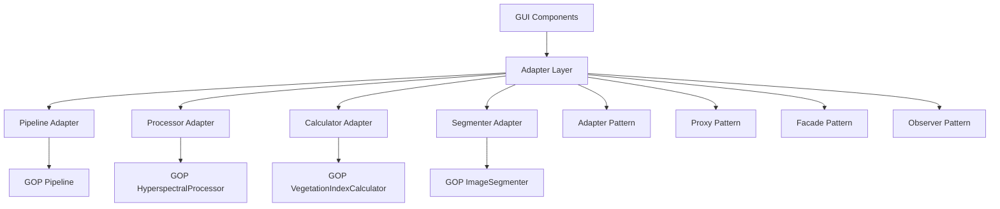

# Интеграционные паттерны для связи GUI с GOP классами

## 1. Архитектура интеграции

### 1.1 Общая схема интеграции



### 1.2 Паттерны проектирования для интеграции

- **Adapter Pattern**: Преобразование интерфейсов GOP для GUI
- **Proxy Pattern**: Кэширование и контроль доступа к тяжелым операциям
- **Facade Pattern**: Упрощенный интерфейс для сложных подсистем GOP
- **Observer Pattern**: Реактивное обновление состояния GUI

## 2. Adapter Pattern для GOP Core

### 2.1 Базовый адаптер

#### [`src/adapters/base_adapter.py`](src/adapters/base_adapter.py)
```python
"""
Базовый класс адаптера для интеграции с GOP модулями
"""

import asyncio
import concurrent.futures
from abc import ABC, abstractmethod
from typing import Any, Dict, Optional
from src.core.cache_manager import CacheManager

class BaseGOPAdapter(ABC):
    """Базовый класс адаптера для GOP модулей"""
    
    def __init__(self, cache_manager: Optional[CacheManager] = None):
        self.cache_manager = cache_manager or CacheManager()
        self.executor = concurrent.futures.ThreadPoolExecutor(max_workers=4)
        self._initialized = False
    
    async def initialize(self):
        """Асинхронная инициализация адаптера"""
        if not self._initialized:
            await self._initialize_adapter()
            self._initialized = True
    
    @abstractmethod
    async def _initialize_adapter(self):
        """Инициализация конкретного адаптера"""
        pass
    
    async def execute_sync_method(self, sync_method, *args, **kwargs):
        """Выполнение синхронного метода в отдельном потоке"""
        loop = asyncio.get_event_loop()
        return await loop.run_in_executor(
            self.executor, 
            self._execute_with_error_handling,
            sync_method, *args, **kwargs
        )
    
    def _execute_with_error_handling(self, sync_method, *args, **kwargs):
        """Выполнение метода с обработкой ошибок"""
        try:
            return sync_method(*args, **kwargs)
        except Exception as e:
            # Логирование ошибки и преобразование для GUI
            error_info = self._format_error(e)
            raise GOPAdapterError(error_info) from e
    
    def _format_error(self, error: Exception) -> Dict[str, Any]:
        """Форматирование ошибки для GUI"""
        return {
            'type': error.__class__.__name__,
            'message': str(error),
            'details': getattr(error, 'details', {})
        }
    
    def generate_cache_key(self, method_name: str, *args, **kwargs) -> str:
        """Генерация ключа кэша на основе метода и параметров"""
        import hashlib
        import json
        
        key_data = {
            'adapter': self.__class__.__name__,
            'method': method_name,
            'args': args,
            'kwargs': kwargs
        }
        
        key_string = json.dumps(key_data, sort_keys=True, default=str)
        return hashlib.md5(key_string.encode()).hexdigest()

class GOPAdapterError(Exception):
    """Специализированное исключение для ошибок адаптера"""
    
    def __init__(self, error_info: Dict[str, Any]):
        super().__init__(error_info['message'])
        self.error_info = error_info
        self.type = error_info['type']
        self.details = error_info.get('details', {})
```

### 2.2 Адаптер для Pipeline

#### [`src/adapters/pipeline_adapter.py`](src/adapters/pipeline_adapter.py)
```python
"""
Адаптер для интеграции с GOP Pipeline
"""

import asyncio
from typing import Dict, Any, List, Optional
from src.adapters.base_adapter import BaseGOPAdapter, GOPAdapterError
from src.core.pipeline import Pipeline

class PipelineAdapter(BaseGOPAdapter):
    """Адаптер для работы с GOP Pipeline"""
    
    def __init__(self, config_path: Optional[str] = None, cache_manager=None):
        super().__init__(cache_manager)
        self.config_path = config_path
        self.pipeline = None
    
    async def _initialize_adapter(self):
        """Инициализация Pipeline адаптера"""
        await self.execute_sync_method(self._initialize_pipeline)
    
    def _initialize_pipeline(self):
        """Синхронная инициализация Pipeline"""
        self.pipeline = Pipeline(self.config_path)
    
    async def process_data(self, config: Dict[str, Any]) -> Dict[str, Any]:
        """
        Асинхронная обработка данных через GOP Pipeline
        
        Args:
            config: Конфигурация обработки
            
        Returns:
            Результаты обработки
        """
        # Проверка инициализации
        if not self.pipeline:
            await self.initialize()
        
        # Валидация конфигурации
        self._validate_processing_config(config)
        
        # Попытка получить из кэша
        cache_key = self.generate_cache_key('process_data', config)
        cached_result = self.cache_manager.get(cache_key)
        
        if cached_result:
            return {
                'status': 'completed',
                'source': 'cache',
                'result': cached_result
            }
        
        # Выполнение обработки
        try:
            result = await self.execute_sync_method(
                self.pipeline.process,
                config['input_path'],
                config.get('output_dir', 'results'),
                config.get('sensor_type', 'Hyperspectral'),
                config.get('segmentation_mask'),
                config.get('selected_indices'),
                config.get('use_refinement', True),
                config.get('compression_ratio')
            )
            
            # Сохранение в кэш
            self.cache_manager.set(cache_key, result, ttl=86400)  # 24 часа
            
            return {
                'status': 'completed',
                'source': 'processing',
                'result': result
            }
            
        except Exception as e:
            raise GOPAdapterError(self._format_error(e))
    
    async def get_processing_status(self, task_id: str) -> Dict[str, Any]:
        """
        Получение статуса обработки (заглушка для асинхронной реализации)
        
        В реальной реализации здесь будет интеграция с системой мониторинга задач
        """
        # TODO: Интеграция с Celery или другой системой очередей
        return {
            'task_id': task_id,
            'status': 'unknown',
            'progress': 0,
            'message': 'Статус обработки не доступен'
        }
    
    async def validate_input_data(self, file_path: str) -> Dict[str, Any]:
        """
        Валидация входных данных
        
        Args:
            file_path: Путь к файлу данных
            
        Returns:
            Результаты валидации
        """
        if not self.pipeline:
            await self.initialize()
        
        try:
            # Использование валидации из GOP Processor
            from src.processing.hyperspectral import HyperspectralProcessor
            processor = HyperspectralProcessor()
            
            validation_result = await self.execute_sync_method(
                processor.get_band_info, file_path
            )
            
            return {
                'valid': True,
                'file_info': validation_result,
                'supported': self._check_support(validation_result)
            }
            
        except Exception as e:
            return {
                'valid': False,
                'error': str(e),
                'supported': False
            }
    
    def _validate_processing_config(self, config: Dict[str, Any]):
        """Валидация конфигурации обработки"""
        required_fields = ['input_path']
        
        for field in required_fields:
            if field not in config:
                raise GOPAdapterError({
                    'type': 'ValidationError',
                    'message': f'Отсутствует обязательное поле: {field}',
                    'details': {'missing_field': field}
                })
    
    def _check_support(self, file_info: Dict[str, Any]) -> bool:
        """Проверка поддержки файла"""
        # Простая проверка на основе количества каналов
        bands = file_info.get('total_bands', 0)
        return bands >= 3  # Минимум 3 канала для базовой обработки
```

### 2.3 Адаптер для HyperspectralProcessor

#### [`src/adapters/processor_adapter.py`](src/adapters/processor_adapter.py)
```python
"""
Адаптер для интеграции с GOP HyperspectralProcessor
"""

import asyncio
from typing import Dict, Any, List
from src.adapters.base_adapter import BaseGOPAdapter
from src.processing.hyperspectral import HyperspectralProcessor

class ProcessorAdapter(BaseGOPAdapter):
    """Адаптер для работы с GOP HyperspectralProcessor"""
    
    def __init__(self, cache_manager=None):
        super().__init__(cache_manager)
        self.processor = None
    
    async def _initialize_adapter(self):
        """Инициализация Processor адаптера"""
        self.processor = HyperspectralProcessor()
    
    async def preprocess_data(self, input_path: str, output_dir: str, 
                            config: Dict[str, Any] = None) -> Dict[str, Any]:
        """
        Предварительная обработка гиперспектральных данных
        
        Args:
            input_path: Путь к входным данным
            output_dir: Директория для сохранения результатов
            config: Конфигурация обработки
            
        Returns:
            Результаты предобработки
        """
        if not self.processor:
            await self.initialize()
        
        config = config or {}
        
        try:
            result = await self.execute_sync_method(
                self.processor.process,
                input_path,
                output_dir
            )
            
            return {
                'status': 'completed',
                'result': result,
                'output_files': result.get('tiff_paths', [])
            }
            
        except Exception as e:
            raise GOPAdapterError(self._format_error(e))
    
    async def create_rgb_composite(self, tiff_paths: List[str], 
                                 rgb_bands: tuple = (30, 20, 10),
                                 output_path: str = None) -> str:
        """
        Создание RGB композита из гиперспектральных данных
        
        Args:
            tiff_paths: Список путей к TIFF файлам
            rgb_bands: Индексы каналов для RGB
            output_path: Путь для сохранения
            
        Returns:
            Путь к созданному RGB композиту
        """
        if not self.processor:
            await self.initialize()
        
        try:
            result_path = await self.execute_sync_method(
                self.processor.create_rgb_composite,
                tiff_paths,
                rgb_bands,
                output_path
            )
            
            return result_path
            
        except Exception as e:
            raise GOPAdapterError(self._format_error(e))
    
    async def get_band_information(self, file_path: str) -> Dict[str, Any]:
        """
        Получение информации о спектральных каналах
        
        Args:
            file_path: Путь к файлу данных
            
        Returns:
            Информация о каналах
        """
        if not self.processor:
            await self.initialize()
        
        cache_key = self.generate_cache_key('get_band_information', file_path)
        cached_info = self.cache_manager.get(cache_key)
        
        if cached_info:
            return cached_info
        
        try:
            band_info = await self.execute_sync_method(
                self.processor.get_band_info,
                file_path
            )
            
            # Сохранение в кэш
            self.cache_manager.set(cache_key, band_info, ttl=3600)  # 1 час
            
            return band_info
            
        except Exception as e:
            raise GOPAdapterError(self._format_error(e))
```

## 3. Proxy Pattern для оптимизации

### 3.1 Processing Proxy с кэшированием

#### [`src/adapters/processing_proxy.py`](src/adapters/processing_proxy.py)
```python
"""
Proxy для оптимизации доступа к тяжелым операциям обработки
"""

import time
from typing import Dict, Any, Optional
from src.adapters.pipeline_adapter import PipelineAdapter

class ProcessingProxy:
    """
    Proxy для обработки данных с кэшированием и оптимизацией
    
    Реализует паттерн Proxy для контроля доступа к тяжелым операциям
    """
    
    def __init__(self, pipeline_adapter: PipelineAdapter):
        self.adapter = pipeline_adapter
        self.processing_cache = {}  # Быстрый in-memory кэш
        self.access_stats = {}      # Статистика доступа
        self.max_cache_size = 100   # Максимальный размер кэша
    
    async def process_data(self, config: Dict[str, Any]) -> Dict[str, Any]:
        """
        Обработка данных с кэшированием и оптимизацией
        
        Args:
            config: Конфигурация обработки
            
        Returns:
            Результаты обработки
        """
        # Генерация ключа кэша
        cache_key = self._generate_cache_key(config)
        
        # Проверка быстрого кэша
        if cache_key in self.processing_cache:
            self._update_access_stats(cache_key)
            return {
                'status': 'completed',
                'source': 'memory_cache',
                'result': self.processing_cache[cache_key]
            }
        
        # Проверка основного кэша через адаптер
        try:
            result = await self.adapter.process_data(config)
            
            # Сохранение в быстрый кэш
            self._add_to_cache(cache_key, result['result'])
            
            return result
            
        except Exception as e:
            # Логирование ошибки
            self._log_processing_error(config, e)
            raise
    
    async def get_processing_status(self, task_id: str) -> Dict[str, Any]:
        """
        Получение статуса обработки с кэшированием запросов
        
        Args:
            task_id: ID задачи
            
        Returns:
            Статус обработки
        """
        # Кэширование статуса на короткое время
        status_key = f"status_{task_id}"
        if status_key in self.processing_cache:
            cached_status = self.processing_cache[status_key]
            if time.time() - cached_status['timestamp'] < 5:  # 5 секунд
                return cached_status['status']
        
        # Получение актуального статуса
        status = await self.adapter.get_processing_status(task_id)
        
        # Сохранение в кэш
        self.processing_cache[status_key] = {
            'status': status,
            'timestamp': time.time()
        }
        
        return status
    
    def _generate_cache_key(self, config: Dict[str, Any]) -> str:
        """Генерация ключа кэша на основе конфигурации"""
        import hashlib
        import json
        
        # Нормализация конфигурации для ключа
        normalized_config = {
            'input_path': config.get('input_path'),
            'sensor_type': config.get('sensor_type'),
            'steps': sorted(config.get('processing_steps', [])),
            'parameters': config.get('parameters', {})
        }
        
        key_string = json.dumps(normalized_config, sort_keys=True)
        return hashlib.md5(key_string.encode()).hexdigest()
    
    def _add_to_cache(self, key: str, data: Any):
        """Добавление данных в кэш с контролем размера"""
        if len(self.processing_cache) >= self.max_cache_size:
            # Удаление наименее используемого элемента
            least_used_key = min(self.access_stats.items(), key=lambda x: x[1])[0]
            del self.processing_cache[least_used_key]
            del self.access_stats[least_used_key]
        
        self.processing_cache[key] = data
        self.access_stats[key] = time.time()
    
    def _update_access_stats(self, key: str):
        """Обновление статистики доступа"""
        self.access_stats[key] = time.time()
    
    def _log_processing_error(self, config: Dict[str, Any], error: Exception):
        """Логирование ошибок обработки"""
        # TODO: Интеграция с системой логирования
        error_info = {
            'config': config,
            'error_type': error.__class__.__name__,
            'error_message': str(error),
            'timestamp': time.time()
        }
        print(f"Processing error: {error_info}")
    
    def clear_cache(self):
        """Очистка кэша"""
        self.processing_cache.clear()
        self.access_stats.clear()
    
    def get_cache_stats(self) -> Dict[str, Any]:
        """Получение статистики кэша"""
        return {
            'cache_size': len(self.processing_cache),
            'hits': sum(1 for k in self.access_stats.values() if k > 0),
            'memory_usage': f"{sum(len(str(v)) for v in self.processing_cache.values())} bytes"
        }
```

## 4. Facade Pattern для упрощения API

### 4.1 GOP Facade для GUI

#### [`src/adapters/gop_facade.py`](src/adapters/gop_facade.py)
```python
"""
Facade для предоставления упрощенного API к GOP системе
"""

from typing import Dict, Any, List
from src.adapters.pipeline_adapter import PipelineAdapter
from src.adapters.processor_adapter import ProcessorAdapter
from src.adapters.calculator_adapter import CalculatorAdapter
from src.adapters.segmenter_adapter import SegmenterAdapter

class GOPFacade:
    """
    Facade для упрощенного доступа к функциональности GOP
    
    Предоставляет единый интерфейс для всех операций обработки и анализа
    """
    
    def __init__(self, config_path: str = None):
        self.config_path = config_path
        self.adapters = {}
        self._initialized = False
    
    async def initialize(self):
        """Инициализация фасада и всех адаптеров"""
        if self._initialized:
            return
        
        # Инициализация адаптеров
        self.adapters['pipeline'] = PipelineAdapter(self.config_path)
        self.adapters['processor'] = ProcessorAdapter()
        self.adapters['calculator'] = CalculatorAdapter()
        self.adapters['segmenter'] = SegmenterAdapter()
        
        # Параллельная инициализация адаптеров
        await asyncio.gather(*[
            adapter.initialize() for adapter in self.adapters.values()
        ])
        
        self._initialized = True
    
    async def create_project(self, name: str, description: str = '', 
                           files: List[str] = None) -> Dict[str, Any]:
        """
        Создание нового проекта с загрузкой файлов
        
        Args:
            name: Название проекта
            description: Описание проекта
            files: Список файлов для загрузки
            
        Returns:
            Информация о созданном проекте
        """
        if not self._initialized:
            await self.initialize()
        
        # Валидация файлов
        validated_files = []
        for file_path in (files or []):
            validation = await self.adapters['processor'].validate_input_data(file_path)
            if validation['valid']:
                validated_files.append({
                    'path': file_path,
                    'info': validation['file_info']
                })
        
        # Создание проекта
        project_info = {
            'name': name,
            'description': description,
            'files': validated_files,
            'created_at': self._get_timestamp(),
            'status': 'created'
        }
        
        return project_info
    
    async def process_project(self, project_id: str, 
                            processing_config: Dict[str, Any]) -> Dict[str, Any]:
        """
        Обработка проекта с заданной конфигурацией
        
        Args:
            project_id: ID проекта
            processing_config: Конфигурация обработки
            
        Returns:
            Результаты обработки
        """
        if not self._initialized:
            await self.initialize()
        
        # Получение информации о проекте
        project_info = await self._get_project_info(project_id)
        if not project_info:
            raise ValueError(f"Проект {project_id} не найден")
        
        # Подготовка конфигурации обработки
        config = self._prepare_processing_config(project_info, processing_config)
        
        # Запуск обработки через Pipeline адаптер
        result = await self.adapters['pipeline'].process_data(config)
        
        # Обновление информации о проекте
        await self._update_project_status(project_id, 'processing_completed', result)
        
        return result
    
    async def analyze_results(self, project_id: str, 
                            analysis_type: str = 'statistical') -> Dict[str, Any]:
        """
        Анализ результатов обработки
        
        Args:
            project_id: ID проекта
            analysis_type: Тип анализа
            
        Returns:
            Результаты анализа
        """
        if not self._initialized:
            await self.initialize()
        
        # Получение результатов обработки
        processing_results = await self._get_processing_results(project_id)
        
        # Выполнение анализа в зависимости от типа
        if analysis_type == 'statistical':
            analysis_result = await self.adapters['calculator'].calculate_statistics(
                processing_results
            )
        elif analysis_type == 'correlation':
            analysis_result = await self.adapters['calculator'].calculate_correlations(
                processing_results
            )
        else:
            raise ValueError(f"Неизвестный тип анализа: {analysis_type}")
        
        return analysis_result
    
    async def generate_visualization(self, project_id: str, 
                                   viz_type: str = 'index_map') -> Dict[str, Any]:
        """
        Генерация визуализаций
        
        Args:
            project_id: ID проекта
            viz_type: Тип визуализации
            
        Returns:
            Данные для визуализации
        """
        if not self._initialized:
            await self.initialize()
        
        # Получение данных для визуализации
        project_data = await self._get_project_data(project_id)
        
        # Генерация визуализации
        if viz_type == 'index_map':
            viz_data = await self._generate_index_map(project_data)
        elif viz_type == 'histogram':
            viz_data = await self._generate_histogram(project_data)
        else:
            raise ValueError(f"Неизвестный тип визуализации: {viz_type}")
        
        return viz_data
    
    # Вспомогательные методы
    def _get_timestamp(self) -> str:
        """Получение текущей временной метки"""
        from datetime import datetime
        return datetime.now().isoformat()
    
    async def _get_project_info(self, project_id: str) -> Dict[str, Any]:
        """Получение информации о проекте"""
        # TODO: Интеграция с системой хранения проектов
        return {}
    
    def _prepare_processing_config(self, project_info: Dict[str, Any], 
                                 user_config: Dict[str, Any]) -> Dict[str, Any]:
        """Подготовка конфигурации обработки"""
        config = {
            'input_path': project_info['files'][0]['path'] if project_info['files'] else '',
            'output_dir': f"results/{project_info['name']}",
            'sensor_type': user_config.get('sensor_type', 'Hyperspectral'),
            'processing_steps': user_config.get('steps', ['preprocessing', 'indices']),
            'parameters': user_config.get('parameters', {})
        }
        return config
    
    async def _update_project_status(self, project_id: str, status: str, data: Any):
        """Обновление статуса проекта"""
        # TODO: Интеграция с системой хранения проектов
        pass
    
    async def _get_processing_results(self, project_id: str) -> Dict[str, Any]:
        """Получение результатов обработки проекта"""
        # TODO: Интеграция с системой хранения проектов
        return {}
    
    async def _get_project_data(self, project_id: str) -> Dict[str, Any]:
        """Получение данных проекта"""
        # TODO: Интеграция с системой хранения проектов
        return {}
    
    async def _generate_index_map(self, project_data: Dict[str, Any]) -> Dict[str, Any]:
        """Генерация карты индексов"""
        # TODO: Реализация генерации карт
        return {'type': 'index_map', 'data': {}}
    
    async def _generate_histogram(self, project_data: Dict[str, Any]) -> Dict[str, Any]:
        """Генерация гистограммы"""
        # TODO: Реализация генерации гистограмм
        return {'type': 'histogram', 'data': {}}
```

## 5. Observer Pattern для реактивных обновлений

### 5.1 Система наблюдения за состоянием

#### [`src/adapters/state_observer.py`](src/adapters/state_observer.py)
```python
"""
Система наблюдения за состоянием обработки для реактивных обновлений GUI
"""

import asyncio
from abc import ABC, abstractmethod
from typing import Dict, Any, List, Callable
from enum import Enum

class ProcessingEventType(Enum):
    """Типы событий обработки"""
    STARTED = "started"
    PROGRESS = "progress"
    COMPLETED = "completed"
    ERROR = "error"
    CANCELLED = "cancelled"

class ProcessingEvent:
    """Событие обработки"""
    
    def __init__(self, event_type: ProcessingEventType, task_id: str, 
                 data: Dict[str, Any] = None):
        self.event_type = event_type
        self.task_id = task_id
        self.data = data or {}
        self.timestamp = asyncio.get_event_loop().time()
    
    def to_dict(self) -> Dict[str, Any]:
        """Преобразование события в словарь"""
        return {
            'type': self.event_type.value,
            'task_id': self.task_id,
            'data': self.data,
            'timestamp': self.timestamp
        }

class ProcessingObserver(ABC):
    """Абстрактный наблюдатель за событиями обработки"""
    
    @abstractmethod
    async def on_processing_event(self, event: ProcessingEvent):
        """Обработка события обработки"""
        pass

class ProcessingSubject:
    """Субъект для управления наблюдателями обработки"""
    
    def __init__(self):
        self.observers: List[ProcessingObserver] = []
        self._lock = asyncio.Lock()
    
    async def add_observer(self, observer: ProcessingObserver):
        """Добавление наблюдателя"""
        async with self._lock:
            if observer not in self.observers:
                self.observers.append(observer)
    
    async def remove_observer(self, observer: ProcessingObserver):
        """Удаление наблюдателя"""
        async with self._lock:
            if observer in self.observers:
                self.observers.remove(observer)
    
    async def notify_observers(self, event: ProcessingEvent):
        """Уведомление всех наблюдателей"""
        async with self._lock:
            observers = self.observers.copy()
        
        # Асинхронное уведомление наблюдателей
        tasks = [observer.on_processing_event(event) for observer in observers]
        await asyncio.gather(*tasks, return_exceptions=True)

class GUIProcessingObserver(ProcessingObserver):
    """Наблюдатель для обновления GUI"""
    
    def __init__(self, update_callback: Callable[[Dict[str, Any]], None]):
        self.update_callback = update_callback
    
    async def on_processing_event(self, event: ProcessingEvent):
        """Обработка события для обновления GUI"""
        event_data = event.to_dict()
        
        # Преобразование события в формат для GUI
        gui_update = self._format_event_for_gui(event_data)
        
        # Вызов callback для обновления интерфейса
        try:
            self.update_callback(gui_update)
        except Exception as e:
            print(f"Error in GUI update callback: {e}")
    
    def _format_event_for_gui(self, event_data: Dict[str, Any]) -> Dict[str, Any]:
        """Форматирование события для GUI"""
        event_type = event_data['type']
        
        if event_type == 'progress':
            return {
                'type': 'processing_progress',
                'task_id': event_data['task_id'],
                'progress': event_data['data'].get('progress', 0),
                'message': event_data['data'].get('message', ''),
                'timestamp': event_data['timestamp']
            }
        elif event_type == 'completed':
            return {
                'type': 'processing_completed',
                'task_id': event_data['task_id'],
                'result': event_data['data'].get('result', {}),
                'timestamp': event_data['timestamp']
            }
        elif event_type == 'error':
            return {
                'type': 'processing_error',
                'task_id': event_data['task_id'],
                'error': event_data['data'].get('error', ''),
                'timestamp': event_data['timestamp']
            }
        else:
            return event_data
```

Эти интеграционные паттерны обеспечивают надежную и эффективную связь между GUI приложением и существующими классами GOP, используя лучшие практики проектирования программного обеспечения.