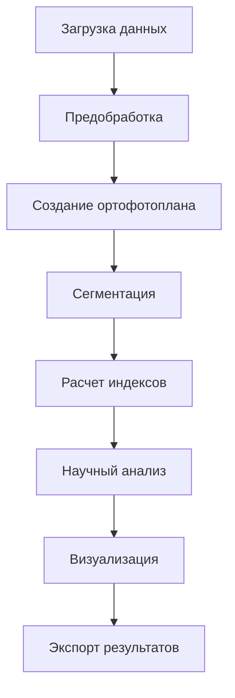

# Спецификация требований к GUI для проекта GOP

## Введение

Данный документ описывает детальные спецификации для создания веб-интерфейса (Flask/Dash) для научной библиотеки GOP (Гиперспектральная обработка и анализ растений). Интерфейс должен предоставлять интуитивно понятный доступ к функциональности библиотеки для научных исследований и анализа растительности.

## 1. Функциональные требования

### 1.1 Основные операции из существующих модулей

#### Обработка гиперспектральных данных
- **Загрузка данных**: Поддержка форматов BIL/HDR, TIFF, DAT
- **Предварительная обработка**: Радиометрическая и атмосферная коррекция
- **Шумоподавление**: PCA, MNF, вейвлеты, фильтр Савицкого-Голея
- **Спектральная калибровка**: Ресемплинг и сглаживание

#### Создание ортофотопланов
- **Интеграция с OpenDroneMap**: Автоматическое создание ортофотопланов
- **Альтернативные методы**: GDAL-based мозаика
- **Оптимизация**: Сжатие и создание пирамид

#### Расчет вегетационных индексов
- **Индексы озеленения**: GNDVI, MCARI, MNLI, OSAVI, TVI, NDVI
- **Индексы стресса**: SIPI2, mARI, PRI, CRI
- **Индексы водного режима**: NDWI, MSI, WI, NDII
- **Автоматическая классификация**: По типам сенсоров (RGB, Multispectral, Hyperspectral)

#### Сегментация изображений
- **Каскадный подход**: DeepLabV3+ → CascadePSP
- **Уточнение границ**: Адаптивные параметры
- **Оценка качества**: Метрики сегментации

#### Научный анализ
- **Статистический анализ**: Описательная статистика, распределения
- **Корреляционный анализ**: Матрицы корреляций между индексами
- **Пространственный анализ**: Индекс Морана, горячие точки
- **Классификация состояния**: Комплексная оценка растительности

### 1.2 Новые функции GUI

#### Управление проектами
- **Создание проектов**: Организация данных по проектам
- **История обработки**: Трекинг всех операций
- **Сохранение состояний**: Возможность продолжить работу

#### Интерактивная визуализация
- **Интерактивные карты**: Масштабирование, панорамирование
- **Сравнение результатов**: Side-by-side сравнение
- **Профильный анализ**: Интерактивные спектральные профили

#### Пакетная обработка
- **Очередь задач**: Планирование множественных операций
- **Параллельная обработка**: Оптимизация производительности
- **Уведомления**: Статус выполнения операций

#### Экспорт и отчеты
- **Научные отчеты**: Автоматическая генерация
- **Множественные форматы**: PDF, Excel, JSON
- **Кастомизация**: Настройка содержания отчетов

### 1.3 Рабочий процесс пользователя



## 2. Интерфейсные требования

### 2.1 Структура главного окна

#### Навигационная панель
- **Логотип и название**: GOP - Гиперспектральная обработка
- **Основные разделы**: Проекты, Обработка, Анализ, Настройки
- **Статус системы**: Индикатор загрузки, уведомления

#### Боковая панель
- **Дерево проекта**: Иерархия данных и результатов
- **Быстрый доступ**: Часто используемые операции
- **Фильтры**: По типам данных, датам, тегам

#### Рабочая область
- **Вкладки**: Многозадачность с табами
- **Панель инструментов**: Контекстно-зависимые инструменты
- **Статус бар**: Информация о текущем состоянии

### 2.2 Виджеты для операций

#### Виджет загрузки данных
```python
class DataUploadWidget:
    - Поддержка drag-and-drop
    - Предпросмотр метаданных
    - Валидация форматов
    - Автоматическое определение типа сенсора
```

#### Виджет предобработки
```python
class PreprocessingWidget:
    - Визуализация до/после обработки
    - Настройка параметров коррекции
    - Режим реального времени
    - Сохранение пресетов
```

#### Виджет визуализации индексов
```python
class IndexVisualizationWidget:
    - Интерактивная карта индексов
    - Гистограммы распределения
    - Цветовые схемы (RdYlGn, viridis, etc.)
    - Экспорт изображений
```

#### Виджет научного анализа
```python
class ScientificAnalysisWidget:
    - Корреляционные матрицы
    - Пространственные паттерны
    - Статистические отчеты
    - Интерактивные графики
```

### 2.3 Визуализация данных и результатов

#### Типы визуализаций
- **Спектральные профили**: Интерактивные графики
- **Карты индексов**: Heatmaps с легендами
- **3D визуализация**: Пространственное распределение
- **Сравнительные панели**: До/после обработки

#### Интерактивные элементы
- **Выбор точек**: Клик по изображению для анализа
- **Профилирование**: Линейные профили через изображение
- **Масштабирование**: Smooth zoom и панорамирование
- **Аннотации**: Добавление меток и комментариев

## 3. Технические требования

### 3.1 Производительность

#### Оптимизация для больших данных
- **Чанковая обработка**: Работа с данными по частям
- **Прогрессивная загрузка**: Постепенное отображение
- **Кэширование**: Многоуровневое кэширование результатов
- **Фоновые процессы**: Неблокирующий интерфейс

#### Ограничения
- **Максимальный размер**: Поддержка до 10GB файлов
- **Память**: Эффективное использование RAM
- **Время отклика**: < 2 секунд для основных операций

### 3.2 Многопоточность и асинхронность

#### Архитектура обработки
```python
class AsyncProcessor:
    - Celery для фоновых задач
    - WebSocket для реального времени
    - Очередь задач с приоритетами
    - Обработка ошибок и повторные попытки
```

#### Управление ресурсами
- **Пул потоков**: Динамическое управление
- **Мониторинг**: Статистика использования ресурсов
- **Ограничения**: Настройка максимальной нагрузки

### 3.3 Совместимость

#### Поддержка браузеров
- **Chrome 90+**: Полная поддержка
- **Firefox 88+**: Основная функциональность
- **Safari 14+**: Базовая поддержка
- **Edge 90+**: Полная совместимость

#### Интеграция с существующим кодом
- **REST API**: Для взаимодействия с ядром GOP
- **Минимальные изменения**: Сохранение существующей архитектуры
- **Обратная совместимость**: Поддержка текущих скриптов

## 4. Архитектурные решения

### 4.1 Паттерны проектирования

#### Frontend Architecture (Dash/Flask)
```python
# Структура компонентов
app/
├── layouts/           # Основные макеты
├── components/        # Переиспользуемые компоненты
├── callbacks/         # Обработчики событий
├── utils/             # Вспомогательные функции
└── assets/           # Статические ресурсы
```

#### Backend Architecture
```python
# Микросервисная архитектура
gop-gui/
├── api/              # REST API endpoints
├── processing/       # Очередь задач
├── storage/          # Управление данными
└── auth/            # Аутентификация (опционально)
```

### 4.2 Интеграция с существующими классами

#### Adapter Pattern для GOP Core
```python
class GOPAdapter:
    def __init__(self, pipeline: Pipeline):
        self.pipeline = pipeline
    
    async def process_async(self, config: Dict) -> AsyncResult:
        # Адаптация синхронного API к асинхронному
        pass
    
    def get_status(self, task_id: str) -> Dict:
        # Получение статуса задачи
        pass
```

#### Proxy Pattern для тяжелых операций
```python
class ProcessingProxy:
    def __init__(self):
        self.cache = {}
        self.processor = HyperspectralProcessor()
    
    def process(self, data: Dict) -> Dict:
        # Кэширование и оптимизация
        cache_key = self._generate_cache_key(data)
        if cache_key in self.cache:
            return self.cache[cache_key]
        # ... обработка
```

### 4.3 Модульность и расширяемость

#### Plugin System
```python
class PluginInterface:
    def register_routes(self, app: Flask) -> None:
        pass
    
    def register_components(self) -> List[Component]:
        pass
    
    def get_config_schema(self) -> Dict:
        pass
```

#### Конфигурационная система
```yaml
gui:
  theme: "dark"  # dark/light
  language: "ru"  # ru/en
  max_file_size: "10GB"
  parallel_workers: 4
  cache:
    enabled: true
    size: "1GB"
```

## 5. Схемы интерфейса

### 5.1 Главная страница

```
┌─────────────────────────────────────────────────────────────┐
│ 🛰️ GOP - Гиперспектральная обработка              [⚙️] [👤] │
├─────────────────┬───────────────────────────────────────────┤
│ 📁 Проекты      │ 📊 Панель управления                     │
│   ► Текущий     │                                           │
│   ► Архив       │  [🔄] Быстрый старт                      │
│   ► Шаблоны     │  [📁] Загрузить данные                  │
│                 │  [🔍] Анализ проекта                    │
│ 📊 Обработка    │  [📈] Визуализация                      │
│   ► Предобработка│                                           │
│   ► Индексы     │  Статистика системы:                     │
│   ► Анализ      │  • Процессоров: 4/8                      │
│                 │  • Память: 2.3/16 GB                     │
│ ⚙️ Настройки    │  • Активных задач: 1                     │
└─────────────────┴───────────────────────────────────────────┘
```

### 5.2 Страница обработки данных

```
┌─────────────────────────────────────────────────────────────┐
│ Обработка гиперспектральных данных              [← Назад]   │
├─────────────────┬───────────────────────────────────────────┤
│ Шаг 1: Данные   │ ┌─────────────────────────────────────┐   │
│   [✅] Загрузка │ │          Предпросмотр данных        │   │
│   [🔲] Коррекция│ │                                     │   │
│   [🔲] Шумоподав│ │  [RGB композит] [Инфракрасный]      │   │
│                 │ └─────────────────────────────────────┘   │
│ Шаг 2: Ортофото │                                           │
│   [🔲] Создание │  Параметры обработки:                    │
│   [🔲] Оптимизац│  • Размер: 1000x1000px                   │
│                 │  • Каналы: 50                            │
│ Шаг 3: Анализ   │  • Тип сенсора: Гиперспектральный        │
│   [🔲] Индексы  │                                         │
│   [🔲] Сегментац│  [▶ Запустить обработку]                │
└─────────────────┴───────────────────────────────────────────┘
```

### 5.3 Виджет визуализации

```
┌─────────────────────────────────────────────────────────────┐
│ Визуализация результатов                       [Экспорт 📁] │
├───────────┬───────────┬─────────────────────────────────────┤
│ Индексы   │ NDVI      │ ┌─────────────────────────────────┐ │
│   □ GNDVI │ ████████  │ │                                 │ │
│   ■ NDWI  │ ██████    │ │        Карта индексов           │ │
│   □ OSAVI │ ████      │ │                                 │ │
│           │           │ └─────────────────────────────────┘ │
│ Настройки │           │                                     │
│   Цвет:   │           │  Гистограмма распределения:         │
│   █ RdYlGn│           │  ┌─┐                               │
│   □ Viridis│           │  │ │  ▄▄▄▄                        │ │
│           │           │  │ │ ██████                        │ │
│   Мин: 0.1│           │  └─┘ ██████                        │ │
│   Макс: 0.9│           │     0.0   0.5   1.0                │
└───────────┴───────────┴─────────────────────────────────────┘
```

## 6. API для интеграции

### 6.1 REST API Endpoints

#### Управление проектами
```python
# Projects API
GET  /api/projects           # Список проектов
POST /api/projects           # Создание проекта
GET  /api/projects/{id}      # Информация о проекте
PUT  /api/projects/{id}      # Обновление проекта
DELETE /api/projects/{id}    # Удаление проекта
```

#### Обработка данных
```python
# Processing API
POST /api/process/upload     # Загрузка данных
POST /api/process/preprocess # Предобработка
POST /api/process/indices    # Расчет индексов
GET  /api/process/status/{id}# Статус обработки
```

#### Анализ и визуализация
```python
# Analysis API
GET  /api/analysis/statistics# Статистика
POST /api/analysis/correlation# Корреляционный анализ
GET  /api/visualization/{type}# Генерация визуализаций
```

### 6.2 WebSocket Events

#### Реальное время
```python
# WebSocket сообщения
{
    "type": "processing_progress",
    "task_id": "uuid",
    "progress": 75,
    "message": "Шумоподавление..."
}

{
    "type": "visualization_update", 
    "data": {...},
    "timestamp": "2024-01-01T10:00:00Z"
}
```

### 6.3 Конфигурационный API

#### Настройки системы
```python
# Config API
GET  /api/config             # Получение конфигурации
PUT  /api/config             # Обновление конфигурации
GET  /api/config/schema      # Схема конфигурации
```

## 7. План реализации

### 7.1 Этапы разработки

#### Фаза 1: Базовый функционал (4 недели)
- Настройка Flask/Dash приложения
- Базовая загрузка и отображение данных
- Простая визуализация индексов

#### Фаза 2: Обработка данных (6 недель)
- Интеграция с GOP pipeline
- Асинхронная обработка
- Управление проектами

#### Фаза 3: Расширенный анализ (4 недели)
- Научные инструменты анализа
- Продвинутая визуализация
- Система отчетов

#### Фаза 4: Оптимизация (2 недели)
- Производительность
- Тестирование
- Документация

### 7.2 Технический стек

#### Frontend
- **Dash**: Основной фреймворк
- **Plotly**: Графики и визуализация
- **Bootstrap**: Стилизация
- **JavaScript**: Кастомные интерактивные элементы

#### Backend  
- **Flask**: Веб-фреймворк
- **Celery**: Очередь задач
- **Redis**: Кэширование и брокер сообщений
- **SQLite/PostgreSQL**: Хранение метаданных

#### Интеграция
- **REST API**: Для взаимодействия с GOP
- **WebSocket**: Реальное время
- **Docker**: Контейнеризация

## Заключение

Данная спецификация предоставляет детальный план для создания современного веб-интерфейса для научной библиотеки GOP. Интерфейс будет сочетать мощь существующего аналитического ядра с удобством веб-технологий, предоставляя исследователям интуитивно понятные инструменты для работы с гиперспектральными данными.

Ключевые преимущества предлагаемого решения:
- **Доступность**: Работа через браузер без установки
- **Масштабируемость**: Поддержка больших объемов данных
- **Интерактивность**: Богатые возможности визуализации
- **Интеграция**: Бесшовная работа с существующим кодом GOP

Реализация будет проводиться поэтапно с постоянным тестированием и обратной связью от потенциальных пользователей.