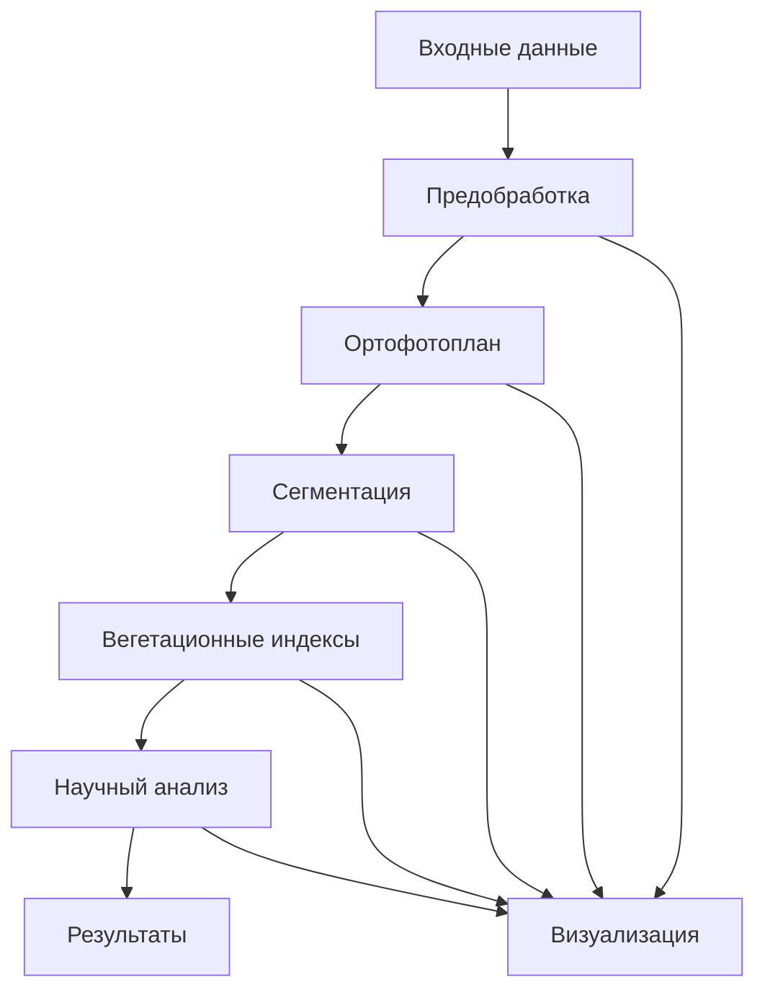

# Архитектура проекта GOP

Этот документ описывает архитектуру проекта GOP (Гиперспектральная обработка и анализ растений).

## 🏗️ Обзор архитектуры

Проект GOP построен по модульной архитектуре с четким разделением ответственности между компонентами. Архитектура спроектирована для обеспечения масштабируемости, поддерживаемости и тестируемости.

## 📁 Структура проекта

```
src/
├── core/              # Основные классы и пайплайны
│   ├── config.py      # Конфигурация системы
│   └── pipeline.py    # Основной пайплайн обработки
├── processing/        # Обработка данных
│   ├── hyperspectral/ # Обработка гиперспектральных данных
│   └── orthophoto.py  # Создание ортофотопланов
├── indices/           # Вегетационные индексы
│   ├── calculator.py  # Калькулятор индексов
│   └── definitions.py # Определения индексов
├── segmentation/      # Сегментация изображений
│   └── segmenter.py   # Сегментатор изображений
└── utils/             # Вспомогательные утилиты
    ├── file_utils.py  # Работа с файлами
    ├── image_utils.py # Утилиты для изображений
    ├── logger.py      # Логгирование
    └── visualization.py # Визуализация
```

## 🔧 Ключевые компоненты

### Pipeline (src/core/pipeline.py)

Основной координатор обработки данных. Управляет последовательностью операций:

```python
class Pipeline:
    """Основной пайплайн обработки гиперспектральных данных"""
    
    def process(self, input_path, output_dir, **kwargs):
        """Основной метод обработки"""
        # 1. Предварительная обработка
        # 2. Создание ортофотоплана
        # 3. Сегментация изображений
        # 4. Расчет вегетационных индексов
        # 5. Научный анализ
```

### HyperspectralProcessor (src/processing/hyperspectral.py)

Обработчик гиперспектральных данных:
- Чтение данных в форматах BIL/HDR, TIFF
- Радиометрическая и атмосферная коррекция
- Шумоподавление (PCA, MNF, вейвлеты)
- Спектральная калибровка

### VegetationIndexCalculator (src/indices/calculator.py)

Калькулятор вегетационных индексов:
- Поддержка более 20 индексов
- Автоматическая классификация по типам сенсоров
- Статистический анализ результатов

### ImageSegmenter (src/segmentation/segmenter.py)

Сегментатор изображений:
- Каскадный подход (DeepLabV3+ → CascadePSP)
- Обработка изображений сверхвысокого разрешения
- Уточнение границ и оценка качества

## 🔄 Поток данных



## 🎯 Архитектурные паттерны

### Фасад (Facade)

Класс `Pipeline` выступает в роли фасада, предоставляя упрощенный интерфейс для сложной системы обработки данных.

### Стратегия (Strategy)

Различные алгоритмы обработки (например, методы шумоподавления) реализованы как стратегии, что позволяет легко их заменять.

### Наблюдатель (Observer)

Система логгирования и уведомлений использует паттерн наблюдателя для отслеживания состояния обработки.

## ⚙️ Конфигурация

### Конфигурационные файлы

- `config/config.yaml` - Основная конфигурация
- `pyproject.toml` - Конфигурация проекта и зависимостей
- `pytest.ini` - Конфигурация тестирования

### Переменные окружения

```bash
export GOP_LOG_LEVEL=INFO
export GOP_CACHE_DIR=/tmp/gop_cache
export GOP_USE_GPU=true
```

## 📈 Масштабируемость

### Обработка больших данных

- Поддержка обработки по частям (chunking)
- Параллельная обработка с использованием multiprocessing
- GPU ускорение для ресурсоемких операций

### Расширяемость

- Модульная архитектура позволяет легко добавлять новые алгоритмы
- Плагинная система для вегетационных индексов
- Конфигурируемые пайплайны обработки

## 🔒 Безопасность

### Обработка данных

- Валидация входных данных
- Обработка ошибок и исключений
- Логгирование операций

### Конфиденциальность

- Локальная обработка данных
- Отсутствие передачи данных на внешние серверы
- Очистка временных файлов

## 🚀 Производительность

### Оптимизации

- Кэширование промежуточных результатов
- Векторизованные операции с NumPy
- Использование специализированных библиотек (GDAL, OpenCV)

### Мониторинг

- Профилирование производительности
- Статистика использования ресурсов
- Логгирование времени выполнения операций

## 🔗 Интеграция

### Внешние системы

- **OpenDroneMap** - Создание ортофотопланов
- **GDAL** - Обработка геоданных
- **PyTorch** - Машинное обучение

### Форматы данных

- **BIL/HDR** - Гиперспектральные данные
- **GeoTIFF** - Геопривязанные изображения
- **JSON/CSV** - Результаты анализа

## 📦 Развертывание

### Локальное развертывание

```bash
# Установка зависимостей
pip install -r requirements.txt

# Запуск обработки
python main.py input.bil output/
```

### Docker развертывание

```dockerfile
FROM python:3.9-slim
WORKDIR /app
COPY requirements.txt .
RUN pip install -r requirements.txt
COPY . .
CMD ["python", "main.py"]
```

## 🔮 Будущие улучшения

### Планируемые функции

- Поддержка потоковой обработки данных
- Интеграция с облачными хранилищами
- Расширенная аналитика и отчетность
- Поддержка дополнительных форматов данных

### Архитектурные улучшения

- Микросервисная архитектура
- Асинхронная обработка
- Распределенные вычисления

---

*Для получения дополнительной информации обратитесь к [руководству разработчика](DEVELOPER.md) или [руководству пользователя](USER_GUIDE.md).*