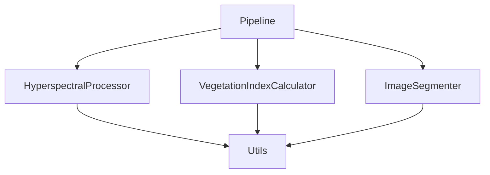

# Руководство разработчика GOP

Этот документ содержит информацию для разработчиков, желающих внести вклад в проект GOP или использовать его API.

## 🚀 Быстрый старт

### Настройка окружения разработки

```bash
# Клонирование репозитория
git clone https://github.com/indykovdm/GOP.git
cd GOP

# Установка зависимостей для разработки
pip install -r requirements-dev.txt

# Установка в режиме разработки
pip install -e .
```

### Запуск тестов

```bash
# Запуск всех тестов
pytest tests/

# Запуск с покрытием кода
pytest tests/ --cov=src --cov-report=html

# Запуск конкретного модуля
pytest tests/test_config.py
```

## 📚 Обзор API

### Основные модули

- **`src.core`** - Основные классы и пайплайны
- **`src.processing`** - Обработка гиперспектральных данных и ортофотопланов
- **`src.indices`** - Расчет вегетационных индексов
- **`src.segmentation`** - Сегментация изображений
- **`src.utils`** - Вспомогательные утилиты

### Ключевые классы

#### Pipeline
Основной пайплайн обработки данных, координирующий работу всех модулей.

```python
from src.core.pipeline import Pipeline

pipeline = Pipeline()
results = pipeline.process(
    input_path="data.hdr",
    output_dir="results/",
    indices=["ndvi", "gndvi"]
)
```

#### HyperspectralProcessor
Обработчик гиперспектральных данных с поддержкой различных форматов.

#### VegetationIndexCalculator
Калькулятор вегетационных индексов с автоматической классификацией.

#### ImageSegmenter
Сегментатор изображений для обработки изображений сверхвысокого разрешения.

## 🏗️ Архитектура

### Структура проекта

```
src/
├── core/           # Основные классы и пайплайны
├── processing/     # Обработка данных
├── indices/        # Вегетационные индексы
├── segmentation/   # Сегментация изображений
└── utils/          # Вспомогательные утилиты
```

### Взаимодействие модулей



## 🔧 Разработка

### Стандарты кода

- **Форматирование**: Используйте Black для автоматического форматирования
- **Линтинг**: Проверяйте код с помощью flake8
- **Типизация**: Используйте аннотации типов и проверяйте с помощью mypy
- **Документация**: Добавляйте docstrings ко всем публичным функциям и классам

### Добавление нового модуля

1. Создайте директорию в `src/`
2. Добавьте `__init__.py` файл
3. Реализуйте функциональность
4. Создайте тесты в `tests/`
5. Обновите документацию

### Пример структуры модуля

```python
# src/new_module/__init__.py
"""
Новый модуль для GOP.

Этот модуль предоставляет функциональность для...
"""

from .core import NewClass

__all__ = ['NewClass']
```

## 🧪 Тестирование

### Типы тестов

- **Модульные тесты** - Тестирование отдельных функций и классов
- **Интеграционные тесты** - Тестирование взаимодействия между компонентами

### Запуск тестов

```bash
# Все тесты
pytest tests/

# С покрытием кода
pytest tests/ --cov=src --cov-report=html

# Конкретный тест
pytest tests/test_module.py::TestClass::test_method

# Только неудачные тесты
pytest tests/ --lf
```

### Маркеры тестов

- `@pytest.mark.slow` - Медленные тесты
- `@pytest.mark.integration` - Интеграционные тесты
- `@pytest.mark.unit` - Модульные тесты
- `@pytest.mark.gpu` - Тесты, требующие GPU

## 📖 Документация

### Генерация документации

```bash
# Перейти в директорию docs
cd docs

# Полная генерация документации
make all

# Только HTML документация
make html

# Очистка сгенерированных файлов
make clean
```

### Структура документации

```
docs/
├── api/                      # Директория с исходниками Sphinx
│   ├── conf.py               # Конфигурация Sphinx
│   ├── index.rst             # Главный индексный файл
│   └── _build/               # Сгенерированная HTML документация
└── *.md                      # Markdown документация
```

## 🤝 Вклад в проект

### Процесс внесения изменений

1. **Форк репозитория** - Создайте форк проекта
2. **Создание ветки** - Создайте ветку для ваших изменений
3. **Внесение изменений** - Реализуйте функциональность или исправьте ошибку
4. **Тестирование** - Убедитесь, что все тесты проходят
5. **Создание Pull Request** - Отправьте изменения на ревью

### Требования к коду

- Все публичные методы должны иметь docstrings
- Код должен проходить линтинг и форматирование
- Тесты должны покрывать новую функциональность
- Изменения не должны ломать существующие тесты

### Шаблон Pull Request

```markdown
## Описание изменений

Краткое описание того, что было изменено.

## Тип изменений

- [ ] Исправление ошибки
- [ ] Новая функциональность
- [ ] Изменение существующей функциональности
- [ ] Документация

## Чеклист

- [ ] Код соответствует стандартам проекта
- [ ] Тесты добавлены/обновлены
- [ ] Документация обновлена
- [ ] Все тесты проходят
```

## 🔄 CI/CD

### GitHub Actions

Тесты автоматически запускаются при:
- Push в ветки `main` и `develop`
- Создании Pull Request

### Воркфлоу

1. **Тестирование** - Запуск тестов на разных версиях Python
2. **Качество кода** - Проверка форматирования и линтинга
3. **Покрытие** - Генерация отчетов о покрытии
4. **Безопасность** - Проверка зависимостей

## 🐛 Устранение проблем

### Распространенные проблемы

#### Импортные ошибки

```bash
# Убедитесь, что src в Python path
export PYTHONPATH="${PYTHONPATH}:$(pwd)/src"
```

#### Отсутствующие зависимости

```bash
# Установите зависимости для разработки
pip install -r requirements-dev.txt
```

#### Проблемы с GDAL

```bash
# Ubuntu/Debian
sudo apt-get install gdal-bin libgdal-dev

# macOS
brew install gdal
```

### Отладка

```bash
# Запуск с отладочным выводом
pytest tests/ -v -s

# Остановка при первом неудачном тесте
pytest tests/ -x
```

## 📊 Лучшие практики

1. **Изолированные тесты** - Каждый тест должен быть независимым
2. **Описательные имена** - Имена тестов должны четко описывать, что тестируется
3. **Мокирование внешних зависимостей** - Используйте моки для файловой системы, сети
4. **Тестирование граничных случаев** - Проверяйте нулевые значения, исключения
5. **Регулярный запуск** - Запускайте тесты перед коммитом изменений

## 🔗 Полезные ссылки

- **[Руководство пользователя](USER_GUIDE.md)** - Как использовать GOP
- **[Архитектура](ARCHITECTURE.md)** - Системная архитектура
- **[Тестирование](TESTING.md)** - Подробное руководство по тестированию
- **[API документация](api/_build/html/index.html)** - Полная API документация

---

*Для получения дополнительной помощи создайте issue на GitHub или обратитесь к существующей документации.*