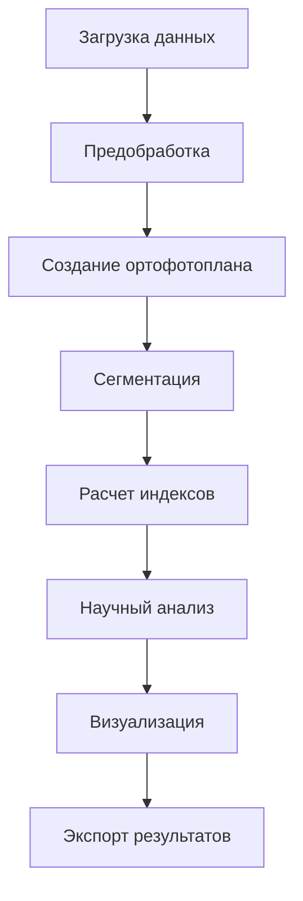
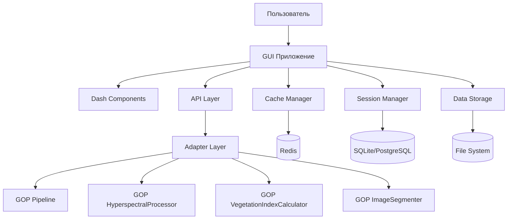

# Руководство по GUI для GOP

Веб-интерфейс для системы GOP, обеспечивающий удобную работу с гиперспектральными данными и анализ растительности.

## 🚀 Быстрый старт

### Установка GUI

```bash
# Установка GUI зависимостей
pip install -r requirements-gui.txt

# Запуск приложения
python gui.py
```

Приложение будет доступно по адресу: `http://localhost:8050`

## 🌟 Особенности

- **Современный веб-интерфейс** на основе Dash и Bootstrap
- **Интуитивная навигация** для работы с проектами
- **Визуализация данных** в реальном времени
- **Асинхронная обработка** больших объемов данных
- **Интеграция с GOP** через адаптеры
- **Адаптивный дизайн** для различных устройств

## 💻 Технологический стек

| Компонент | Технология | Назначение |
|-----------|------------|------------|
| **Frontend** | Dash, Plotly, Bootstrap | Пользовательский интерфейс |
| **Backend** | Flask, Dash | Веб-сервер и логика приложения |
| **API** | REST, WebSocket | Коммуникация с клиентом |
| **Очереди задач** | Celery, Redis | Асинхронная обработка |
| **Кэширование** | Redis, Memory | Оптимизация производительности |
| **База данных** | SQLite/PostgreSQL | Хранение сессий и проектов |

## 📊 Основные возможности

### Обработка гиперспектральных данных
- **Загрузка данных**: Поддержка форматов BIL/HDR, TIFF, DAT
- **Предварительная обработка**: Радиометрическая и атмосферная коррекция
- **Шумоподавление**: PCA, MNF, вейвлеты
- **Спектральная калибровка**: Ресемплинг и сглаживание

### Создание ортофотопланов
- **Интеграция с OpenDroneMap**: Автоматическое создание ортофотопланов
- **Альтернативные методы**: GDAL-based мозаика
- **Оптимизация**: Сжатие и создание пирамид

### Расчет вегетационных индексов
- **Индексы озеленения**: GNDVI, MCARI, MNLI, OSAVI, TVI, NDVI
- **Индексы стресса**: SIPI2, mARI, PRI, CRI
- **Индексы водного режима**: NDWI, MSI, WI, NDII

### Сегментация изображений
- **Каскадный подход**: DeepLabV3+ → CascadePSP
- **Уточнение границ**: Адаптивные параметры
- **Оценка качества**: Метрики сегментации

## 🎯 Рабочий процесс



## 🏗️ Архитектура

### Общая структура



## 📁 Структура проекта

```
gui/
├── api/                     # REST API слой
│   └── routes.py            # API эндпоинты
├── app/                     # Dash приложение
│   └── app.py               # Основное приложение
├── components/              # Компоненты интерфейса
│   ├── layout.py            # Основной layout
│   ├── navigation.py        # Навигация
│   ├── sidebar.py           # Боковая панель
│   ├── dashboard.py         # Дашборд
│   ├── data_upload.py       # Загрузка данных
│   ├── visualization.py     # Визуализация
│   └── callbacks.py         # Обработчики событий
├── services/                # Сервисный слой
│   ├── gop_adapter.py       # Адаптер для GOP
│   ├── session_manager.py   # Управление сессиями
│   └── cache_manager.py     # Управление кэшем
└── utils/                   # Утилиты
    ├── file_utils.py        # Работа с файлами
    ├── validation_utils.py  # Валидация данных
    └── visualization_utils.py # Утилиты визуализации
```

## 🔧 Установка и запуск

### Базовая установка

```bash
# Установка зависимостей
pip install -r requirements-gui.txt

# Запуск приложения
python gui.py
```

### Расширенная конфигурация

```bash
# Запуск с конкретными настройками
python gui.py --host 0.0.0.0 --port 8050 --debug

# Production режим
gunicorn --bind 0.0.0.0:8050 gui.app:server
```

### Docker развертывание

```bash
# Сборка и запуск
docker build -t gop-gui .
docker run -p 8050:8050 gop-gui

# Или через docker-compose
docker-compose up
```

## 🎨 Интерфейс пользователя

### Главный макет

- **Навигационная панель**: Логотип, основные разделы, поиск
- **Боковая панель**: Дерево проекта, быстрый доступ, фильтры
- **Рабочая область**: Вкладки, панель инструментов, визуализация
- **Статус бар**: Информация о текущем состоянии

### Основные экраны

#### Дашборд
- Обзор проектов и статистика
- Быстрый запуск обработки
- Виджеты с ключевыми метриками
- Графики и визуализации

#### Загрузка данных
- Drag-and-drop интерфейс
- Предпросмотр метаданных
- Валидация форматов файлов
- Пакетная загрузка

#### Визуализация
- Интерактивные карты с масштабированием
- Сравнение результатов side-by-side
- Спектральные профили
- Графики и диаграммы

## 🔄 Управление данными

### Сессии и проекты
- **Создание проектов**: Организация данных по проектам
- **История обработки**: Трекинг всех операций
- **Сохранение состояний**: Возможность продолжить работу

### Кэширование
- **Многоуровневое кэширование** (Redis + Memory)
- **Автоматическое обновление** кэша
- **Политики истечения** срока действия

## 🛠️ Интеграция с GOP

### Адаптеры для основных модулей

#### Pipeline Adapter
```python
class PipelineAdapter:
    """Адаптер для GOP Pipeline"""
    
    async def process_async(self, input_path, output_dir, **kwargs):
        """Асинхронная обработка через GOP Pipeline"""
        return await asyncio.get_event_loop().run_in_executor(
            None, self.pipeline.process, input_path, output_dir, **kwargs
        )
```

#### Processor Adapter
Адаптер для HyperspectralProcessor

#### Calculator Adapter
Адаптер для VegetationIndexCalculator

#### Segmenter Adapter
Адаптер для ImageSegmenter

## 📊 Конфигурация

### Конфигурационный файл

```yaml
server:
  host: "localhost"
  port: 8050
  debug: false

redis:
  host: "localhost"
  port: 6379
  db: 0

database:
  url: "sqlite:///gop_gui.db"

celery:
  broker_url: "redis://localhost:6379/0"
  result_backend: "redis://localhost:6379/0"

cache:
  default_timeout: 3600
  key_prefix: "gop_gui_"
```

## ❓ Часто задаваемые вопросы

**Q: Какой порт использует приложение?**
A: По умолчанию порт 8050, можно изменить через конфигурацию.

**Q: Нужен ли Redis для работы?**
A: Да, Redis требуется для кэширования и асинхронной обработки.

**Q: Можно ли использовать без интернета?**
A: Да, приложение работает локально, интернет не требуется.

**Q: Как настроить базу данных?**
A: По умолчанию используется SQLite, можно настроить PostgreSQL.

---

*Для получения дополнительной помощи обратитесь к [руководству пользователя](USER_GUIDE.md) или создайте issue на GitHub.*