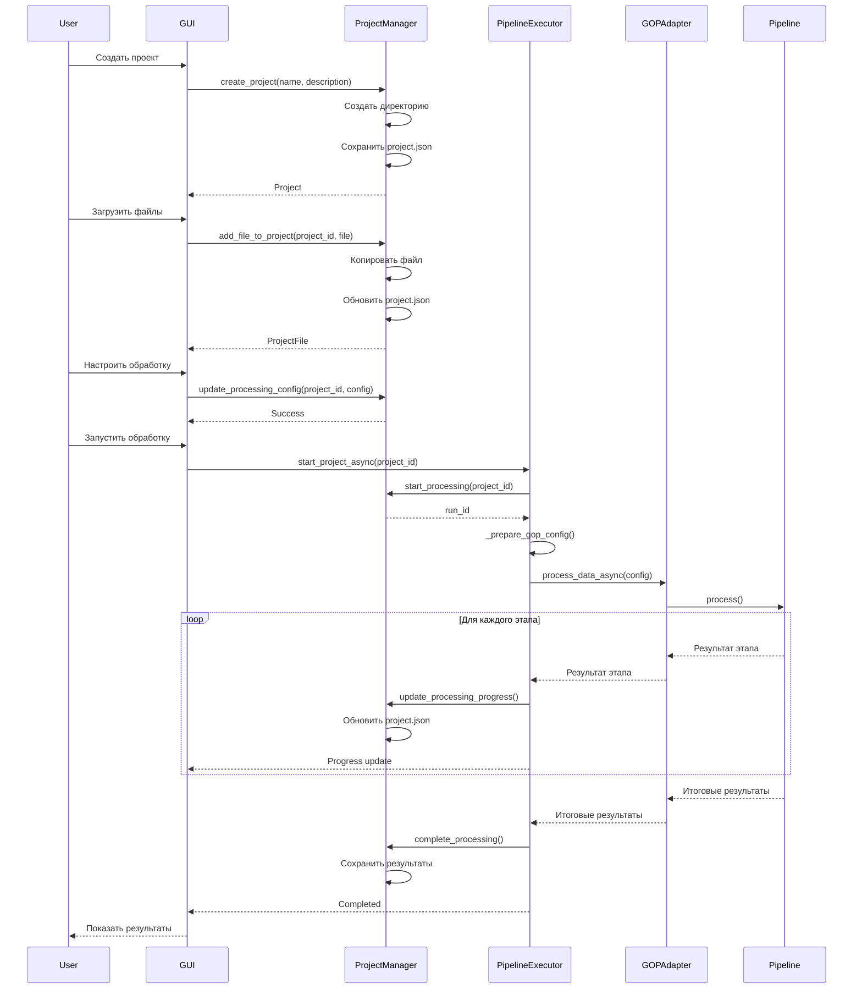
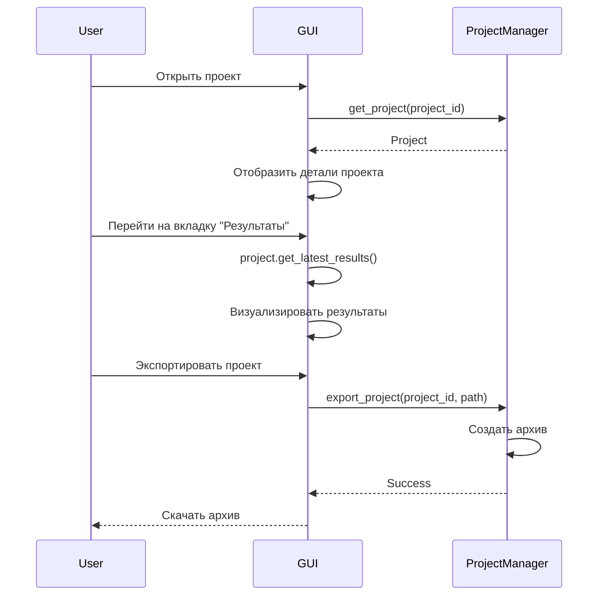

# Архитектура системы управления проектами GOP

## Обзор

Данный документ описывает архитектуру системы управления проектами для приложения GOP (Geospatial Orthophoto Processing). Система обеспечивает полный жизненный цикл проектов: создание, хранение, обработку и визуализацию результатов гиперспектрального анализа.

## Принципы проектирования

1. **Простота**: JSON-файловое хранилище без зависимости от тяжелых БД
2. **Интеграция**: Бесшовная работа с существующим Pipeline и GOPAdapter
3. **Расширяемость**: Легкое добавление новых функций и типов проектов
4. **Отказоустойчивость**: Валидация данных и обработка ошибок на всех уровнях
5. **Совместимость**: Следование паттернам Dash (callbacks, stores)

---

## 1. Модели данных

### 1.1 Project (Проект)

```python
# gui/models/project.py

from dataclasses import dataclass, field, asdict
from typing import List, Dict, Any, Optional
from datetime import datetime
from enum import Enum
import uuid
import json


class ProjectStatus(Enum):
    """Статусы проекта"""
    NEW = "new"                      # Новый проект
    READY = "ready"                  # Готов к обработке (файлы загружены)
    PROCESSING = "processing"        # В процессе обработки
    COMPLETED = "completed"          # Обработка завершена
    ERROR = "error"                  # Ошибка при обработке
    CANCELLED = "cancelled"          # Обработка отменена


class PipelineStage(Enum):
    """Этапы пайплайна обработки"""
    PREPROCESSING = "preprocessing"
    ORTHOPHOTO = "orthophoto"
    SEGMENTATION = "segmentation"
    INDICES = "indices"
    CONDITION = "condition"
    ANALYSIS = "analysis"


@dataclass
class ProcessingConfig:
    """Конфигурация обработки проекта"""
    sensor_type: str = "Hyperspectral"  # RGB, Multispectral, Hyperspectral
    selected_indices: List[str] = field(default_factory=lambda: ["NDVI", "EVI"])
    use_refinement: bool = True
    compression_ratio: Optional[float] = None
    stages_enabled: Dict[str, bool] = field(default_factory=lambda: {
        "preprocessing": True,
        "orthophoto": True,
        "segmentation": True,
        "indices": True,
        "condition": True,
        "analysis": True
    })
    custom_parameters: Dict[str, Any] = field(default_factory=dict)
    
    def to_dict(self) -> Dict[str, Any]:
        """Преобразование в словарь"""
        return asdict(self)
    
    @classmethod
    def from_dict(cls, data: Dict[str, Any]) -> 'ProcessingConfig':
        """Создание из словаря"""
        return cls(**data)


@dataclass
class ProjectFile:
    """Файл проекта"""
    file_id: str
    filename: str
    filepath: str  # Относительный путь от projects/{project_id}/files/
    file_size: int  # Размер в байтах
    file_type: str  # Тип файла (extension)
    uploaded_at: str  # ISO 8601 timestamp
    checksum: Optional[str] = None  # MD5 checksum для валидации
    
    def to_dict(self) -> Dict[str, Any]:
        """Преобразование в словарь"""
        return asdict(self)
    
    @classmethod
    def from_dict(cls, data: Dict[str, Any]) -> 'ProjectFile':
        """Создание из словаря"""
        return cls(**data)


@dataclass
class ProcessingResult:
    """Результат обработки"""
    stage: str  # Название этапа (preprocessing, orthophoto, etc.)
    status: str  # success, error, skipped
    started_at: str  # ISO 8601 timestamp
    completed_at: Optional[str] = None  # ISO 8601 timestamp
    duration_seconds: Optional[float] = None
    output_files: List[str] = field(default_factory=list)  # Пути к выходным файлам
    metrics: Dict[str, Any] = field(default_factory=dict)  # Метрики этапа
    error_message: Optional[str] = None
    
    def to_dict(self) -> Dict[str, Any]:
        """Преобразование в словарь"""
        return asdict(self)
    
    @classmethod
    def from_dict(cls, data: Dict[str, Any]) -> 'ProcessingResult':
        """Создание из словаря"""
        return cls(**data)


@dataclass
class ProcessingHistory:
    """История обработки проекта"""
    run_id: str  # Уникальный ID запуска обработки
    started_at: str  # ISO 8601 timestamp
    completed_at: Optional[str] = None
    status: str  # processing, completed, error, cancelled
    total_duration_seconds: Optional[float] = None
    stages: List[ProcessingResult] = field(default_factory=list)
    final_results: Dict[str, Any] = field(default_factory=dict)  # Итоговые результаты
    error_message: Optional[str] = None
    
    def to_dict(self) -> Dict[str, Any]:
        """Преобразование в словарь"""
        data = asdict(self)
        data['stages'] = [stage.to_dict() if hasattr(stage, 'to_dict') else stage 
                         for stage in self.stages]
        return data
    
    @classmethod
    def from_dict(cls, data: Dict[str, Any]) -> 'ProcessingHistory':
        """Создание из словаря"""
        stages = [ProcessingResult.from_dict(s) if isinstance(s, dict) else s 
                 for s in data.get('stages', [])]
        data_copy = data.copy()
        data_copy['stages'] = stages
        return cls(**data_copy)


@dataclass
class Project:
    """Основная модель проекта"""
    project_id: str
    name: str
    description: str = ""
    status: str = ProjectStatus.NEW.value
    created_at: str = field(default_factory=lambda: datetime.utcnow().isoformat())
    updated_at: str = field(default_factory=lambda: datetime.utcnow().isoformat())
    
    # Файлы проекта
    files: List[ProjectFile] = field(default_factory=list)
    
    # Конфигурация обработки
    processing_config: ProcessingConfig = field(default_factory=ProcessingConfig)
    
    # История обработки (может быть несколько запусков)
    processing_history: List[ProcessingHistory] = field(default_factory=list)
    
    # Текущий запуск обработки (если есть)
    current_run_id: Optional[str] = None
    
    # Метаданные
    tags: List[str] = field(default_factory=list)
    metadata: Dict[str, Any] = field(default_factory=dict)
    
    def to_dict(self) -> Dict[str, Any]:
        """Преобразование в словарь для JSON сериализации"""
        data = asdict(self)
        # Преобразуем вложенные объекты
        data['processing_config'] = self.processing_config.to_dict()
        data['files'] = [f.to_dict() if hasattr(f, 'to_dict') else f for f in self.files]
        data['processing_history'] = [h.to_dict() if hasattr(h, 'to_dict') else h 
                                      for h in self.processing_history]
        return data
    
    @classmethod
    def from_dict(cls, data: Dict[str, Any]) -> 'Project':
        """Создание проекта из словаря"""
        # Преобразуем вложенные объекты
        processing_config = ProcessingConfig.from_dict(data.get('processing_config', {}))
        files = [ProjectFile.from_dict(f) if isinstance(f, dict) else f 
                for f in data.get('files', [])]
        processing_history = [ProcessingHistory.from_dict(h) if isinstance(h, dict) else h 
                             for h in data.get('processing_history', [])]
        
        data_copy = data.copy()
        data_copy['processing_config'] = processing_config
        data_copy['files'] = files
        data_copy['processing_history'] = processing_history
        
        return cls(**data_copy)
    
    @classmethod
    def create_new(cls, name: str, description: str = "") -> 'Project':
        """Создание нового проекта"""
        project_id = str(uuid.uuid4())
        return cls(
            project_id=project_id,
            name=name,
            description=description
        )
    
    def add_file(self, filename: str, filepath: str, file_size: int, 
                 file_type: str, checksum: Optional[str] = None) -> ProjectFile:
        """Добавление файла в проект"""
        file_id = str(uuid.uuid4())
        project_file = ProjectFile(
            file_id=file_id,
            filename=filename,
            filepath=filepath,
            file_size=file_size,
            file_type=file_type,
            uploaded_at=datetime.utcnow().isoformat(),
            checksum=checksum
        )
        self.files.append(project_file)
        self.updated_at = datetime.utcnow().isoformat()
        return project_file
    
    def update_status(self, status: ProjectStatus) -> None:
        """Обновление статуса проекта"""
        self.status = status.value
        self.updated_at = datetime.utcnow().isoformat()
    
    def start_processing(self) -> str:
        """Начало новой обработки"""
        run_id = str(uuid.uuid4())
        history = ProcessingHistory(
            run_id=run_id,
            started_at=datetime.utcnow().isoformat(),
            status="processing"
        )
        self.processing_history.append(history)
        self.current_run_id = run_id
        self.update_status(ProjectStatus.PROCESSING)
        return run_id
    
    def get_current_processing(self) -> Optional[ProcessingHistory]:
        """Получение текущей обработки"""
        if not self.current_run_id:
            return None
        for history in self.processing_history:
            if history.run_id == self.current_run_id:
                return history
        return None
    
    def get_latest_results(self) -> Optional[Dict[str, Any]]:
        """Получение результатов последней успешной обработки"""
        for history in reversed(self.processing_history):
            if history.status == "completed":
                return history.final_results
        return None
```

---

## 2. ProjectManager Service

### 2.1 API проектного менеджера

```python
# gui/services/project_manager.py

import os
import json
import shutil
from pathlib import Path
from typing import List, Dict, Any, Optional, Callable
from datetime import datetime
import hashlib

from ..models.project import (
    Project, ProjectStatus, ProjectFile, 
    ProcessingHistory, ProcessingResult, ProcessingConfig
)


class ProjectManager:
    """Менеджер для управления проектами"""
    
    def __init__(self, projects_dir: str = "projects"):
        """
        Инициализация менеджера проектов
        
        Args:
            projects_dir: Директория для хранения проектов
        """
        self.projects_dir = Path(projects_dir)
        self.projects_dir.mkdir(parents=True, exist_ok=True)
        
        # Кэш проектов в памяти (опционально)
        self._cache: Dict[str, Project] = {}
        self._cache_enabled = True
    
    # ==================== CRUD операции ====================
    
    def create_project(self, name: str, description: str = "", 
                      tags: Optional[List[str]] = None) -> Project:
        """
        Создание нового проекта
        
        Args:
            name: Название проекта
            description: Описание проекта
            tags: Теги проекта
            
        Returns:
            Созданный проект
        """
        project = Project.create_new(name, description)
        if tags:
            project.tags = tags
        
        # Создание директории проекта
        project_dir = self._get_project_dir(project.project_id)
        project_dir.mkdir(parents=True, exist_ok=True)
        
        # Создание поддиректорий
        (project_dir / "files").mkdir(exist_ok=True)
        (project_dir / "results").mkdir(exist_ok=True)
        
        # Сохранение проекта
        self._save_project(project)
        
        return project
    
    def get_project(self, project_id: str) -> Optional[Project]:
        """
        Получение проекта по ID
        
        Args:
            project_id: ID проекта
            
        Returns:
            Проект или None если не найден
        """
        # Проверка кэша
        if self._cache_enabled and project_id in self._cache:
            return self._cache[project_id]
        
        # Загрузка с диска
        project = self._load_project(project_id)
        
        # Обновление кэша
        if project and self._cache_enabled:
            self._cache[project_id] = project
        
        return project
    
    def update_project(self, project: Project) -> bool:
        """
        Обновление проекта
        
        Args:
            project: Проект для обновления
            
        Returns:
            True если успешно
        """
        project.updated_at = datetime.utcnow().isoformat()
        success = self._save_project(project)
        
        # Обновление кэша
        if success and self._cache_enabled:
            self._cache[project.project_id] = project
        
        return success
    
    def delete_project(self, project_id: str, delete_files: bool = True) -> bool:
        """
        Удаление проекта
        
        Args:
            project_id: ID проекта
            delete_files: Удалить файлы проекта
            
        Returns:
            True если успешно
        """
        project_dir = self._get_project_dir(project_id)
        
        if not project_dir.exists():
            return False
        
        try:
            if delete_files:
                shutil.rmtree(project_dir)
            else:
                # Удаляем только метаданные
                metadata_file = project_dir / "project.json"
                if metadata_file.exists():
                    metadata_file.unlink()
            
            # Удаление из кэша
            if project_id in self._cache:
                del self._cache[project_id]
            
            return True
        except Exception as e:
            print(f"Ошибка удаления проекта {project_id}: {e}")
            return False
    
    def list_projects(self, status: Optional[str] = None, 
                     tags: Optional[List[str]] = None,
                     sort_by: str = "updated_at",
                     reverse: bool = True) -> List[Project]:
        """
        Получение списка проектов с фильтрацией
        
        Args:
            status: Фильтр по статусу
            tags: Фильтр по тегам
            sort_by: Поле для сортировки
            reverse: Обратная сортировка
            
        Returns:
            Список проектов
        """
        projects = []
        
        # Загрузка всех проектов
        for project_dir in self.projects_dir.iterdir():
            if project_dir.is_dir():
                project = self._load_project(project_dir.name)
                if project:
                    projects.append(project)
        
        # Фильтрация по статусу
        if status:
            projects = [p for p in projects if p.status == status]
        
        # Фильтрация по тегам
        if tags:
            projects = [p for p in projects 
                       if any(tag in p.tags for tag in tags)]
        
        # Сортировка
        if sort_by:
            projects.sort(
                key=lambda p: getattr(p, sort_by, ""),
                reverse=reverse
            )
        
        return projects
    
    def search_projects(self, query: str) -> List[Project]:
        """
        Поиск проектов по названию или описанию
        
        Args:
            query: Поисковый запрос
            
        Returns:
            Список найденных проектов
        """
        query_lower = query.lower()
        all_projects = self.list_projects()
        
        return [
            p for p in all_projects
            if query_lower in p.name.lower() or query_lower in p.description.lower()
        ]
    
    # ==================== Управление файлами ====================
    
    def add_file_to_project(self, project_id: str, source_path: str,
                           filename: Optional[str] = None) -> Optional[ProjectFile]:
        """
        Добавление файла в проект
        
        Args:
            project_id: ID проекта
            source_path: Путь к исходному файлу
            filename: Имя файла (если None, берется из source_path)
            
        Returns:
            ProjectFile или None при ошибке
        """
        project = self.get_project(project_id)
        if not project:
            return None
        
        source = Path(source_path)
        if not source.exists():
            return None
        
        # Определение имени файла
        if filename is None:
            filename = source.name
        
        # Копирование файла в директорию проекта
        files_dir = self._get_project_dir(project_id) / "files"
        dest_path = files_dir / filename
        
        # Если файл существует, добавляем суффикс
        counter = 1
        while dest_path.exists():
            name, ext = os.path.splitext(filename)
            dest_path = files_dir / f"{name}_{counter}{ext}"
            counter += 1
        
        try:
            shutil.copy2(source, dest_path)
            
            # Расчет checksum
            checksum = self._calculate_checksum(dest_path)
            
            # Добавление файла в проект
            file_size = dest_path.stat().st_size
            file_type = dest_path.suffix
            relative_path = f"files/{dest_path.name}"
            
            project_file = project.add_file(
                filename=dest_path.name,
                filepath=relative_path,
                file_size=file_size,
                file_type=file_type,
                checksum=checksum
            )
            
            # Обновление статуса проекта
            if project.status == ProjectStatus.NEW.value:
                project.update_status(ProjectStatus.READY)
            
            self.update_project(project)
            
            return project_file
            
        except Exception as e:
            print(f"Ошибка добавления файла: {e}")
            return None
    
    def remove_file_from_project(self, project_id: str, file_id: str,
                                delete_file: bool = True) -> bool:
        """
        Удаление файла из проекта
        
        Args:
            project_id: ID проекта
            file_id: ID файла
            delete_file: Удалить физический файл
            
        Returns:
            True если успешно
        """
        project = self.get_project(project_id)
        if not project:
            return False
        
        # Поиск файла
        file_to_remove = None
        for f in project.files:
            if f.file_id == file_id:
                file_to_remove = f
                break
        
        if not file_to_remove:
            return False
        
        # Удаление физического файла
        if delete_file:
            file_path = self._get_project_dir(project_id) / file_to_remove.filepath
            if file_path.exists():
                try:
                    file_path.unlink()
                except Exception as e:
                    print(f"Ошибка удаления файла: {e}")
        
        # Удаление из списка
        project.files = [f for f in project.files if f.file_id != file_id]
        
        # Обновление статуса если нет файлов
        if not project.files and project.status == ProjectStatus.READY.value:
            project.update_status(ProjectStatus.NEW)
        
        return self.update_project(project)
    
    def get_project_files(self, project_id: str) -> List[ProjectFile]:
        """
        Получение списка файлов проекта
        
        Args:
            project_id: ID проекта
            
        Returns:
            Список файлов
        """
        project = self.get_project(project_id)
        return project.files if project else []
    
    # ==================== Управление обработкой ====================
    
    def update_processing_config(self, project_id: str, 
                                config: ProcessingConfig) -> bool:
        """
        Обновление конфигурации обработки
        
        Args:
            project_id: ID проекта
            config: Новая конфигурация
            
        Returns:
            True если успешно
        """
        project = self.get_project(project_id)
        if not project:
            return False
        
        project.processing_config = config
        return self.update_project(project)
    
    def start_processing(self, project_id: str) -> Optional[str]:
        """
        Начало обработки проекта
        
        Args:
            project_id: ID проекта
            
        Returns:
            Run ID или None при ошибке
        """
        project = self.get_project(project_id)
        if not project:
            return None
        
        # Проверка наличия файлов
        if not project.files:
            return None
        
        # Проверка что не идет обработка
        if project.status == ProjectStatus.PROCESSING.value:
            return None
        
        run_id = project.start_processing()
        self.update_project(project)
        
        return run_id
    
    def update_processing_progress(self, project_id: str, run_id: str,
                                   stage_result: ProcessingResult) -> bool:
        """
        Обновление прогресса обработки
        
        Args:
            project_id: ID проекта
            run_id: ID запуска обработки
            stage_result: Результат этапа
            
        Returns:
            True если успешно
        """
        project = self.get_project(project_id)
        if not project:
            return False
        
        # Поиск истории обработки
        history = None
        for h in project.processing_history:
            if h.run_id == run_id:
                history = h
                break
        
        if not history:
            return False
        
        # Добавление результата этапа
        history.stages.append(stage_result)
        
        return self.update_project(project)
    
    def complete_processing(self, project_id: str, run_id: str,
                          final_results: Dict[str, Any],
                          status: str = "completed") -> bool:
        """
        Завершение обработки проекта
        
        Args:
            project_id: ID проекта
            run_id: ID запуска обработки
            final_results: Итоговые результаты
            status: Статус завершения (completed/error/cancelled)
            
        Returns:
            True если успешно
        """
        project = self.get_project(project_id)
        if not project:
            return False
        
        # Поиск истории обработки
        history = None
        for h in project.processing_history:
            if h.run_id == run_id:
                history = h
                break
        
        if not history:
            return False
        
        # Обновление истории
        history.completed_at = datetime.utcnow().isoformat()
        history.status = status
        history.final_results = final_results
        
        # Расчет длительности
        if history.started_at:
            start = datetime.fromisoformat(history.started_at)
            end = datetime.fromisoformat(history.completed_at)
            history.total_duration_seconds = (end - start).total_seconds()
        
        # Обновление статуса проекта
        project.current_run_id = None
        if status == "completed":
            project.update_status(ProjectStatus.COMPLETED)
        elif status == "error":
            project.update_status(ProjectStatus.ERROR)
        elif status == "cancelled":
            project.update_status(ProjectStatus.CANCELLED)
        
        return self.update_project(project)
    
    def get_processing_status(self, project_id: str) -> Optional[Dict[str, Any]]:
        """
        Получение статуса обработки
        
        Args:
            project_id: ID проекта
            
        Returns:
            Статус обработки
        """
        project = self.get_project(project_id)
        if not project:
            return None
        
        current = project.get_current_processing()
        if not current:
            return {
                "status": project.status,
                "is_processing": False
            }
        
        # Расчет прогресса
        total_stages = len(project.processing_config.stages_enabled)
        completed_stages = len(current.stages)
        progress = (completed_stages / total_stages * 100) if total_stages > 0 else 0
        
        return {
            "status": project.status,
            "is_processing": True,
            "run_id": current.run_id,
            "started_at": current.started_at,
            "progress": progress,
            "completed_stages": completed_stages,
            "total_stages": total_stages,
            "current_stage": current.stages[-1].stage if current.stages else None
        }
    
    # ==================== Статистика ====================
    
    def get_statistics(self) -> Dict[str, Any]:
        """
        Получение общей статистики по проектам
        
        Returns:
            Статистика
        """
        all_projects = self.list_projects()
        
        stats = {
            "total_projects": len(all_projects),
            "by_status": {},
            "total_files": 0,
            "total_size_bytes": 0,
            "total_processing_runs": 0,
            "successful_runs": 0
        }
        
        for project in all_projects:
            # Подсчет по статусам
            status = project.status
            stats["by_status"][status] = stats["by_status"].get(status, 0) + 1
            
            # Подсчет файлов и размера
            stats["total_files"] += len(project.files)
            stats["total_size_bytes"] += sum(f.file_size for f in project.files)
            
            # Подсчет обработок
            stats["total_processing_runs"] += len(project.processing_history)
            stats["successful_runs"] += sum(
                1 for h in project.processing_history if h.status == "completed"
            )
        
        return stats
    
    # ==================== Вспомогательные методы ====================
    
    def _get_project_dir(self, project_id: str) -> Path:
        """Получение директории проекта"""
        return self.projects_dir / project_id
    
    def _save_project(self, project: Project) -> bool:
        """Сохранение проекта в JSON файл"""
        project_dir = self._get_project_dir(project.project_id)
        metadata_file = project_dir / "project.json"
        
        try:
            with open(metadata_file, 'w', encoding='utf-8') as f:
                json.dump(project.to_dict(), f, ensure_ascii=False, indent=2)
            return True
        except Exception as e:
            print(f"Ошибка сохранения проекта: {e}")
            return False
    
    def _load_project(self, project_id: str) -> Optional[Project]:
        """Загрузка проекта из JSON файла"""
        project_dir = self._get_project_dir(project_id)
        metadata_file = project_dir / "project.json"
        
        if not metadata_file.exists():
            return None
        
        try:
            with open(metadata_file, 'r', encoding='utf-8') as f:
                data = json.load(f)
            return Project.from_dict(data)
        except Exception as e:
            print(f"Ошибка загрузки проекта {project_id}: {e}")
            return None
    
    def _calculate_checksum(self, filepath: Path) -> str:
        """Расчет MD5 checksum файла"""
        md5 = hashlib.md5()
        with open(filepath, 'rb') as f:
            for chunk in iter(lambda: f.read(4096), b""):
                md5.update(chunk)
        return md5.hexdigest()
    
    def clear_cache(self) -> None:
        """Очистка кэша проектов"""
        self._cache.clear()
    
    def export_project(self, project_id: str, export_path: str) -> bool:
        """
        Экспорт проекта в архив
        
        Args:
            project_id: ID проекта
            export_path: Путь для экспорта
            
        Returns:
            True если успешно
        """
        project_dir = self._get_project_dir(project_id)
        if not project_dir.exists():
            return False
        
        try:
            shutil.make_archive(export_path, 'zip', project_dir)
            return True
        except Exception as e:
            print(f"Ошибка экспорта проекта: {e}")
            return False
```

---

## 3. Интеграция с Pipeline

### 3.1 Pipeline Executor

Создать новый файл [`gui/services/pipeline_executor.py`](gui/services/pipeline_executor.py) для управления выполнением пайплайна:

**Основные функции:**
- [`execute_project()`](gui/services/pipeline_executor.py) - Асинхронное выполнение обработки проекта
- [`_prepare_gop_config()`](gui/services/pipeline_executor.py) - Подготовка конфигурации для GOP Pipeline
- [`_process_pipeline_stages()`](gui/services/pipeline_executor.py) - Обработка результатов этапов
- [`start_project_async()`](gui/services/pipeline_executor.py) - Запуск обработки в фоновом режиме
- [`cancel_project()`](gui/services/pipeline_executor.py) - Отмена обработки

**Интеграция с GOPAdapter:**
```python
# Пример использования
executor = PipelineExecutor(project_manager, gop_adapter)
result = await executor.execute_project(project_id, progress_callback)
```

### 3.2 Диаграмма потока данных

```
Пользователь
    │
    ├─> Создает проект (GUI)
    │       │
    │       ▼
    │   ProjectManager.create_project()
    │       │
    │       ▼
    │   Сохранение в projects/{id}/project.json
    │
    ├─> Загружает файлы (GUI)
    │       │
    │       ▼
    │   ProjectManager.add_file_to_project()
    │       │
    │       ▼
    │   Копирование в projects/{id}/files/
    │
    ├─> Настраивает обработку (GUI)
    │       │
    │       ▼
    │   ProjectManager.update_processing_config()
    │
    └─> Запускает обработку (GUI)
            │
            ▼
        PipelineExecutor.start_project_async()
            │
            ├─> ProjectManager.start_processing()
            │       │
            │       └─> Создание ProcessingHistory
            │
            ├─> PipelineExecutor._prepare_gop_config()
            │       │
            │       └─> Формирование конфигурации для Pipeline
            │
            ├─> GOPAdapter.process_data_async()
            │       │
            │       └─> Pipeline.process()
            │               │
            │               ├─> Preprocessing
            │               ├─> Orthophoto
            │               ├─> Segmentation
            │               ├─> Indices
            │               ├─> Condition
            │               └─> Analysis
            │
            ├─> PipelineExecutor._process_pipeline_stages()
            │       │
            │       └─> ProjectManager.update_processing_progress()
            │               │
            │               └─> Обновление ProcessingResult для каждого этапа
            │
            └─> ProjectManager.complete_processing()
                    │
                    └─> Сохранение итоговых результатов
```

---

## 4. Изменения GUI компонентов

### 4.1 Обновление [`gui/components/sidebar.py`](gui/components/sidebar.py)

**Изменения:**
1. Добавить параметр `project_manager` в [`create_sidebar()`](gui/components/sidebar.py)
2. Заменить хардкод проектов на вызов [`project_manager.list_projects()`](gui/services/project_manager.py)
3. Использовать реальную статистику из [`project_manager.get_statistics()`](gui/services/project_manager.py)
4. Создать динамические элементы списка с ID проектов
5. Добавить функцию [`_get_status_badge()`](gui/components/sidebar.py) для отображения статусов

**Новые элементы:**
- Pattern matching IDs для проектов: `{"type": "project-item", "index": project_id}`
- Условное отключение кнопок если нет проектов

### 4.2 Обновление [`gui/components/dashboard.py`](gui/components/dashboard.py)

**Изменения:**
1. Добавить параметр `project_manager` в [`create_dashboard()`](gui/components/dashboard.py)
2. Использовать реальную статистику вместо хардкода
3. Загружать последние 5 проектов для отображения
4. Добавить функцию [`_create_recent_projects_list()`](gui/components/dashboard.py)
5. Форматировать даты из ISO 8601

### 4.3 Новая страница деталей проекта

Создать [`gui/components/project_detail.py`](gui/components/project_detail.py):

```python
def create_project_detail_page(project):
    """Страница деталей проекта"""
    return html.Div([
        # Заголовок с названием проекта
        dbc.Row([
            dbc.Col([
                html.H2(project.name),
                html.P(project.description, className="text-muted"),
                _get_status_badge(project.status)
            ])
        ], className="mb-4"),
        
        # Вкладки
        dbc.Tabs([
            # Вкладка "Обзор"
            dbc.Tab(label="Обзор", children=[
                _create_overview_tab(project)
            ]),
            
            # Вкладка "Файлы"
            dbc.Tab(label="Файлы", children=[
                _create_files_tab(project)
            ]),
            
            # Вкладка "Обработка"
            dbc.Tab(label="Обработка", children=[
                _create_processing_tab(project)
            ]),
            
            # Вкладка "Результаты"
            dbc.Tab(label="Результаты", children=[
                _create_results_tab(project)
            ], disabled=project.status != ProjectStatus.COMPLETED.value),
        ])
    ])
```

### 4.4 Обновление [`gui/components/callbacks.py`](gui/components/callbacks.py)

**Новые callbacks:**

1. **`create_new_project`** - Создание проекта
   - Input: `create-project-btn.n_clicks`
   - State: `project-name-input.value`, `project-description-input.value`
   - Output: Обновление списка проектов, уведомление

2. **`upload_files_to_project`** - Загрузка файлов
   - Input: `file-upload.contents`
   - State: `project-store.data` (текущий проект)
   - Output: Список загруженных файлов

3. **`start_project_processing`** - Запуск обработки
   - Input: `start-processing-btn.n_clicks`
   - State: Конфигурация обработки
   - Output: Запуск PipelineExecutor

4. **`update_processing_progress`** - Обновление прогресса
   - Input: `progress-interval.n_intervals`
   - State: `processing-store.data`
   - Output: Прогресс-бар, текущий этап

5. **`select_project`** - Выбор проекта из списка
   - Input: `{"type": "project-item", "index": ALL}.n_clicks`
   - Output: Обновление `project-store`, переход на страницу проекта

6. **`delete_project`** - Удаление проекта
   - Input: `delete-project-btn.n_clicks`
   - Output: Обновление списка, уведомление

### 4.5 Обновление [`gui/components/layout.py`](gui/components/layout.py)

**Изменения в Stores:**
```python
# Добавить новые stores
dcc.Store(id='project-store', storage_type='session'),  # Текущий проект
dcc.Store(id='processing-store'),  # Статус обработки
dcc.Store(id='projects-list-store'),  # Кэш списка проектов
```

**Новые модальные окна:**
- Модальное окно подтверждения удаления проекта
- Модальное окно экспорта проекта
- Модальное окно просмотра результатов

### 4.6 Обновление [`gui/app/app.py`](gui/app/app.py)

**Инициализация сервисов:**
```python
from gui.services.project_manager import ProjectManager
from gui.services.pipeline_executor import PipelineExecutor
from gui.services.gop_adapter import GOPAdapter
from gui.config import GUIConfig

# Инициализация
GUIConfig.init_app(app)
project_manager = ProjectManager(GUIConfig.PROJECTS_FOLDER)
gop_adapter = GOPAdapter(GUIConfig.GOP_CONFIG_PATH)
pipeline_executor = PipelineExecutor(project_manager, gop_adapter)

# Передача в компоненты
app.layout = create_main_layout(project_manager)

# Регистрация callbacks
register_callbacks(app)
register_project_callbacks(app, project_manager, pipeline_executor)
```

---

## 5. Структура файлов и директорий

### 5.1 Структура проекта

```
projects/                           # Корневая директория проектов
├── {project-id-1}/                # Директория проекта
│   ├── project.json               # Метаданные проекта
│   ├── files/                     # Загруженные файлы
│   │   ├── input_data.bil
│   │   └── input_data.hdr
│   └── results/                   # Результаты обработки
│       ├── {run-id-1}/           # Результаты конкретного запуска
│       │   ├── orthophoto.tif
│       │   ├── segmentation_mask.tif
│       │   ├── NDVI_map.tif
│       │   ├── EVI_map.tif
│       │   └── scientific_report.json
│       └── {run-id-2}/
│           └── ...
├── {project-id-2}/
│   └── ...
└── .index.json                    # Опциональный индекс для быстрого поиска
```

### 5.2 Формат project.json

```json
{
  "project_id": "550e8400-e29b-41d4-a716-446655440000",
  "name": "Анализ поля пшеницы",
  "description": "NDVI анализ для оценки состояния посевов",
  "status": "completed",
  "created_at": "2024-01-15T10:30:00.000Z",
  "updated_at": "2024-01-15T14:45:00.000Z",
  
  "files": [
    {
      "file_id": "f1234567-89ab-cdef-0123-456789abcdef",
      "filename": "field_data.bil",
      "filepath": "files/field_data.bil",
      "file_size": 524288000,
      "file_type": ".bil",
      "uploaded_at": "2024-01-15T10:35:00.000Z",
      "checksum": "5d41402abc4b2a76b9719d911017c592"
    }
  ],
  
  "processing_config": {
    "sensor_type": "Hyperspectral",
    "selected_indices": ["NDVI", "EVI", "SAVI"],
    "use_refinement": true,
    "compression_ratio": null,
    "stages_enabled": {
      "preprocessing": true,
      "orthophoto": true,
      "segmentation": true,
      "indices": true,
      "condition": true,
      "analysis": true
    },
    "custom_parameters": {}
  },
  
  "processing_history": [
    {
      "run_id": "r1234567-89ab-cdef-0123-456789abcdef",
      "started_at": "2024-01-15T11:00:00.000Z",
      "completed_at": "2024-01-15T14:45:00.000Z",
      "status": "completed",
      "total_duration_seconds": 13500,
      "stages": [
        {
          "stage": "preprocessing",
          "status": "success",
          "started_at": "2024-01-15T11:00:00.000Z",
          "completed_at": "2024-01-15T11:30:00.000Z",
          "duration_seconds": 1800,
          "output_files": ["results/r1234.../preprocessed_data.tif"],
          "metrics": {
            "bands_processed": 224,
            "corrections_applied": ["radiometric", "atmospheric"]
          },
          "error_message": null
        },
        {
          "stage": "orthophoto",
          "status": "success",
          "started_at": "2024-01-15T11:30:00.000Z",
          "completed_at": "2024-01-15T12:00:00.000Z",
          "duration_seconds": 1800,
          "output_files": ["results/r1234.../orthophoto.tif"],
          "metrics": {
            "resolution": "0.5m",
            "coverage_area_m2": 100000
          },
          "error_message": null
        }
      ],
      "final_results": {
        "orthophoto_path": "results/r1234.../orthophoto.tif",
        "indices": {
          "NDVI": {
            "mean": 0.65,
            "std": 0.15,
            "min": 0.1,
            "max": 0.95
          }
        },
        "plant_condition": {
          "class": "Хорошее",
          "confidence": 0.85,
          "overall_score": 0.72
        }
      },
      "error_message": null
    }
  ],
  
  "current_run_id": null,
  "tags": ["пшеница", "ndvi", "2024"],
  "metadata": {
    "location": "Поле №5",
    "crop_type": "wheat",
    "season": "spring_2024"
  }
}
```

### 5.3 Новые файлы для создания

```
gui/
├── models/
│   ├── __init__.py
│   └── project.py                 # Модели данных проекта
├── services/
│   ├── project_manager.py         # Менеджер проектов
│   └── pipeline_executor.py       # Исполнитель пайплайна
└── components/
    └── project_detail.py          # Страница деталей проекта
```

---

## 6. Порядок реализации

### Фаза 1: Базовая инфраструктура (Приоритет: Высокий)

1. **Создать модели данных**
   - [ ] Создать [`gui/models/__init__.py`](gui/models/__init__.py)
   - [ ] Создать [`gui/models/project.py`](gui/models/project.py) с классами:
     - [`ProjectStatus`](gui/models/project.py)
     - [`PipelineStage`](gui/models/project.py)
     - [`ProcessingConfig`](gui/models/project.py)
     - [`ProjectFile`](gui/models/project.py)
     - [`ProcessingResult`](gui/models/project.py)
     - [`ProcessingHistory`](gui/models/project.py)
     - [`Project`](gui/models/project.py)

2. **Создать ProjectManager**
   - [ ] Создать [`gui/services/project_manager.py`](gui/services/project_manager.py)
   - [ ] Реализовать CRUD операции
   - [ ] Реализовать управление файлами
   - [ ] Реализовать управление обработкой
   - [ ] Добавить тесты для ProjectManager

3. **Обновить конфигурацию**
   - [ ] Добавить `PROJECTS_FOLDER` в [`gui/config.py`](gui/config.py)
   - [ ] Создать директорию `projects/` при инициализации

### Фаза 2: Интеграция с Pipeline (Приоритет: Высокий)

4. **Создать PipelineExecutor**
   - [ ] Создать [`gui/services/pipeline_executor.py`](gui/services/pipeline_executor.py)
   - [ ] Реализовать [`execute_project()`](gui/services/pipeline_executor.py)
   - [ ] Реализовать [`_prepare_gop_config()`](gui/services/pipeline_executor.py)
   - [ ] Реализовать [`_process_pipeline_stages()`](gui/services/pipeline_executor.py)
   - [ ] Добавить обработку ошибок и отмену задач

5. **Обновить GOPAdapter**
   - [ ] Убедиться что [`GOPAdapter.process_data_async()`](gui/services/gop_adapter.py) возвращает детальные результаты
   - [ ] Добавить поддержку progress callbacks

### Фаза 3: GUI компоненты (Приоритет: Средний)

6. **Обновить Sidebar**
   - [ ] Модифицировать [`create_sidebar()`](gui/components/sidebar.py) для работы с ProjectManager
   - [ ] Добавить [`_get_status_badge()`](gui/components/sidebar.py)
   - [ ] Реализовать динамический список проектов

7. **Обновить Dashboard**
   - [ ] Модифицировать [`create_dashboard()`](gui/components/dashboard.py)
   - [ ] Добавить [`_create_recent_projects_list()`](gui/components/dashboard.py)
   - [ ] Использовать реальную статистику

8. **Создать страницу деталей проекта**
   - [ ] Создать [`gui/components/project_detail.py`](gui/components/project_detail.py)
   - [ ] Реализовать вкладки: Обзор, Файлы, Обработка, Результаты
   - [ ] Добавить визуализацию результатов

### Фаза 4: Callbacks и интеграция (Приоритет: Средний)

9. **Добавить новые callbacks**
   - [ ] Реализовать [`create_new_project`](gui/components/callbacks.py)
   - [ ] Реализовать [`upload_files_to_project`](gui/components/callbacks.py)
   - [ ] Реализовать [`start_project_processing`](gui/components/callbacks.py)
   - [ ] Реализовать [`update_processing_progress`](gui/components/callbacks.py)
   - [ ] Реализовать [`select_project`](gui/components/callbacks.py)
   - [ ] Реализовать [`delete_project`](gui/components/callbacks.py)

10. **Обновить Layout**
    - [ ] Добавить новые Stores в [`gui/components/layout.py`](gui/components/layout.py)
    - [ ] Добавить новые модальные окна
    - [ ] Обновить роутинг для страницы деталей проекта

11. **Обновить App**
    - [ ] Инициализировать ProjectManager в [`gui/app/app.py`](gui/app/app.py)
    - [ ] Инициализировать PipelineExecutor
    - [ ] Передать сервисы в компоненты

### Фаза 5: Тестирование и документация (Приоритет: Низкий)

12. **Написать тесты**
    - [ ] Тесты для моделей данных
    - [ ] Тесты для ProjectManager
    - [ ] Тесты для PipelineExecutor
    - [ ] Интеграционные тесты GUI

13. **Обновить документацию**
    - [ ] Обновить [`docs/GUI_GUIDE.md`](docs/GUI_GUIDE.md)
    - [ ] Обновить [`docs/USER_GUIDE.md`](docs/USER_GUIDE.md)
    - [ ] Добавить примеры использования API

---

## 7. Диаграммы взаимодействия

### 7.1 Создание и обработка проекта



### 7.2 Просмотр результатов



---

## 8. Обработка ошибок

### 8.1 Типы ошибок

1. **Ошибки валидации**
   - Отсутствие обязательных полей
   - Неверный формат данных
   - Несуществующий проект/файл

2. **Ошибки файловой системы**
   - Недостаточно места на диске
   - Нет прав доступа
   - Поврежденные файлы

3. **Ошибки обработки**
   - Ошибка в Pipeline
   - Отмена пользователем
   - Таймаут обработки

### 8.2 Стратегии обработки

```python
# Пример обработки ошибок в ProjectManager
def add_file_to_project(self, project_id: str, source_path: str) -> Optional[ProjectFile]:
    try:
        # Валидация
        if not os.path.exists(source_path):
            raise FileNotFoundError(f"Файл не найден: {source_path}")
        
        project = self.get_project(project_id)
        if not project:
            raise ValueError(f"Проект не найден: {project_id}")
        
        # Проверка места на диске
        file_size = os.path.getsize(source_path)
        available_space = shutil.disk_usage(self.projects_dir).free
        if file_size > available_space:
            raise IOError("Недостаточно места на диске")
        
        # Копирование файла
        # ...
        
    except FileNotFoundError as e:
        logger.error(f"Файл не найден: {e}")
        return None
    except ValueError as e:
        logger.error(f"Ошибка валидации: {e}")
        return None
    except IOError as e:
        logger.error(f"Ошибка ввода-вывода: {e}")
        return None
    except Exception as e:
        logger.error(f"Неожиданная ошибка: {e}")
        return None
```

---

## 9. Производительность и оптимизация

### 9.1 Кэширование

- **In-memory кэш** в ProjectManager для часто используемых проектов
- **Опциональный индексный файл** `.index.json` для быстрого поиска
- **Lazy loading** результатов обработки (загрузка по требованию)

### 9.2 Асинхронность

- Все операции обработки выполняются асинхронно
- Использование `asyncio` для неблокирующих операций
- Progress callbacks для обновления UI

### 9.3 Ограничения

- Максимальный размер файла: 10 GB (настраивается)
- Максимальное количество файлов в проекте: 100 (настраивается)
- Автоматическая очистка старых результатов (опционально)

---

## 10. Безопасность

### 10.1 Валидация входных данных

- Проверка типов файлов (whitelist расширений)
- Валидация размеров файлов
- Проверка путей (предотвращение path traversal)
- Checksum валидация для целостности файлов

### 10.2 Изоляция проектов

- Каждый проект в отдельной директории
- Относительные пути внутри проекта
- Запрет доступа к файлам вне директории проекта

---

## 11. Миграция и обратная совместимость

### 11.1 Миграция существующих данных

Если в системе уже есть результаты обработки:

```python
# Скрипт миграции
def migrate_existing_results():
    """Миграция существующих результатов в проекты"""
    results_dir = Path("results")
    
    for result_dir in results_dir.iterdir():
        if result_dir.is_dir():
            # Создать проект из существующих результатов
            project = project_manager.create_project(
                name=f"Migrated: {result_dir.name}",
                description="Автоматически мигрированный проект"
            )
            
            # Копировать результаты
            # ...
```

### 11.2 Версионирование формата

Добавить поле `schema_version` в `project.json` для будущих изменений формата:

```json
{
  "schema_version": "1.0",
  "project_id": "...",
  ...
}
```

---

## 12. Заключение

Данная архитектура обеспечивает:

✅ **Простоту** - JSON-файловое хранилище без БД
✅ **Интеграцию** - Бесшовная работа с существующим Pipeline
✅ **Расширяемость** - Легко добавлять новые функции
✅ **Надежность** - Валидация и обработка ошибок
✅ **Производительность** - Асинхронная обработка и кэширование
✅ **Удобство** - Интуитивный GUI с реальными данными

### Следующие шаги

1. Начать с **Фазы 1** - создание моделей данных и ProjectManager
2. Протестировать базовую функциональность CRUD
3. Перейти к **Фазе 2** - интеграция с Pipeline
4. Постепенно обновлять GUI компоненты (**Фаза 3-4**)
5. Завершить тестированием и документацией (**Фаза 5**)

### Контакты для вопросов

- Email: st087204@student.spbu.ru
- Документация: [`docs/GUI_GUIDE.md`](docs/GUI_GUIDE.md)
- API Reference: [`docs/api/`](docs/api/)