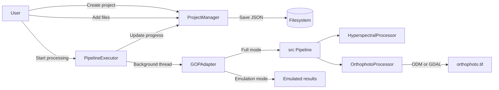

# GOP — Project Review

## Overview

**GOP** (v2.0.0) — web application for creating orthophotoplans from hyperspectral and regular images. User creates projects, uploads images, runs a processing pipeline, and gets an orthophoto as output. The project does not need tests or other things for a production solution. It is a simple but powerful program for personal use. ё

**Stack:** Python 3.10, Dash + Flask, GDAL, OpenDroneMap  
**Entry point:** [`main.py`](main.py) → launches Dash GUI on `127.0.0.1:8050`

---

## Architecture

```
main.py                    ← Entry point
├── gui/                   ← Web UI layer (Dash + Flask)
│   ├── app/app.py         ← App factory, server setup
│   ├── api/routes.py      ← REST API (Flask Blueprint)
│   ├── components/        ← UI components (layout, sidebar, dashboard, etc.)
│   ├── models/project.py  ← Data models (dataclasses)
│   ├── services/          ← Business logic
│   │   ├── project_manager.py    ← CRUD + file management
│   │   ├── pipeline_executor.py  ← Background processing orchestration
│   │   ├── gop_adapter.py        ← Bridge to src/ processing core
│   │   ├── session_manager.py    ← User sessions (file-based)
│   │   └── cache_manager.py      ← Multi-tier cache (Redis/file/memory)
│   └── utils/             ← Upload utils, memory monitor
└── src/                   ← Processing core (science layer)
    ├── core/
    │   ├── config.py      ← Thread-safe singleton config (YAML)
    │   └── pipeline.py    ← Main processing pipeline
    ├── processing/
    │   ├── orthophoto.py              ← ODM / GDAL orthophoto creation
    │   └── hyperspectral/processor.py ← Hyperspectral data loading (GDAL)
    └── utils/             ← Validators, exceptions, GDAL utils, logger
```

---

## Key Components

### GUI Layer (`gui/`)

| Component | What it does |
|---|---|
| [`app.py`](gui/app/app.py) | Dash app factory. Creates Flask server, registers API blueprint, inits services, registers callbacks |
| [`routes.py`](gui/api/routes.py) | REST endpoints: `/api/health`, `/api/config`, `/api/projects`, `/api/process`. File upload with streaming |
| [`callbacks.py`](gui/components/callbacks.py) | All Dash callbacks: routing, project CRUD, file browser, processing start/cancel/progress polling |
| [`project_detail.py`](gui/components/project_detail.py) | Project detail page with 4 tabs: Overview, Files, Processing, Results |
| [`server_file_picker.py`](gui/components/server_file_picker.py) | Server-side file browser — adds files via `shutil.copy2` (no OOM) |
| [`project_manager.py`](gui/services/project_manager.py) | Project lifecycle: CRUD, file add/remove, processing state machine, stats. Persists as JSON on disk |
| [`pipeline_executor.py`](gui/services/pipeline_executor.py) | Runs pipeline stages in background threads. Supports cancel via `threading.Event`. Falls back to emulation if GOP core unavailable |
| [`gop_adapter.py`](gui/services/gop_adapter.py) | Adapter between GUI and `src/`. Has full mode (real processing) and emulation mode |

### Processing Core (`src/`)

| Component | What it does |
|---|---|
| [`config.py`](src/core/config.py) | Thread-safe singleton config. Loads from YAML, supports dot-notation access, DI |
| [`pipeline.py`](src/core/pipeline.py) | 2-stage pipeline: (1) hyperspectral preprocessing → (2) orthophoto creation |
| [`orthophoto.py`](src/processing/orthophoto.py) | Creates orthophoto via OpenDroneMap (preferred) or GDAL `gdal_merge.py` (fallback). Validates and optimizes output |
| [`processor.py`](src/processing/hyperspectral/processor.py) | Loads hyperspectral data via GDAL, validates, caches. `process()` method is a stub (TODO) |
| [`gdal_utils.py`](src/utils/gdal_utils.py) | Context managers for GDAL datasets, safe read/write, metadata extraction |
| [`exceptions.py`](src/utils/exceptions.py) | Exception hierarchy: `GOPException` → `ValidationError`, `ProcessingError`, `FileError`, `GDALError` |
| [`validators.py`](src/utils/validators.py) | Validation for arrays, wavelengths, file paths, band names, configs |

---

## Data Flow



---

## Project Model & State Machine

States: `new` → `ready` → `run` → `done` / `error` / `cancelled`

- **new**: project created, no files
- **ready**: files uploaded
- **run**: pipeline executing in background thread
- **done**: processing completed
- **error** / **cancelled**: terminal states

Pipeline stages: `preprocessing` → `orthophoto` (each weighted 50%)

---

## Configuration

[`config.yaml`](config.yaml) — single YAML file covering:
- Processing params (resolution, batch size, ODM timeout, radiometric/atmospheric correction, noise reduction, spectral calibration)
- Output settings (format, reports)
- Performance (memory limits, parallelism, cache)
- Validation rules
- External tools (ODM, GDAL)
- Experimental features (ML, cloud — disabled)

GUI config via [`gui/config.py`](gui/config.py) — env vars for host/port, DB URL, Redis, upload limits (max 10GB per file, 100 files).

---

## Notable Design Decisions

1. **Dual-mode processing** — `GOPAdapter` works in full mode (real GDAL/ODM processing) or emulation mode (fake results with delays). Allows GUI development without heavy dependencies.

2. **Server-side file picker** — files are copied via `shutil.copy2` at filesystem level instead of browser upload (base64). Solves OOM for large files (multi-GB hyperspectral data).

3. **Thread-based execution** — `PipelineExecutor` uses `threading.Thread` with `threading.Event` for cancellation. No Celery dependency required.

4. **JSON-on-disk persistence** — projects stored as `project.json` in per-project directories. No database required. In-memory cache for fast reads.

5. **Multi-tier caching** — Redis (if available) → file cache → in-memory LRU. Graceful degradation.

6. **Dependency injection** — `Config` supports both singleton and DI patterns. Pipeline accepts injected config.

---

## Issues & Observations

### Incomplete / Stubs

| # | File | What's missing |
|---|------|----------------|
| 1 | [`processor.py:178-190`](src/processing/hyperspectral/processor.py:178) | `process()` is a stub — just returns `output_dir` |
| 2 | [`processor.py:167-169`](src/processing/hyperspectral/processor.py:167) | `save_results()` has TODO, doesn't actually save data |
| 3 | [`orthophoto.py:293`](src/processing/orthophoto.py:293) | GPS file creation is a TODO stub |
| 4 | [`routes.py:196-211`](gui/api/routes.py:196) | `/api/process` endpoints are stubs returning hardcoded responses |


### Architecture

| # | Observation |
|---|-------------|
| 1 | REST API (`routes.py`) and Dash callbacks (`callbacks.py`) are parallel systems doing similar things. API routes are mostly stubs while real logic lives in callbacks |
| 2 | `SessionManager` and `CacheManager` are implemented but not wired into the app |
| 4 | Thread-based processing won't scale. Consider Celery or process pool for production |

---

## Supported Formats

**Input:** `.bil`, `.hdr`, `.tif`, `.tiff`, `.dat`, `.png`, `.jpg`, `.jpeg`, `.geotiff`  
**Output:** GeoTIFF (`orthophoto.tif`)

---

## Deployment

- **Local:** `python main.py` → runs on `127.0.0.1:8050`
- **Dependencies:** GDAL, OpenDroneMap (optional), Redis (optional), psutil, numpy, dash, flask
