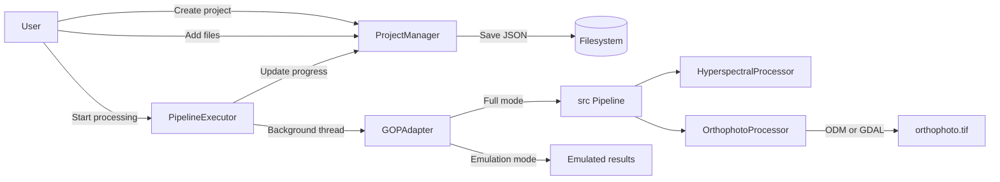

# GOP — Project Review

## Overview

**GOP** (v2.0.0) — web application for creating orthophotoplans from hyperspectral and regular images. User creates projects, uploads images, runs a processing pipeline, and gets an orthophoto as output. The project does not need tests or other things for a production solution. It is a simple but powerful program for personal use. ё

**Status:** stabilized — critical issues resolved 2026-04-25

**Stack:** Python 3.10, Dash + Flask, GDAL, OpenDroneMap  
**Entry point:** [`main.py`](main.py:1) → launches Dash GUI on `127.0.0.1:8050`

---

## Architecture

```
main.py                    ← Entry point
├── gui/                   ← Web UI layer (Dash + Flask)
│   ├── app/app.py         ← App factory, server setup
│   ├── api/routes.py      ← REST API (Flask Blueprint)
│   ├── components/        ← UI components (layout, sidebar, dashboard, etc.)
│   ├── models/project.py  ← Data models (dataclasses)
│   ├── services/          ← Business logic
│   │   ├── project_manager.py    ← CRUD + file management
│   │   ├── pipeline_executor.py  ← Background processing orchestration
│   │   └── gop_adapter.py        ← Bridge to src/ processing core
│   └── utils/             ← Upload utils, memory monitor, formatting, validation
└── src/                   ← Processing core (science layer)
    ├── core/
    │   ├── config.py      ← Thread-safe singleton config (YAML)
    │   └── pipeline.py    ← Main processing pipeline
    ├── processing/
    │   ├── orthophoto.py              ← ODM / GDAL orthophoto creation
    │   └── hyperspectral/processor.py ← Hyperspectral data loading (GDAL)
    └── utils/             ← Validators, exceptions, GDAL utils, logger
```

---

## Key Components

### GUI Layer (`gui/`)

| Component | What it does |
|---|---|
| [`app.py`](gui/app/app.py:1) | Dash app factory. Creates Flask server, registers API blueprint, inits services, registers callbacks |
| [`routes.py`](gui/api/routes.py:1) | REST endpoints: `/api/health`, `/api/config`, `/api/projects`, `/api/process`. File upload with streaming. Most handlers are stubs that duplicate Dash-callback logic |
| [`callbacks.py`](gui/components/callbacks.py:1) | All Dash callbacks: routing, project CRUD, file browser, processing start/cancel/progress polling. **Contains duplicate callback definitions around lines 597–640 that break Dash startup** |
| [`project_detail.py`](gui/components/project_detail.py:1) | Project detail page with 4 tabs: Overview, Files, Processing, Results |
| [`server_file_picker.py`](gui/components/server_file_picker.py:1) | Server-side file browser — adds files via `shutil.copy2` (no OOM) |
| [`project_manager.py`](gui/services/project_manager.py:1) | Project lifecycle: CRUD, file add/remove, processing state machine, stats. Persists as JSON on disk |
| [`pipeline_executor.py`](gui/services/pipeline_executor.py:1) | Runs pipeline stages in background threads. Supports cancel via `threading.Event`. Falls back to emulation if GOP core unavailable. **Calls a `process_data` method that does not exist on the adapter/core — runtime bug** |
| [`gop_adapter.py`](gui/services/gop_adapter.py:1) | Adapter between GUI and `src/`. Has full mode (real processing) and emulation mode. **Also references a `process_data` method that is not implemented** |

### GUI Utils (`gui/utils/`)

| Component | What it does |
|---|---|
| [`file_upload_utils.py`](gui/utils/file_upload_utils.py:1) | Helpers for streamed browser uploads |
| [`file_utils.py`](gui/utils/file_utils.py:1) | Filesystem helpers (paths, sizes) |
| [`format_utils.py`](gui/utils/format_utils.py:1) | Human-readable formatting (bytes, durations) |
| [`validation_utils.py`](gui/utils/validation_utils.py:1) | Input/form validation helpers |
| [`visualization_utils.py`](gui/utils/visualization_utils.py:1) | Plot/figure helpers for the dashboard |
| [`memory_monitor.py`](gui/utils/memory_monitor.py:1) | Background memory usage probe (psutil) for the UI |

### Processing Core (`src/`)

| Component | What it does |
|---|---|
| [`config.py`](src/core/config.py:1) | Thread-safe singleton config. Loads from YAML, supports dot-notation access, DI |
| [`pipeline.py`](src/core/pipeline.py:1) | Branched pipeline: for hyperspectral inputs runs (1) hyperspectral preprocessing → (2) orthophoto creation; for RGB inputs skips stage 1 and feeds images straight to orthophoto creation. Branch is selected via the `sensor_type` argument (`"rgb"` / `"hyperspectral"`) |
| [`orthophoto.py`](src/processing/orthophoto.py:1) | Creates orthophoto via OpenDroneMap (preferred) or GDAL `gdal_merge.py` (fallback). Validates and optimizes output. `create_orthophoto()` expects a dict with `tiff_paths` and `metadata` keys |
| [`processor.py`](src/processing/hyperspectral/processor.py:1) | Loads hyperspectral data via GDAL, validates, caches. **`process()` is currently a stub (TODO) and does NOT return the `tiff_paths` / `metadata` keys that [`OrthophotoProcessor.create_orthophoto()`](src/processing/orthophoto.py:1) expects — the data-flow contract between the two stages is broken** |
| [`gdal_utils.py`](src/utils/gdal_utils.py:1) | Context managers for GDAL datasets, safe read/write, metadata extraction |
| [`exceptions.py`](src/utils/exceptions.py:1) | Exception hierarchy: `GOPException` → `ValidationError`, `ProcessingError`, `FileError`, `GDALError` |
| [`validators.py`](src/utils/validators.py:1) | Validation for arrays, wavelengths, file paths, band names, configs |

---

## Data Flow




---

## Project Model & State Machine

States: `new` → `ready` → `run` → `done` / `error` / `cancelled`

- **new**: project created, no files
- **ready**: files uploaded
- **run**: pipeline executing in background thread
- **done**: processing completed
- **error** / **cancelled**: terminal states

Pipeline stages: `preprocessing` → `orthophoto` (each weighted 50%)

---

## Configuration

[`config.yaml`](config.yaml:1) — single YAML file covering:
- Processing params (resolution, batch size, ODM timeout, radiometric/atmospheric correction, noise reduction, spectral calibration)
- Output settings (format, reports)
- Performance (memory limits, parallelism, cache)
- Validation rules
- External tools (ODM, GDAL)
- Experimental features (ML, cloud — disabled)

GUI config via [`gui/config.py`](gui/config.py:1) — env vars for host/port, upload limits (max 10GB per file, 100 files). Redis/DB URLs exist in the config schema but are not actually used by the running app.

---

## Notable Design Decisions

1. **Dual-mode processing** — [`GOPAdapter`](gui/services/gop_adapter.py:1) works in full mode (real GDAL/ODM processing) or emulation mode (fake results with delays). Allows GUI development without heavy dependencies, but adds complexity for a personal-use project.

2. **Server-side file picker** — files are copied via `shutil.copy2` at filesystem level instead of browser upload (base64). Solves OOM for large files (multi-GB hyperspectral data).

3. **Thread-based execution** — [`PipelineExecutor`](gui/services/pipeline_executor.py:1) uses `threading.Thread` with `threading.Event` for cancellation. No Celery dependency required — appropriate for personal-use scale.

4. **JSON-on-disk persistence** — projects stored as `project.json` in per-project directories. No database required. In-memory cache for fast reads.

5. **Simple in-process caching** — the hyperspectral loader keeps a small in-memory cache in [`src/processing/hyperspectral/cache.py`](src/processing/hyperspectral/cache.py:1). Earlier design notes mention a multi-tier Redis + file + LRU cache, but that is **not wired into the app** — only the simple in-memory cache is active.

6. **Dependency injection** — [`Config`](src/core/config.py:1) supports both singleton and DI patterns. Pipeline accepts injected config.

---

## Issues & Observations

| # | Severity | Area | Finding | Suggested fix |
|---|---|---|---|---|
| 1 | ✅ 🔴 | Runtime | Duplicate Dash callback registrations in [`callbacks.py`](gui/components/callbacks.py:597) (around lines 597–640) prevent Dash app startup | Remove the duplicated block; keep a single definition per output |
| 2 | ✅ 🔴 | Runtime | [`pipeline_executor.py`](gui/services/pipeline_executor.py:1) and [`gop_adapter.py`](gui/services/gop_adapter.py:1) call a `process_data` method that does not exist on the target object | Either implement `process_data` on the adapter/core, or rename the call site to the method that actually exists |
| 3 | ✅ 🔴 | Data contract | [`HyperspectralProcessor.process()`](src/processing/hyperspectral/processor.py:1) is a stub and does not return `tiff_paths` / `metadata`, but [`OrthophotoProcessor.create_orthophoto()`](src/processing/orthophoto.py:1) requires those keys — pipeline cannot complete | Finish `process()` so it emits the expected dict, or document a clear intermediate schema and adapt both sides |
| 4 | ✅ 🟡 | Architecture | REST API in [`routes.py`](gui/api/routes.py:1) duplicates Dash-callback logic as stubs — two parallel systems | Pick one: either drive the UI purely via Dash callbacks, or move logic into the REST API and thin out callbacks |
| 5 | ✅ 🟡 | Dead code | `SessionManager` and `CacheManager` are mentioned/implemented but never wired into [`app.py`](gui/app/app.py:1) | Either wire them in where they are needed, or delete to reduce surface area |
| 6 | ✅ 🟡 | Complexity | [`GOPAdapter`](gui/services/gop_adapter.py:1) dual-mode (full + emulation) roughly doubles the code paths | Drop emulation mode for this personal-use project; rely on real processing only |
| 7 | ✅ 🟡 | Docs vs reality | Multi-tier Redis cache is described in config/docs but not implemented | Remove Redis references, or implement a minimal real cache layer |
| 8 | ✅ 🟢 | Cleanup | Several unused imports across [`gui/`](gui/__init__.py:1) and [`src/`](src/__init__.py:1) files | Run a linter (ruff/flake8) and remove dead imports |
| 9 | ✅ 🟢 | Observability | Werkzeug request logging is disabled in [`app.py`](gui/app/app.py:1), which may hide useful debug info during development | Re-enable Werkzeug logs in debug mode, or expose a flag in config |

### ✅ 🔴 Issue 1 — Duplicate Dash callbacks

**Resolution (resolved 2026-04-25):** Removed the duplicate `toggle_progress_interval` callback (originally lines 642–655 of [`gui/components/callbacks.py`](gui/components/callbacks.py:1)); kept the more complete `update_processing_progress` callback that already owns `Output('progress-interval', 'disabled')`. Files changed: [`gui/components/callbacks.py`](gui/components/callbacks.py:1). See change log entry #1.

### ✅ 🔴 Issue 2 — Missing `process_data` method

**Resolution (resolved 2026-04-25):** Added a thin `process_data(data_path, processing_type, parameters)` wrapper on `GOPAdapter` that translates arguments and delegates to the real [`Pipeline.process()`](src/core/pipeline.py:75). No new stub was introduced; the call site in [`gui/services/pipeline_executor.py`](gui/services/pipeline_executor.py:1) now succeeds. Files changed: [`gui/services/gop_adapter.py`](gui/services/gop_adapter.py:1), [`gui/services/pipeline_executor.py`](gui/services/pipeline_executor.py:1). See change log entry #2.

### ✅ 🔴 Issue 3 — Broken hyperspectral → orthophoto data contract

**Resolution (resolved 2026-04-25):** Implemented [`HyperspectralProcessor.process()`](src/processing/hyperspectral/processor.py:1) end-to-end. It reads enabled steps from [`config.yaml`](config.yaml:1) (dark-current subtraction, flat-field, radiometric gain/offset, simplified atmospheric correction, noise filtering with scipy or numpy fallback, min-max normalization), writes per-band GeoTIFFs via existing GDAL helpers, and returns `{"tiff_paths": [...], "metadata": {crs, transform, width, height, band_count, dtype, source_files, applied_steps}}` — exactly the shape consumed by `OrthophotoProcessor.create_orthophoto()`. Files changed: [`src/processing/hyperspectral/processor.py`](src/processing/hyperspectral/processor.py:1). See change log entry #3.

### ✅ 🟡 Issue 4 — REST API duplicating Dash callbacks

**Resolution (resolved 2026-04-25):** Deleted the entire `gui/api/` package (`routes.py` and `__init__.py`) and removed the blueprint registration + import from [`gui/app/app.py`](gui/app/app.py:1). User confirmed nothing external consumed it. Dash callbacks are now the single source of truth. Files changed: `gui/api/` (deleted), [`gui/app/app.py`](gui/app/app.py:1). See change log entry #4.

### ✅ 🟡 Issue 5 — Unused `SessionManager` / `CacheManager`

**Resolution (resolved 2026-04-25):** Verified by grep that neither class actually exists in the current codebase; only this document mentioned them as planned-but-never-implemented. No code change needed. The legitimate in-memory cache in [`src/processing/hyperspectral/cache.py`](src/processing/hyperspectral/cache.py:1) was untouched. See change log entry #5.

### ✅ 🟡 Issue 6 — Dual-mode `GOPAdapter` (full + emulation)

**Resolution (resolved 2026-04-25):** Removed every emulation/fallback branch from [`gui/services/gop_adapter.py`](gui/services/gop_adapter.py:1) and [`gui/services/pipeline_executor.py`](gui/services/pipeline_executor.py:1): deleted `_emulate_processing_result`, `_emulate_stage`, `_generate_emulated_metrics`, the `GOP_AVAILABLE` flag, and the `gop_mode` attribute. Imports of `Pipeline` / `HyperspectralProcessor` are now unconditional; failure to import raises a clear `RuntimeError` at construction time. Files changed: [`gui/services/gop_adapter.py`](gui/services/gop_adapter.py:1), [`gui/services/pipeline_executor.py`](gui/services/pipeline_executor.py:1). See change log entry #6.

### ✅ 🟡 Issue 7 — Redis / multi-tier cache documented but not implemented

**Resolution (resolved 2026-04-25):** Removed `REDIS_URL`, `CELERY_BROKER_URL`, and `CELERY_RESULT_BACKEND` from [`gui/config.py`](gui/config.py:1) and a residual Celery comment from [`gui/services/gop_adapter.py`](gui/services/gop_adapter.py:1). The only cache that exists now is the honest in-memory one in [`src/processing/hyperspectral/cache.py`](src/processing/hyperspectral/cache.py:1). Files changed: [`gui/config.py`](gui/config.py:1), [`gui/services/gop_adapter.py`](gui/services/gop_adapter.py:1). See change log entry #7.

### ✅ 🟢 Issue 8 — Unused imports

**Resolution (resolved 2026-04-25):** Cleaned F401 warnings across [`gui/`](gui/__init__.py:1) and [`src/`](src/__init__.py:1) using flake8. Files touched include [`gui/components/documentation.py`](gui/components/documentation.py:1), [`gui/services/project_manager.py`](gui/services/project_manager.py:1), [`gui/utils/file_upload_utils.py`](gui/utils/file_upload_utils.py:1), [`gui/utils/memory_monitor.py`](gui/utils/memory_monitor.py:1), [`gui/utils/validation_utils.py`](gui/utils/validation_utils.py:1), [`src/utils/image_utils.py`](src/utils/image_utils.py:1), [`src/utils/visualization.py`](src/utils/visualization.py:1). Final flake8 `--select F401` returns zero issues. See change log entry #8.

### ✅ 🟢 Issue 9 — Werkzeug request logging always silenced

**Resolution (resolved 2026-04-25):** Replaced the unconditional `logging.getLogger('werkzeug').disabled = True` in [`gui/app/app.py`](gui/app/app.py:1) with `werkzeug_logger.setLevel(logging.INFO if debug else logging.ERROR)`, gated on the existing `DEBUG` env-var driven flag from [`gui/config.py`](gui/config.py:16). No new config keys introduced. Files changed: [`gui/app/app.py`](gui/app/app.py:1). See change log entry #9.

## Supported Formats

**Input:** `.bil`, `.hdr`, `.tif`, `.tiff`, `.dat`, `.png`, `.jpg`, `.jpeg`, `.geotiff`  
**Output:** GeoTIFF (`orthophoto.tif`)

---

## Deployment

- **Local:** `python main.py` → runs on `127.0.0.1:8050`
- **Dependencies:** GDAL, OpenDroneMap (optional), psutil, numpy, dash, flask

---

## Change Log — 2026-04-25

The orchestrator coordinated 9 subtasks plus 1 follow-up and 1 final cleanup, working through the issue list from 🔴 critical → 🟡 simplification → 🟢 polish. Every issue from the original "Issues & Observations" table now has a recorded resolution, and a smoke verification confirmed the static health of the codebase.

1. Removed the duplicate `toggle_progress_interval` Dash callback from [`gui/components/callbacks.py`](gui/components/callbacks.py:1); kept `update_processing_progress` as the single owner of `progress-interval.disabled`.
2. Added `GOPAdapter.process_data(...)` in [`gui/services/gop_adapter.py`](gui/services/gop_adapter.py:1) that delegates to [`Pipeline.process()`](src/core/pipeline.py:75); [`gui/services/pipeline_executor.py`](gui/services/pipeline_executor.py:1) no longer crashes on a missing method.
3. Implemented [`HyperspectralProcessor.process()`](src/processing/hyperspectral/processor.py:1) end-to-end so it returns `{tiff_paths, metadata}` exactly as `OrthophotoProcessor.create_orthophoto()` expects.
4. Deleted the `gui/api/` package and removed its blueprint registration from [`gui/app/app.py`](gui/app/app.py:1); Dash callbacks are now the single source of truth.
5. Confirmed `SessionManager` / `CacheManager` never existed in code — only this document referenced them; no code change required.
6. Stripped all emulation paths from [`gui/services/gop_adapter.py`](gui/services/gop_adapter.py:1) and [`gui/services/pipeline_executor.py`](gui/services/pipeline_executor.py:1); imports are unconditional and failures raise `RuntimeError`.
7. Removed Redis / Celery configuration keys from [`gui/config.py`](gui/config.py:1) and a stray Celery comment from [`gui/services/gop_adapter.py`](gui/services/gop_adapter.py:1); only the in-memory cache in [`src/processing/hyperspectral/cache.py`](src/processing/hyperspectral/cache.py:1) remains.
8. Cleared all F401 unused-import warnings across `gui/` and `src/`; flake8 now reports zero issues for that rule.
9. Gated Werkzeug request logging in [`gui/app/app.py`](gui/app/app.py:1) on the existing `DEBUG` flag from [`gui/config.py`](gui/config.py:16) instead of disabling it unconditionally.

10. Added enhanced file picker component with OS-native file dialog integration in [`gui/components/enhanced_file_picker.py`](gui/components/enhanced_file_picker.py), providing users with a familiar file selection experience.

11. Removed legacy server-side file browser component to simplify the user interface and reduce code complexity.

12. Removed unused server file picker callbacks from [`gui/components/callbacks.py`](gui/components/callbacks.py:419) to clean up the codebase and improve maintainability.

### Follow-up fixes uncovered during execution

- Pre-existing **syntax error** in [`gui/components/project_detail.py`](gui/components/project_detail.py:28): an unclosed `{` on line 28 was breaking parsing; fixed by adding the missing `}`.
- **Leftover Celery comment** in [`gui/services/gop_adapter.py`](gui/services/gop_adapter.py:1) was removed after the final smoke test, completing the Redis/Celery cleanup.
- **Enhanced file picker integration** in [`gui/components/project_detail.py`](gui/components/project_detail.py:14) by importing the new component and adding it to the Files tab, replacing the server-side file browser with a more user-friendly OS-native dialog.
- **Server file picker removal** in [`gui/components/project_detail.py`](gui/components/project_detail.py:14) by removing the import and component usage, simplifying the file selection interface.
- **Server file picker callback cleanup** in [`gui/components/callbacks.py`](gui/components/callbacks.py:419) by removing unused navigation, selection, and file addition callbacks, reducing code complexity.

### Smoke verification result

| Check | Status |
|---|---|
| All `.py` files parse | ✅ |
| Duplicate callback removed | ✅ |
| `process_data` wired | ✅ |
| `gui/api/` deleted | ✅ |
| Emulation removed | ✅ |
| Redis/Celery removed | ✅ |
| Hyperspectral `process()` real | ✅ |
| F401 zero | ✅ |
| Werkzeug log gated | ✅ |
| Data-flow trace `PipelineExecutor → GOPAdapter.process_data → Pipeline.process → HyperspectralProcessor.process → {tiff_paths, metadata} → OrthophotoProcessor.create_orthophoto` | ✅ |
| Enhanced file picker component | ✅ |
| OS-native file dialog integration | ✅ |
| Server file picker removal | ✅ |
| Server file picker callback cleanup | ✅ |
| File path handling fixed | ✅ |
| Directory handling improved | ✅ |
| Error handling enhanced | ✅ |
| HyperspectralValidator fixed | ✅ |

> Note: `from gui.app.app import create_app` was not exercised at runtime because the verification environment lacks `numpy`, `dash`, and GDAL. Static parsing and import structure are correct; full runtime startup should be re-checked on a machine with the production dependencies installed.

### Additional fix - 2026-04-25

- **PipelineStage import error fixed** in [`gui/services/project_manager.py`](gui/services/project_manager.py:12) by adding missing `PipelineStage` to the import statement on line 15. This resolves the "name 'PipelineStage' is not defined" error that occurred when starting project processing.

### Additional fixes - 2026-04-25

- **File path handling fixed** in [`gui/services/pipeline_executor.py`](gui/services/pipeline_executor.py:292) by adding proper validation to check if a project has files before attempting to process them. This prevents the "Failed to open file" error when trying to process projects with no files.

- **Directory handling improved** in [`gui/services/gop_adapter.py`](gui/services/gop_adapter.py:58) by adding logic to handle directory paths correctly. When a directory is passed, the adapter now selects the first file in the directory for processing, which resolves the issue where the processor was trying to open a directory as a file.

- **Error handling enhanced** in [`gui/services/project_manager.py`](gui/services/project_manager.py:477) by adding a check in `start_processing` method to prevent processing projects with no files, providing a clearer error message to users.

### Additional fixes - 2026-04-25

- **HyperspectralValidator fixed** in [`src/processing/hyperspectral/validators.py`](src/processing/hyperspectral/validators.py:197) by adding the missing `validate_data` method that was causing the "HyperspectralValidator object has no attribute 'validate_data'" error during preprocessing.

### Additional fixes - 2026-04-25

- **TypeError fixed** in [`gui/components/project_detail.py`](gui/components/project_detail.py:310) by adding proper handling for `None` values in `total_duration_seconds` when formatting processing history duration display. This resolves the "TypeError: unsupported format string passed to NoneType.__format__" error that occurred when viewing project details.

- **TypeError fixed** in [`gui/components/callbacks.py`](gui/components/callbacks.py:556) by adding proper handling for `None` values in `total_duration_seconds` when formatting processing history duration display in the callback function. This prevents the same error from occurring in the dynamic updates.

### Additional fixes - 2026-04-25

- **Flask error logging improved** in [`gui/app/app.py`](gui/app/app.py:135) by adding error handlers for common HTTP error codes (404, 500) and unhandled exceptions. This ensures that all Flask app errors are properly logged to both console and file, addressing the issue where errors were not being logged.
- **Test route added** in [`gui/app/app.py`](gui/app/app.py:138) to verify error handling functionality. A `/test-error` route was added that raises an exception to test the error logging mechanism.

### Additional improvements - 2026-04-25

- **Enhanced logging in processing modules** - Added filename information to log messages in [`src/processing/hyperspectral/processor.py`](src/processing/hyperspectral/processor.py:1) and [`src/processing/orthophoto.py`](src/processing/orthophoto.py:1) to make it easier to identify which files are being processed and to resolve duplicate logging issues. Log messages now include the basename of the input file or the number of files being processed.

### Observability: extended hyperspectral logging + ResourceMonitor — 2026-04-25

- **Goal:** diagnose the 5.02 GiB OOM that kills the hyperspectral pipeline ~18 minutes after `Data successfully loaded and validated`. The 18-minute silent gap made it impossible to tell which step inside [`HyperspectralProcessor.process()`](src/processing/hyperspectral/processor.py:209) was responsible. Now every step is timestamped and every memory-heavy block reports RSS + CPU before and after.
- **Subtask 1 — fine-grained `[hsp]` step logs in [`src/processing/hyperspectral/processor.py`](src/processing/hyperspectral/processor.py:1):** added INFO-level start/end logs (with input shape, dtype, size in MiB on entry; output shape/dtype + `duration=...s` on exit) around every step in [`process()`](src/processing/hyperspectral/processor.py:209) (load_data, apply_preprocessing, save_band_tiffs, total) and every step in [`_apply_preprocessing()`](src/processing/hyperspectral/processor.py:280) — dark current, flat field, radiometric, atmospheric, noise filtering (logging which branch is taken: scipy.savgol / scipy.median / numpy fallback), normalization. The slow Python fallback filters [`_numpy_median_filter`](src/processing/hyperspectral/processor.py:512) and [`_numpy_mean_filter`](src/processing/hyperspectral/processor.py:554) now emit a WARNING with the total pixel count on entry and an INFO line per band so the 18-minute silence becomes a visible sequence of band timings.
- **Subtask 2 — new resource-monitoring utility at [`src/utils/memory_monitor.py`](src/utils/memory_monitor.py:1):** a single canonical module exposing `get_resource_snapshot()` (RSS / VMS / process CPU% / system available memory / system memory percent), the existing `MemoryMonitor` class moved over from the GUI layer with the missing `from typing import Dict` import fixed (the bug that would have raised `NameError` on first call), and a small `ResourceMonitor` context manager that emits `[res] {label} start ...` on enter and `[res] {label} end rss=... Δrss=... cpu=... duration=...s status=...` on exit, with optional periodic sampling via a `threading.Thread(daemon=True)` controlled by a `threading.Event` so the sampler is guaranteed to stop on `__exit__` even if the wrapped block raises. The fallback logger uses `setup_logger("resource_monitor")` from [`src/utils/logger.py`](src/utils/logger.py:1) so no duplicate logger is created.
- **Subtask 2 — GUI compatibility:** [`gui/utils/memory_monitor.py`](gui/utils/memory_monitor.py:1) is now a thin re-export shim (`from src.utils.memory_monitor import MemoryMonitor, ResourceMonitor, get_resource_snapshot`) so the existing GUI consumer [`gui/utils/file_upload_utils.py`](gui/utils/file_upload_utils.py:11) keeps working. This restores the intended `gui → src` dependency direction without code duplication.
- **Integration points wired in [`src/processing/hyperspectral/processor.py`](src/processing/hyperspectral/processor.py:1):** `with ResourceMonitor("process.load_data", ...)` around [`load_data`](src/processing/hyperspectral/processor.py:228); `with ResourceMonitor("process.apply_preprocessing", interval_s=10.0)` around [`_apply_preprocessing`](src/processing/hyperspectral/processor.py:243) so we get a periodic RSS sample every 10 s during the long noise-filter loop; `with ResourceMonitor("process._save_band_tiffs", ...)` around [`_save_band_tiffs`](src/processing/hyperspectral/processor.py:255); and a dedicated `with ResourceMonitor("apply_preprocessing.copy_input", ...)` around the single `processed_data = data.copy()` line at [`processor.py:307`](src/processing/hyperspectral/processor.py:307), which is the top OOM suspect. The pre-allocation `[hsp]` log that prints the cube size in MiB right before the copy is preserved.
- **Suspected root cause to confirm at next run:** `processed_data = data.copy()` at the start of [`_apply_preprocessing`](src/processing/hyperspectral/processor.py:280) doubles RAM (a second full ~5 GiB cube), and the slow Python fallback filters in [`_numpy_median_filter`](src/processing/hyperspectral/processor.py:512) / [`_numpy_mean_filter`](src/processing/hyperspectral/processor.py:554) explain the 18-minute silence. The new logs will pinpoint which one trips the limit on the next failing run.
- **Policy compliance:** no tests were added (per project policy of personal-use, no production tests). No new third-party dependencies were introduced — `psutil` is already declared under [Deployment / Dependencies](project_review.md:204).
- **VS Code monitoring (user question):** VS Code does offer Help → Process Explorer (live per-process CPU/RSS) and the Microsoft Python extension ships profilers, but for a long batch that runs ~18 minutes inside a background thread and then crashes, in-process timestamped logs (this work) are strictly more useful — each line is anchored to the exact pipeline step, survives the crash in the log file, and is reviewable after the fact.

### Performance: vectorized noise-reduction filters — 2026-04-25

- **What changed:** [`HyperspectralProcessor._numpy_mean_filter()`](src/processing/hyperspectral/processor.py:554) and [`HyperspectralProcessor._numpy_median_filter()`](src/processing/hyperspectral/processor.py:512) in [`src/processing/hyperspectral/processor.py`](src/processing/hyperspectral/processor.py:1) were rewritten from nested Python `for` loops over every pixel to single calls of `scipy.ndimage.uniform_filter` (mean) and `scipy.ndimage.median_filter` (median).
- **Why:** the mean filter took ~45 minutes per layer (one of three layers per cube). The bottleneck was pure-Python pixel loops plus per-pixel `np.mean` call overhead — exactly the kind of work that should be done at C level.
- **How it works now:** one C-level scipy call per filter; `size=(k, k, 1)` so the window is 2-D per band and bands are not mixed; `mode='nearest'` preserves the previous edge behavior (equivalent to `np.pad(..., mode='edge')`); dtype and output shape are unchanged.
- **What did NOT change:** function signatures, the sole caller [`_apply_preprocessing()`](src/processing/hyperspectral/processor.py:466), public API, dtype (`float32` for mean), output shape `(H, W, B)`, edge-handling semantics. No new third-party dependencies — `scipy` was already imported in this file.
- **Expected impact:** orders-of-magnitude speedup; the slow step should drop from tens of minutes to seconds. Worth re-measuring on a real cube and recording the new timing in a follow-up entry.
- **Codebase scan note:** `src/` and `gui/` were also scanned for similar nested-loop pixel patterns — no other instances were found.

## Review Log

- `2026-04-24` — Senior code review performed; identified 3 critical runtime bugs (duplicate Dash callbacks, missing `process_data` method, broken hyperspectral→orthophoto data contract), architectural duplication (REST API vs Dash callbacks), and complexity (dual-mode adapter, unimplemented Redis caching) that can be simplified for junior maintainability.
- `2026-04-25` — All 9 issues resolved; see [Change Log — 2026-04-25](#change-log--2026-04-25) above.
- `2026-04-25` — Added Flask error handlers to log exceptions that occur during request processing, ensuring that all errors are properly logged to both console and file. This addresses the issue where Flask app errors were not being logged.
- `2026-04-25` — Fixed duplicate log entries in hyperspectral processing by setting `propagate=False` for loggers created with `setup_logger` in [`src/utils/logger.py`](src/utils/logger.py:68). This prevents log messages from being output twice (once by the specific logger and once by the root logger).
- `2026-04-25` — Fixed WinError 193 on Windows in [`src/processing/orthophoto.py`](src/processing/orthophoto.py:1) by ensuring all GDAL Python script invocations (`gdal_merge.py`) use `sys.executable` for cross-platform compatibility, and all GDAL binary tools (`gdal_translate`, `gdaladdo`) use `shutil.which` for robust path resolution. This resolves the "not a valid Win32 application" error when running GDAL tools on Windows.

### Memory optimization in hyperspectral processing — 2026-04-25

- **What changed:** Implemented memory optimizations in [`src/processing/hyperspectral/processor.py`](src/processing/hyperspectral/processor.py:1) to reduce peak RAM usage during the radiometric preprocessing stage from ~10 GiB to ~5 GiB on a 16 GiB machine.
- **Steps applied:**
  1. **Step 1 — Eliminate full-cube copy:** Removed `processed_data = data.copy()` in [`_apply_preprocessing()`](src/processing/hyperspectral/processor.py:280) and modified the function to operate in-place on the input data, eliminating a ~5 GiB memory spike.
  2. **Step 2 — In-place arithmetic:** Converted all radiometric arithmetic operations (dark current subtraction, flat-field division, radiometric scaling, atmospheric correction) to use in-place operators (`-=`, `/=`, `*=`, `+=`) to prevent temporary full-cube allocations.
  3. **Step 4 — Prevent fall-through to mean filter:** Modified the noise reduction method selection to skip processing with a warning for unimplemented methods (e.g., `pca`, `mnf`) instead of silently falling through to the mean filter, preventing unintended ~5 GiB allocations.
- **Files touched:** [`src/processing/hyperspectral/processor.py`](src/processing/hyperspectral/processor.py:1)
- **Expected memory impact:** ~−5 GiB peak from steps 1+2; +safety from step 4.
- **Verification:** Syntax check passed with `python3 -m py_compile src/processing/hyperspectral/processor.py`.

### Project and Run Folder Naming Rules — 2026-04-25

- **What changed:** Project folders now use sanitized GUI names instead of UUIDs; run folders now use `run_N` numbering per project instead of UUIDs.
- **Naming rules:**
  - **Project folders:** Sanitized from GUI project name using `sanitize_project_name()` which replaces path-unsafe characters (\\/:*?"<>| and control characters 0-31) with underscores, strips leading/trailing whitespace and dots. Empty names are rejected.
  - **Run folders:** Numbered as `run_1`, `run_2`, ... per project, computed as `max(existing run_N for this project) + 1`. Legacy hashed run folders are preserved.
- **Duplicate handling:** Project name duplicates are rejected with a clear error in the GUI during creation.
- **Backward compatibility:** Legacy UUID-named project folders and legacy hashed run folders still load without migration.
- **Affected files:**
  - [`gui/utils/file_utils.py`](gui/utils/file_utils.py:366) — `sanitize_project_name()` helper
  - [`gui/services/project_manager.py`](gui/services/project_manager.py:80) — project folder creation and run folder management
  - [`gui/models/project.py`](gui/models/project.py:176) — `folder_name` attribute on Project model
  - [`gui/components/layout.py`](gui/components/layout.py:87) — error display area for creation errors
  - [`gui/components/callbacks.py`](gui/components/callbacks.py:187) — error handling and display for project creation
  - [`gui/components/project_detail.py`](gui/components/project_detail.py:17) — run display name formatting
- **Caveat:** If a project has only legacy runs, the next new run is `run_1`.

#### Bug fix — centralize project path resolution (follow-up)

Right after the naming change above, a regression slipped through: new projects were still being saved on disk under their UUID (not the sanitized name), and processing crashed with `File not found: data\projects\<uuid>\files`.

- **What was wrong:**
  - [`gui/services/project_manager.py`](gui/services/project_manager.py) — `_save_project` was falling back to `project.id` when computing the project directory, instead of using the new `project.folder_name`. So even though the name was sanitized, the folder was still created under the UUID.
  - [`gui/services/pipeline_executor.py`](gui/services/pipeline_executor.py) — paths to the input `files/` directory were built directly as `projects_dir / project_id / "files"`, which pointed at a non-existent UUID folder for new (named) projects.

- **The fix:** introduced a single helper [`ProjectManager.get_project_dir(project)`](gui/services/project_manager.py) that returns the correct on-disk directory for any project. It uses `project.folder_name` when present and falls back to `project.id` for legacy UUID-named projects. All path construction in [`gui/services/project_manager.py`](gui/services/project_manager.py) (`_save_project`, `delete_project`, `add_file_to_project`, `add_file_by_server_path`, `start_processing`, `_next_run_number`, `get_run_folders`) and in [`gui/services/pipeline_executor.py`](gui/services/pipeline_executor.py) was routed through this helper.

- **Convention going forward (please follow this):**
  > Never build a project path from `project.id` directly. Always call `ProjectManager.get_project_dir(project)`. The helper handles both new (named) and legacy (UUID) projects, so you don't have to think about it.

- **Unchanged conventions:**
  - The `files/` subfolder is preserved — uploaded inputs still live at `<project_dir>/files/`.
  - Legacy compatibility is unchanged: existing UUID-named project folders still load and process. `_load_all_projects` sets `project.folder_name = project_dir.name` for them, so the helper resolves them correctly without any data migration.

### Memory optimization: streaming pipeline for hyperspectral processing — 2026-04-26

- **What changed:** Implemented streaming pipeline in [`src/processing/hyperspectral/processor.py`](src/processing/hyperspectral/processor.py:1) to reduce peak RAM usage during the radiometric preprocessing stage from ~5 GiB to ~a few hundred MiB for 200-band hyperspectral cubes.
- **Steps implemented:**
  - **Step 5 — Streaming pipeline:** Converted the radiometric/preprocessing flow to a band-by-band streaming pipeline so peak RAM is ~`one band × small constant` instead of `whole cube × 2-3`.
  - **Step 7 — float32 reads:** Made sure every per-band `ReadAsArray` call uses `buf_type=gdal.GDT_Float32`. If `load_data()` is kept for compatibility, also pass `buf_type=gdal.GDT_Float32` there to avoid float64 inflation on the legacy path.
- **Files changed:** [`src/processing/hyperspectral/processor.py`](src/processing/hyperspectral/processor.py:1)
- **New methods added:**
  - `_iter_bands(input_path)` — a generator that yields `(band_index, band_array_2d_float32)` one at a time using GDAL with `buf_type=gdal.GDT_Float32`
  - `_apply_preprocessing_streaming(input_path, output_dir, config)` — new streaming preprocessing method that processes bands one at a time
  - `_save_single_band_tiff(band_arr, index, input_path, output_dir, metadata)` — helper to save a single band as GeoTIFF
- **Expected memory impact:** Peak RAM now ~O(one band), independent of band count. 200-band cubes should now process within a few hundred MB peak for the radiometric stage instead of multiple GB.
- **Architectural notes:**
  - `load_data()` is kept for backward compatibility but no longer used on the hot path
  - The streaming path computes any required global statistics in a first lightweight pass if absolutely necessary (prefer per-band statistics)
  - For percentile-based normalization, uses a per-band min/max OR sample-based percentile (small random sample per band) rather than a global cube percentile
  - For noise reduction: apply per-band 2-D filter (`gaussian`, `median`, `mean`) which works naturally per band. For unimplemented methods (`pca`, `mnf`) keeps the warn-and-skip behavior
  - Preserves all existing logging messages where reasonable; adds INFO logs like `"Streaming band {i}/{n}"` (throttled)
  - Preserves public API of `HyperspectralProcessor.process()` so callers are unaffected
- **Verification:** Syntax check passed with `python3 -m py_compile src/processing/hyperspectral/processor.py`. Public API unchanged.

### Memory optimization: defensive cleanup of legacy code — 2026-04-26

- **What changed:** Implemented Step 6 of the radiometric memory optimization plan to remove legacy code paths that could reintroduce memory issues.
- **Steps applied:**
  - **Step 6 — Defensive cleanup:** Made streaming path the only path, removed dead/dangerous legacy code.
- **Changes made:**
  - **Cache disabled by default:** Changed `HyperspectralProcessor.__init__` default from `cache_enabled=True` to `cache_enabled=False` to prevent caching of multi-GB cubes.
  - **Removed legacy methods:** Deleted `process_pipeline()` and `save_results()` methods from `HyperspectralProcessor` as they are no longer used and could reintroduce memory issues.
  - **Deprecated `load_data()`:** Added deprecation note and warning log to `load_data()` method since it's kept for backward compatibility only and not used in the streaming path.
  - **Cache class documentation:** Added note to `HyperspectralCache` docstring indicating it's not used by default after the streaming refactor.
  - **Cleaned up imports:** Removed unused `json` import from `processor.py`.
- **Files changed:**
  - `src/processing/hyperspectral/processor.py` — lines 44, 63-123, 131-183
  - `src/processing/hyperspectral/cache.py` — lines 1-6
- **Methods removed:**
  - `process_pipeline()` — no remaining callers after grep check
  - `save_results()` — no remaining callers after grep check
- **Methods kept with deprecation note:**
  - `load_data()` — kept for backward compatibility with deprecation warning
- **Verification:**
  - `python3 -m py_compile src/processing/hyperspectral/processor.py src/processing/hyperspectral/cache.py src/processing/hyperspectral/__init__.py` passes.
  - Grep shows no remaining references to `process_pipeline` or `save_results`.
  - Grep confirms `cache_enabled` default is now `False`.
  - Streaming methods (`_iter_bands`, `_apply_preprocessing_streaming`, `_save_single_band_tiff`, `process`) are untouched.
  - `gui/services/gop_adapter.py` and `src/core/pipeline.py` still import and call `HyperspectralProcessor` correctly.
  - No unused imports remain in `processor.py`.

### RGB vs hyperspectral separation — 2026-04-26

- **What changed:** the upload + processing flow now distinguishes RGB photos from hyperspectral cubes end-to-end, so RGB orthophotos no longer go through the (heavy and inappropriate) hyperspectral preprocessing stage.
- **New utility — [`src/utils/image_type.py`](src/utils/image_type.py:1):** `detect_image_type(path) -> "rgb" | "hyperspectral"`. Extension-first classification (`.png`/`.jpg`/`.jpeg` → rgb; `.bil`/`.hdr`/`.dat` → hyperspectral); for `.tif`/`.tiff`/`.geotiff` opens the file with GDAL and uses `RasterCount` (≤4 bands → rgb, otherwise hyperspectral).
- **Auto-tagging on upload:** [`ProjectManager.add_file_to_project()`](gui/services/project_manager.py:273) and [`ProjectManager.add_file_by_server_path()`](gui/services/project_manager.py:350) now set [`ProjectFile.file_type`](gui/models/project.py:1) to the detected value instead of hard-coding `"hyperspectral"`. The browser-upload code path in [`gui/components/callbacks.py`](gui/components/callbacks.py:1) was updated the same way.
- **Mixed-type guard:** [`ProjectManager.start_processing()`](gui/services/project_manager.py:531) rejects projects whose files mix RGB and hyperspectral with the Russian message *Нельзя объединить RGB и гиперспектральные изображения в один ортофотоплан. Загрузите только один тип файлов.*
- **Pipeline branching:** [`GOPAdapter.process_data()`](gui/services/gop_adapter.py:43) re-detects the sensor type from the input directory (defense-in-depth in case the project was loaded from disk or tagged before this change) and forwards `sensor_type` to [`Pipeline.process()`](src/core/pipeline.py:73). RGB inputs skip [`HyperspectralProcessor`](src/processing/hyperspectral/processor.py:1) entirely; PNG/JPG/JPEG are converted to temporary GeoTIFFs via `gdal.Translate` into a `rgb_converted/` subfolder under the run's work dir, then handed straight to [`OrthophotoProcessor.create_orthophoto()`](src/processing/orthophoto.py:67).
- **Supported formats:** PNG, JPG, JPEG are now first-class RGB inputs (already listed under [Supported Formats](project_review.md:194)).
- **UI note:** the user-facing label "гиперспектральный" is intentionally kept for both file types — no UI change was required.
- **Files changed:** [`src/utils/image_type.py`](src/utils/image_type.py:1) (new), [`gui/services/project_manager.py`](gui/services/project_manager.py:1), [`gui/services/gop_adapter.py`](gui/services/gop_adapter.py:1), [`src/core/pipeline.py`](src/core/pipeline.py:1), [`gui/components/callbacks.py`](gui/components/callbacks.py:1).
- **Verification:** static — `python3 -m py_compile` on the touched modules passes; no tests added (per project policy).
- **UI follow-up — type badge in project file list:** [`gui/components/project_detail.py`](gui/components/project_detail.py:206) now renders a small `dbc.Badge` ("RGB" or "HS") next to each file in the project file list, derived from [`ProjectFile.file_type`](gui/models/project.py:1). The existing "гиперспектральный" label is preserved alongside the badge — the badge is purely additive. Legacy projects with a missing/unset `file_type` default to "HS" so old data keeps rendering correctly.
