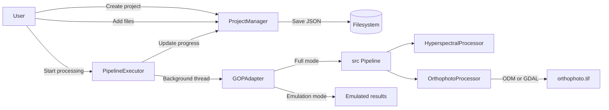

# GOP — Project Review

## Overview

**GOP** (v2.0.0) — web application for creating orthophotoplans from hyperspectral and regular images. User creates projects, uploads images, runs a processing pipeline, and gets an orthophoto as output. The project does not need tests or other things for a production solution. It is a simple but powerful program for personal use. ё

**Stack:** Python 3.10, Dash + Flask, GDAL, OpenDroneMap  
**Entry point:** [`main.py`](main.py:1) → launches Dash GUI on `127.0.0.1:8050`

---

## Architecture

```
main.py                    ← Entry point
├── gui/                   ← Web UI layer (Dash + Flask)
│   ├── app/app.py         ← App factory, server setup
│   ├── api/routes.py      ← REST API (Flask Blueprint)
│   ├── components/        ← UI components (layout, sidebar, dashboard, etc.)
│   ├── models/project.py  ← Data models (dataclasses)
│   ├── services/          ← Business logic
│   │   ├── project_manager.py    ← CRUD + file management
│   │   ├── pipeline_executor.py  ← Background processing orchestration
│   │   └── gop_adapter.py        ← Bridge to src/ processing core
│   └── utils/             ← Upload utils, memory monitor, formatting, validation
└── src/                   ← Processing core (science layer)
    ├── core/
    │   ├── config.py      ← Thread-safe singleton config (YAML)
    │   └── pipeline.py    ← Main processing pipeline
    ├── processing/
    │   ├── orthophoto.py              ← ODM / GDAL orthophoto creation
    │   └── hyperspectral/processor.py ← Hyperspectral data loading (GDAL)
    └── utils/             ← Validators, exceptions, GDAL utils, logger
```

---

## Key Components

### GUI Layer (`gui/`)

| Component | What it does |
|---|---|
| [`app.py`](gui/app/app.py:1) | Dash app factory. Creates Flask server, registers API blueprint, inits services, registers callbacks |
| [`routes.py`](gui/api/routes.py:1) | REST endpoints: `/api/health`, `/api/config`, `/api/projects`, `/api/process`. File upload with streaming. Most handlers are stubs that duplicate Dash-callback logic |
| [`callbacks.py`](gui/components/callbacks.py:1) | All Dash callbacks: routing, project CRUD, file browser, processing start/cancel/progress polling. **Contains duplicate callback definitions around lines 597–640 that break Dash startup** |
| [`project_detail.py`](gui/components/project_detail.py:1) | Project detail page with 4 tabs: Overview, Files, Processing, Results |
| [`server_file_picker.py`](gui/components/server_file_picker.py:1) | Server-side file browser — adds files via `shutil.copy2` (no OOM) |
| [`project_manager.py`](gui/services/project_manager.py:1) | Project lifecycle: CRUD, file add/remove, processing state machine, stats. Persists as JSON on disk |
| [`pipeline_executor.py`](gui/services/pipeline_executor.py:1) | Runs pipeline stages in background threads. Supports cancel via `threading.Event`. Falls back to emulation if GOP core unavailable. **Calls a `process_data` method that does not exist on the adapter/core — runtime bug** |
| [`gop_adapter.py`](gui/services/gop_adapter.py:1) | Adapter between GUI and `src/`. Has full mode (real processing) and emulation mode. **Also references a `process_data` method that is not implemented** |

### GUI Utils (`gui/utils/`)

| Component | What it does |
|---|---|
| [`file_upload_utils.py`](gui/utils/file_upload_utils.py:1) | Helpers for streamed browser uploads |
| [`file_utils.py`](gui/utils/file_utils.py:1) | Filesystem helpers (paths, sizes) |
| [`format_utils.py`](gui/utils/format_utils.py:1) | Human-readable formatting (bytes, durations) |
| [`validation_utils.py`](gui/utils/validation_utils.py:1) | Input/form validation helpers |
| [`visualization_utils.py`](gui/utils/visualization_utils.py:1) | Plot/figure helpers for the dashboard |
| [`memory_monitor.py`](gui/utils/memory_monitor.py:1) | Background memory usage probe (psutil) for the UI |

### Processing Core (`src/`)

| Component | What it does |
|---|---|
| [`config.py`](src/core/config.py:1) | Thread-safe singleton config. Loads from YAML, supports dot-notation access, DI |
| [`pipeline.py`](src/core/pipeline.py:1) | 2-stage pipeline: (1) hyperspectral preprocessing → (2) orthophoto creation |
| [`orthophoto.py`](src/processing/orthophoto.py:1) | Creates orthophoto via OpenDroneMap (preferred) or GDAL `gdal_merge.py` (fallback). Validates and optimizes output. `create_orthophoto()` expects a dict with `tiff_paths` and `metadata` keys |
| [`processor.py`](src/processing/hyperspectral/processor.py:1) | Loads hyperspectral data via GDAL, validates, caches. **`process()` is currently a stub (TODO) and does NOT return the `tiff_paths` / `metadata` keys that [`OrthophotoProcessor.create_orthophoto()`](src/processing/orthophoto.py:1) expects — the data-flow contract between the two stages is broken** |
| [`gdal_utils.py`](src/utils/gdal_utils.py:1) | Context managers for GDAL datasets, safe read/write, metadata extraction |
| [`exceptions.py`](src/utils/exceptions.py:1) | Exception hierarchy: `GOPException` → `ValidationError`, `ProcessingError`, `FileError`, `GDALError` |
| [`validators.py`](src/utils/validators.py:1) | Validation for arrays, wavelengths, file paths, band names, configs |

---

## Data Flow



> ⚠️ Note: in the current code the `HSP → ORP` edge is broken — `HyperspectralProcessor.process()` is a stub and does not produce the `tiff_paths` / `metadata` dict that `OrthophotoProcessor` consumes.

---

## Project Model & State Machine

States: `new` → `ready` → `run` → `done` / `error` / `cancelled`

- **new**: project created, no files
- **ready**: files uploaded
- **run**: pipeline executing in background thread
- **done**: processing completed
- **error** / **cancelled**: terminal states

Pipeline stages: `preprocessing` → `orthophoto` (each weighted 50%)

---

## Configuration

[`config.yaml`](config.yaml:1) — single YAML file covering:
- Processing params (resolution, batch size, ODM timeout, radiometric/atmospheric correction, noise reduction, spectral calibration)
- Output settings (format, reports)
- Performance (memory limits, parallelism, cache)
- Validation rules
- External tools (ODM, GDAL)
- Experimental features (ML, cloud — disabled)

GUI config via [`gui/config.py`](gui/config.py:1) — env vars for host/port, upload limits (max 10GB per file, 100 files). Redis/DB URLs exist in the config schema but are not actually used by the running app.

---

## Notable Design Decisions

1. **Dual-mode processing** — [`GOPAdapter`](gui/services/gop_adapter.py:1) works in full mode (real GDAL/ODM processing) or emulation mode (fake results with delays). Allows GUI development without heavy dependencies, but adds complexity for a personal-use project.

2. **Server-side file picker** — files are copied via `shutil.copy2` at filesystem level instead of browser upload (base64). Solves OOM for large files (multi-GB hyperspectral data).

3. **Thread-based execution** — [`PipelineExecutor`](gui/services/pipeline_executor.py:1) uses `threading.Thread` with `threading.Event` for cancellation. No Celery dependency required — appropriate for personal-use scale.

4. **JSON-on-disk persistence** — projects stored as `project.json` in per-project directories. No database required. In-memory cache for fast reads.

5. **Simple in-process caching** — the hyperspectral loader keeps a small in-memory cache in [`src/processing/hyperspectral/cache.py`](src/processing/hyperspectral/cache.py:1). Earlier design notes mention a multi-tier Redis + file + LRU cache, but that is **not wired into the app** — only the simple in-memory cache is active.

6. **Dependency injection** — [`Config`](src/core/config.py:1) supports both singleton and DI patterns. Pipeline accepts injected config.

---

## Issues & Observations

| # | Severity | Area | Finding | Suggested fix |
|---|---|---|---|---|
| 1 | 🔴 | Runtime | Duplicate Dash callback registrations in [`callbacks.py`](gui/components/callbacks.py:597) (around lines 597–640) prevent Dash app startup | Remove the duplicated block; keep a single definition per output |
| 2 | 🔴 | Runtime | [`pipeline_executor.py`](gui/services/pipeline_executor.py:1) and [`gop_adapter.py`](gui/services/gop_adapter.py:1) call a `process_data` method that does not exist on the target object | Either implement `process_data` on the adapter/core, or rename the call site to the method that actually exists |
| 3 | 🔴 | Data contract | [`HyperspectralProcessor.process()`](src/processing/hyperspectral/processor.py:1) is a stub and does not return `tiff_paths` / `metadata`, but [`OrthophotoProcessor.create_orthophoto()`](src/processing/orthophoto.py:1) requires those keys — pipeline cannot complete | Finish `process()` so it emits the expected dict, or document a clear intermediate schema and adapt both sides |
| 4 | 🟡 | Architecture | REST API in [`routes.py`](gui/api/routes.py:1) duplicates Dash-callback logic as stubs — two parallel systems | Pick one: either drive the UI purely via Dash callbacks, or move logic into the REST API and thin out callbacks |
| 5 | 🟡 | Dead code | `SessionManager` and `CacheManager` are mentioned/implemented but never wired into [`app.py`](gui/app/app.py:1) | Either wire them in where they are needed, or delete to reduce surface area |
| 6 | 🟡 | Complexity | [`GOPAdapter`](gui/services/gop_adapter.py:1) dual-mode (full + emulation) roughly doubles the code paths | Drop emulation mode for this personal-use project; rely on real processing only |
| 7 | 🟡 | Docs vs reality | Multi-tier Redis cache is described in config/docs but not implemented | Remove Redis references, or implement a minimal real cache layer |
| 8 | 🟢 | Cleanup | Several unused imports across [`gui/`](gui/__init__.py:1) and [`src/`](src/__init__.py:1) files | Run a linter (ruff/flake8) and remove dead imports |
| 9 | 🟢 | Observability | Werkzeug request logging is disabled in [`app.py`](gui/app/app.py:1), which may hide useful debug info during development | Re-enable Werkzeug logs in debug mode, or expose a flag in config |

## Supported Formats

**Input:** `.bil`, `.hdr`, `.tif`, `.tiff`, `.dat`, `.png`, `.jpg`, `.jpeg`, `.geotiff`  
**Output:** GeoTIFF (`orthophoto.tif`)

---

## Deployment

- **Local:** `python main.py` → runs on `127.0.0.1:8050`
- **Dependencies:** GDAL, OpenDroneMap (optional), psutil, numpy, dash, flask

---

## Review Log

- `2026-04-24` — Senior code review performed; identified 3 critical runtime bugs (duplicate Dash callbacks, missing `process_data` method, broken hyperspectral→orthophoto data contract), architectural duplication (REST API vs Dash callbacks), and complexity (dual-mode adapter, unimplemented Redis caching) that can be simplified for junior maintainability.
